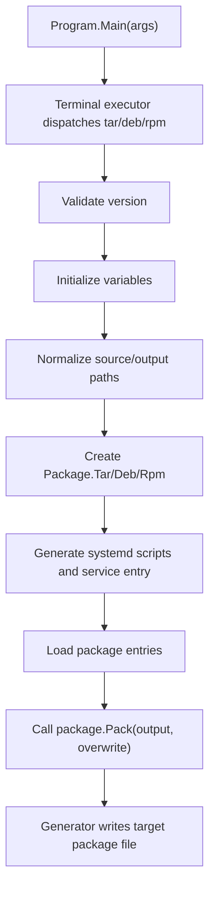

# Zongsoft.Tools.Packager 实现说明

本文档面向维护者，说明 `Zongsoft.Tools.Packager` 的源码结构、命令执行流水线、包模型、文件收集规则、systemd 脚本生成，以及 `.tar.gz`、`.deb`、`.rpm` 三种包格式的当前实现方式。

## 设计目标

`Zongsoft.Tools.Packager` 的目标是使用纯 .NET 代码生成 Linux 应用安装包，尽量减少对目标系统工具链的打包期依赖。

核心设计取向：

- 对外提供统一入口 `dotnet-pack`，通过 `tar`、`deb`、`rpm` 子命令选择输出格式。
- 在三种格式之间复用应用元数据、变量解析、文件收集、脚本生成和命名规则。
- 默认服务模型面向 systemd，适合 .NET 后台服务和 Web 服务。
- 直接写入包格式原语，而不是调用 `tar`、`dpkg-deb`、`rpmbuild`、`cpio`。
- 支持在 Windows、Linux、macOS 上生成 Linux 包，并对文件权限做平台兼容处理。

## 源码结构

| 文件 | 职责 |
| --- | --- |
| `Program.cs` | 初始化终端命令树，注册 `TarCommand`、`DebCommand`、`RpmCommand`。 |
| `PackCommand.cs` | 三种打包命令的模板方法基类，声明通用命令选项并编排执行流程。 |
| `PackCommand.Tar.cs` | 创建 `Package.Tar`。 |
| `PackCommand.Deb.cs` | 创建 `Package.Deb`。 |
| `PackCommand.Rpm.cs` | 创建 `Package.Rpm`，解析 RPM 专用的 `provides`、`conflicts`。 |
| `Package.cs` | 包模型、安装脚本模型、包条目模型和文件收集逻辑。 |
| `Package.Tar.cs` | `.tar.gz` 包类型：默认安装路径、文件名、入口方法。 |
| `Package.Deb.cs` | `.deb` 包类型：默认安装路径、文件名、入口方法。 |
| `Package.Rpm.cs` | `.rpm` 包类型：默认安装路径、文件名、RPM 专用属性。 |
| `Generator.Tar.cs` | 写入 gzip PAX tar、`install.sh`、`uninstall.sh`。 |
| `Generator.Deb.cs` | 写入 Debian `ar` 容器、`control.tar.gz`、`data.tar.gz`。 |
| `Generator.Rpm.cs` | 写入 RPM lead、signature/header、metadata header、gzip cpio payload。 |
| `Scriptor.Systemd.cs` | 生成或收集 systemd 单元文件，生成安装/卸载脚本。 |
| `Normalizer.cs` | 变量展开、文本规范化、文件内容读取。 |
| `Variables.cs` | 变量集合和常用变量的强类型访问器。 |
| `Utility.cs` | RID、安装路径、路径规范化、Unix 时间戳、文件权限等辅助逻辑。 |
| `Dumper.cs` | 控制台输出启动画面、错误和警告消息。 |

## 执行流水线

入口命令结构：

```text
dotnet-pack
├── tar
├── deb
└── rpm
```

核心流程由 `PackCommand<TPackage>.OnExecuteAsync()` 编排：



`PackCommand<TPackage>` 做通用工作，子类只负责创建具体 `Package`：

```csharp
protected override Package.Deb CreatePackage(CommandContext context)
```

`RpmCommand` 额外读取：

- `--provides`
- `--conflicts`

这两个选项按逗号或分号拆分，最终写入 RPM metadata header。

## 命令选项模型

通用必填选项：

| 选项 | 类型 | 说明 |
| --- | --- | --- |
| `--name` | `string` | 应用/包名称。 |
| `--version` | `Version` | 包版本，`0.0.0.0` 被拒绝。 |
| `--platform` | `Platform` | 目标平台。 |
| `--framework` | `string` | 目标框架，如 `net8.0`、`net9.0`、`net10.0`。 |

常用可选项：

| 选项 | 默认值 | 说明 |
| --- | --- | --- |
| `--source` | 当前目录 | 输入目录。 |
| `--output` | `source` | 输出目录；相对路径基于 `source`。 |
| `--exclude` | 空 | 加载打包项时跳过的文件模式列表，多个模式用逗号或分号分隔。 |
| `--edition` | 空 | 包版本/渠道标识，参与包名；RPM 中也作为 release。 |
| `--compilation` | `Release` | 查找宿主文件时使用的配置名。 |
| `--architecture` | `x64` | 目标架构。 |
| `--overwrite` | `false` | 是否覆盖已存在的输出文件。 |
| `--install-path` | 由包名推导 | 安装目录。 |
| `--title` | 空 | 人类可读标题。 |
| `--summary` | 空 | 短描述；可为文件路径。 |
| `--description` | 空 | 长描述；可为文件路径。 |
| `--url` | `https://github.com/Zongsoft` | 项目主页。 |
| `--license` | 空 | 许可证文本。 |
| `--category` | 格式默认 | Debian `Section` 或 RPM `Group`。 |
| `--maintainer` | `Zongsoft Studio <zongsoft@gmail.com>` | 维护者/供应商。 |
| `--dependencies` | 空 | 依赖列表。 |

systemd 与生命周期脚本选项：

| 选项 | 说明 |
| --- | --- |
| `--daemon` | systemd 单元文件名/标识；`none`、`disable`、`disabled` 表示禁用。 |
| `--daemon-bind` | 生成服务时传给 `--urls` 的绑定地址；纯数字会转成 `http://127.0.0.1:<port>`。 |
| `--daemon-environments` | 逗号或分号分隔的变量名，写入生成的服务文件。 |
| `--installing` / `--installed` | 安装前/安装后脚本。 |
| `--uninstalling` / `--uninstalled` | 卸载前/卸载后脚本。 |
| `--preinstalling` / `--postinstalling` | 拼接到 `installing` 前后。 |
| `--preinstalled` / `--postinstalled` | 拼接到 `installed` 前后。 |
| `--preuninstalling` / `--postuninstalling` | 拼接到 `uninstalling` 前后。 |
| `--preuninstalled` / `--postuninstalled` | 拼接到 `uninstalled` 前后。 |

## 变量与规范化

### 变量来源

`PackCommand<TPackage>.GetVariables()` 按以下顺序产生变量：

1. 当前进程环境变量。
2. 命令描述符声明的选项和默认值。
3. 命令行中出现但未在描述符中声明的额外选项。
4. 调用方显式传入的追加变量。

随后调用：

```csharp
Normalizer.Initialize(...)
```

变量名不区分大小写。当前实现先对变量序列调用 `DistinctBy(variable => variable.Key)`，因此同名变量保留第一次出现的值；这意味着环境变量可能优先于同名命令选项。这个行为与“后写入覆盖前值”的直觉不同，属于后续可以整理的实现细节。

### 变量语法

`Normalizer` 支持两种变量引用形式：

```text
$(name)
%name%
```

示例：

```bash
dotnet-pack deb \
  --name:%APP_NAME% \
  --version:%APP_VERSION% \
  --platform:linux \
  --framework:net10.0 \
  --source:./bin/%compilation%/%framework%/publish
```

变量展开失败时会输出未定义变量错误，并跳过相关路径或文本。

### 文本与文件

`summary`、`description` 以及四个主生命周期脚本变量会经过 `NormalizeFile()`：

1. 空值返回 `null`。
2. 先展开变量。
3. 如果展开结果是存在的文件路径，读取文件内容。
4. 否则把展开结果当作文本。

`Scriptor.Systemd` 对脚本值还会做第二层解释：如果脚本值看起来像路径，则相对 `source` 读取；如果包含换行，则直接视为脚本文本。

## 包模型

`Package` 抽象类持有三种格式共享的元数据：

- `Name`
- `PackageName`
- `Edition`
- `Version`
- `Platform`
- `Architecture`
- `Runtime`
- `Framework`
- `Title`
- `Summary`
- `Description`
- `Maintainer`
- `License`
- `Url`
- `Category`
- `InstallPath`
- `Dependencies`
- `Entries`
- `Scripts`

包名规则：

```text
name
name-edition
```

输出文件名规则：

```text
name@version_runtime.ext
name-edition@version_runtime.ext
```

示例：

```text
Zongsoft.Example@1.0.0_linux-x64.deb
Zongsoft.Example-enterprise@1.0.0_linux-x64.rpm
```

### Runtime Identifier

`Utility.GetRuntimeIdentifier()` 根据平台和架构生成运行时标识：

```text
linux + x64   => linux-x64
linux + arm64 => linux-arm64
windows + x64 => win-x64
windows       => win
```

`Platform.Windows` 还声明了 `Win` 别名。

### 默认安装路径

`Utility.Unix.GetInstallPath(name)` 根据包名推导默认安装路径：

```text
Zongsoft.Example => /opt/zongsoft/zongsoft.example
MyApp            => /opt/myapp
```

规则：

- 名称为空时返回 `/opt`。
- 名称转为小写。
- 如果名称包含点号，点号前一段作为 vendor 目录。
- 否则安装到 `/opt/<name>`。

## 打包项加载

打包项由 `Package.EntryCollection` 负责加载。

### 默认加载

如果没有位置参数：

```text
递归收集 source 下所有文件
entryName = 文件相对 source 的路径
```

对 `.deb` 和 `.rpm`，`entryName` 会加上安装路径前缀，例如：

```text
InstallPath = /opt/zongsoft/zongsoft.example
EntryName   = opt/zongsoft/zongsoft.example/app.dll
```

对 `.tar.gz`，`EntryPrefix` 为 `null`，应用文件保留在归档根目录下，安装时由 `install.sh` 复制到目标目录。

### 显式加载

位置参数格式：

```text
path
path:alias
```

解析规则：

- 以最后一个冒号拆分路径和别名。
- Windows 盘符中的 `C:` 不作为别名分隔符。
- 相对路径基于 `source`。
- 绝对路径可以位于 `source` 外部；如果没有别名，最终只使用文件名。
- 目录递归展开。
- 通配符支持最后一级路径中的 `*` 和 `?`。
- 重复的目标路径会触发冲突警告并跳过。

### 排除规则

`--exclude` 会在 `Package.EntryCollection.Load()` 收集文件时生效：

- 多个模式用逗号或分号拆分。
- 模式先经过变量展开，再统一为 `/` 路径分隔符。
- 相对模式基于 `source`，同时会匹配源文件相对路径、最终包内路径和文件名。
- 支持 `*`、`?`、`**`；目录模式如 `logs/` 等价于 `logs/**`。
- 命中的文件直接跳过，不产生重复条目冲突警告。
- systemd 生成/加入的服务文件和自动生成的 `.version` 文件不经过该过滤器。

### 根路径别名

如果 alias 以 `/` 或 `\` 开头，则条目标记为 `Rooted`。

示例：

```bash
dotnet-pack deb \
  --name:MyApp \
  --version:1.0.0 \
  --platform:linux \
  --framework:net10.0 \
  --source:publish \
  appsettings.Production.json:/etc/myapp/appsettings.json
```

三种格式的处理方式：

| 格式 | 处理方式 |
| --- | --- |
| `.deb` | payload 路径为 `etc/myapp/appsettings.json`，安装后位于 `/etc/myapp/appsettings.json`；`/etc` 下 root 条目会写入 `conffiles`。 |
| `.rpm` | payload 路径为 `/etc/myapp/appsettings.json`，RPM header 中标记配置文件。 |
| `.tar.gz` | 文件存放到 `.root/etc/myapp/appsettings.json`，由 `install.sh` 复制到 `${DESTDIR}/etc/myapp/appsettings.json`。 |

### 文件权限

Unix-like 主机：

```text
File.GetUnixFileMode(path) & rwx mask
```

Windows 主机或读取不到有效权限时：

- `.sh`、`.dll`、`.exe`、无扩展名文件使用 `0755`。
- 其他文件使用 `0644`。

## systemd 生成器

三种包类型当前都使用 `Scriptor.Systemd`。

### 服务文件解析

`--daemon` 为空时，默认使用包名小写形式作为服务标识。

流程：

1. 若 `--daemon:none`、`--daemon:disable` 或 `--daemon:disabled`，禁用服务生成。
2. 否则在 `source` 下查找 `--daemon` 指定的文件。
3. 如果文件存在，将其加入包条目。
4. 如果文件不存在，尝试生成临时 `.service` 文件并加入包条目。

### 宿主定位

生成 `.service` 文件时需要定位 .NET 宿主。查找顺序：

1. `<source>/<name>.dll`
2. `<source>/bin/<compilation>/<framework>/<name>.dll`
3. `<source>` 下唯一 `.exe`，并推断同名 `.dll`
4. `<source>/bin/<compilation>/<framework>` 下唯一 `.exe`，并推断同名 `.dll`

找不到宿主时输出：

```text
The daemon host location failed.
```

### 生成的服务内容

普通服务：

```ini
[Unit]
Description=<title-or-name>

[Service]
Type=simple
WorkingDirectory=<install-path>
ExecStartPre=mkdir -p <install-path>/logs
ExecStart=dotnet <install-path>/<host>
Restart=on-failure
RestartSec=10
KillSignal=SIGINT
SyslogIdentifier=<name>
DynamicUser=no
PrivateTmp=no
ReadWritePaths=<install-path> <install-path>/logs /tmp

Environment=DOTNET_NOLOGO=true
<custom-environment-lines>

[Install]
WantedBy=multi-user.target
```

如果 `--daemon-bind` 非空，则改为：

```ini
ExecStart=dotnet <install-path>/<host> --urls <bind>
```

其中纯数字绑定值会被转换成：

```text
http://127.0.0.1:<port>
```

### 生命周期脚本

脚本模型映射：

| `Package.InstallScripts` | Debian 文件 | RPM tag | Tar 路径 |
| --- | --- | --- | --- |
| `Installing` | `preinst` | `1023` | 融合到 `install.sh` |
| `Installed` | `postinst` | `1024` | 融合到 `install.sh` |
| `Uninstalling` | `prerm` | `1025` | 融合到 `uninstall.sh` |
| `Uninstalled` | `postrm` | `1026` | 融合到 `uninstall.sh` |

未提供脚本时，默认行为：

- 安装前停止同名 systemd 服务。
- 安装后创建 `/etc/systemd/system/<service>` 符号链接。
- 安装后执行 `systemctl daemon-reload`、`systemctl enable` 和 `systemctl start`。
- 卸载前禁用并停止服务。
- 卸载后删除服务符号链接、重载 systemd，并删除安装目录。

禁用 systemd 时，默认脚本退化为 no-op，卸载后仍会删除安装目录。

## `.tar.gz` 实现

实现文件：`Generator.Tar.cs`

### 格式概要

`.tar.gz` 等价于：

```text
gzip(tar archive)
```

当前实现使用 .NET 的 `System.Formats.Tar`：

```csharp
new TarWriter(gzip, TarEntryFormat.Pax, false)
```

因此归档条目使用 PAX tar 格式，可支持更长路径和扩展元数据。

生成 `.tar.gz` 的同时，会在输出目录生成一个同名 `.sh` 安装脚本，例如：

```text
MyApp@1.0.0_linux-x64.tar.gz
MyApp@1.0.0_linux-x64.sh
```

该脚本定位同目录下的 `.tar.gz`，解压到临时目录，并调用解压后的 `install.sh` 完成安装。

### 归档结构

```text
<application files>
.root/<rooted files>
install.sh
uninstall.sh
```

rooted 文件只有存在根路径别名时写入 `.root/`。生命周期脚本不再作为独立文件写入，而是融合到 `install.sh` 和 `uninstall.sh`。

### 文件条目

应用文件写入为：

```text
TarEntryType.RegularFile
name = entry.EntryName
mode = entry.Mode
mtime = entry.ModifiedTime
data = File.OpenRead(entry.Source)
```

rooted 文件写入为：

```text
name = .root/<entry.EntryName>
```

### install.sh / uninstall.sh

`install.sh` 是自包含安装器，权限 `0755`。`uninstall.sh` 是自包含卸载器，权限 `0755`，安装时会复制到目标安装目录。

支持：

- 默认安装。
- 从安装目录执行 `uninstall.sh` 卸载。
- `INSTALL_PATH` 覆盖应用安装路径。
- `DESTDIR` 暂存安装。
- 执行融合后的生命周期脚本。
- 安装/卸载 rooted 文件。

安装流程：

```text
SOURCE_DIR = install.sh 所在目录
INSTALL_PATH = 环境变量或包默认安装路径
DESTDIR = 可选暂存目录
TARGET = DESTDIR + INSTALL_PATH
执行 installing.sh
创建 TARGET
复制普通归档文件到 TARGET
复制 uninstall.sh 到 TARGET
复制 rooted 文件到 DESTDIR + /<root-path>
执行 installed.sh
```

卸载流程：

```text
执行 uninstalling.sh
rm -rf TARGET
删除 rooted 文件
执行 uninstalled.sh
```

## `.deb` 实现

实现文件：`Generator.Deb.cs`

### Debian 二进制包概要

Debian 二进制包是 Unix `ar` 容器，现代格式版本为 `2.0`。

当前写入：

```text
debian-binary
control.tar.gz
data.tar.gz
```

### ar 容器

文件以全局头开始：

```text
!<arch>\n
```

每个成员写入 60 字节 ASCII 头：

```text
name/ timestamp uid gid mode size `\n
```

当前实现：

- `uid = 0`
- `gid = 0`
- `mode = 100644`
- 成员长度为奇数时补一个换行字节，使下个成员按偶数边界开始。

### debian-binary

内容固定：

```text
2.0\n
```

### control.tar.gz

`control.tar.gz` 使用 gzip + PAX tar，包含：

```text
control
preinst
postinst
prerm
postrm
conffiles
```

说明：

- `control` 权限为 `0644`。
- 维护者脚本只有内容非空时写入，权限为 `0755`。
- 维护者脚本自动加 `#!/bin/sh` 和 `set -e`。
- `conffiles` 只在存在 rooted 且路径位于 `/etc/` 下的文件时写入。

### control 字段

当前生成字段：

```text
Package: <package-name>
Version: <version>
Section: <category-or-utils>
Priority: optional
Architecture: <debian-architecture>
Installed-Size: <payload-size-in-KiB>
Maintainer: <maintainer>
Homepage: <url>
License: <license>
Depends: <dependencies>
Description: <summary-or-title-or-name>
 <long-description-line>
 .
 <long-description-line>
```

说明：

- `Depends` 仅在依赖非空时写入。
- `Description` 第一行是短描述。
- 长描述每行前置一个空格。
- 空行写为 ` .`。
- `License` 不是 Debian control 的标准必需字段，当前作为额外字段写入。

### Debian 架构映射

| .NET `Architecture` | Debian architecture |
| --- | --- |
| `X64` | `amd64` |
| `X86` | `i386` |
| `Arm64` | `arm64` |
| `Arm` | `armhf` |
| 其他 | `all` |

### data.tar.gz

`data.tar.gz` 使用 gzip + PAX tar，写入 `Package.Entries`。

对非 rooted 条目，`.deb` 的 `EntryPrefix` 是去掉开头 `/` 的安装路径：

```text
InstallPath = /opt/zongsoft/zongsoft.example
EntryName   = opt/zongsoft/zongsoft.example/app.dll
```

Debian 解包后文件位于：

```text
/opt/zongsoft/zongsoft.example/app.dll
```

对 rooted 条目，prefix 被跳过，因此：

```text
Alias     = /etc/myapp/appsettings.json
EntryName = etc/myapp/appsettings.json
```

安装后位于：

```text
/etc/myapp/appsettings.json
```

## `.rpm` 实现

实现文件：`Generator.Rpm.cs`

### RPM 文件概要

RPM 文件由以下逻辑部分组成：

```text
Lead
Signature
Header
Payload
```

当前实现写入：

```text
lead
signature header
metadata header
gzip(newc cpio payload)
```

当前不生成 GPG/PGP 签名，只写入基本 signature tag，例如包体大小和 MD5 digest。

### Lead

lead 固定 96 字节：

| 偏移 | 内容 |
| --- | --- |
| `0..3` | RPM magic：`ed ab ee db` |
| `4` | major version：`3` |
| `5` | minor version：`0` |
| `6..7` | package type：binary package |
| `8..9` | architecture number |
| `10..75` | `<package-name>-<version>`，最长 66 字节 |
| `76..77` | OS number：Linux |
| `78..79` | signature type：header-style signature |

lead 架构号映射：

| .NET `Architecture` | RPM lead architecture number |
| --- | --- |
| `X64` | `1` |
| `X86` | `1` |
| `Arm64` | `12` |
| `Arm` | `12` |
| 其他 | `255` |

### Header 编码

RPM header 结构：

```text
magic/version/reserved
index count
store size
index entries
store bytes
padding to 8 bytes
```

index entry：

```text
tag    int32 big-endian
type   int32 big-endian
offset int32 big-endian
count  int32 big-endian
```

当前支持的 type：

| Type | 含义 |
| --- | --- |
| `3` | int16 array |
| `4` | int32 array |
| `6` | string |
| `7` | binary |
| `8` | string array |
| `9` | international string |

数值使用 big-endian，字符串使用 UTF-8 并以 `NUL` 结尾。

### Signature Header

signature section 使用与 RPM header 相同的索引/存储区结构。

当前写入：

| Tag | 内容 |
| --- | --- |
| `257` | metadata header + payload 的字节长度。 |
| `261` | metadata header + payload 的 MD5 digest。 |

signature section 末尾按 8 字节对齐。

### Metadata Header

当前写入的主要内容：

- 包名、版本、release。
- 摘要、描述、构建时间、构建主机。
- 包大小、许可证、维护者、分类、URL。
- OS 和架构。
- 安装/卸载脚本。
- 文件大小、模式、mtime、digest、用户名、组名、配置文件标记。
- payload 格式、压缩器和压缩级别。
- Requires、Provides、Conflicts。
- dirname、basename、dirindex 三组文件路径表。

常用 tag：

| Tag | 当前写入内容 |
| --- | --- |
| `1000` | 包名。 |
| `1001` | 版本。 |
| `1002` | release；未指定 edition 时为 `1`，否则为 edition。 |
| `1004` | 摘要。 |
| `1005` | 描述。 |
| `1006` | 构建时间。 |
| `1007` | 构建主机。 |
| `1009` | 安装大小。 |
| `1014` | 许可证。 |
| `1015` | 维护者/打包者。 |
| `1016` | 分组。 |
| `1020` | URL。 |
| `1021` | OS，固定 `linux`。 |
| `1022` | RPM 架构。 |
| `1023..1026` | pre/post install、pre/post uninstall 脚本。 |
| `1028` | 文件大小数组。 |
| `1030` | 文件模式数组。 |
| `1034` | 文件修改时间数组。 |
| `1035` | 文件 SHA-1 digest 数组。 |
| `1037` | 文件 flags；`/etc` rooted 文件标记为配置文件。 |
| `1039` / `1040` | 用户名/组名，固定 `root`。 |
| `1048..1050` | Requires flags/name/version。 |
| `1047`, `1112`, `1113` | Provides name/flags/version。 |
| `1053..1055` | Conflicts flags/name/version。 |
| `1056` | Install prefix。 |
| `1116..1118` | 文件目录索引、文件基本名、目录名。 |
| `1124` | Payload format，固定 `cpio`。 |
| `1125` | Payload compressor，固定 `gzip`。 |
| `1126` | Payload flags，固定 `9`。 |

### RPM 架构映射

| .NET `Architecture` | RPM architecture |
| --- | --- |
| `X64` | `x86_64` |
| `X86` | `i386` |
| `Arm64` | `aarch64` |
| `Arm` | `armv7hl` |
| 其他 | `noarch` |

### Requires、Provides、Conflicts

关系表达式支持：

```text
name
name = version
name >= version
name <= version
name > version
name < version
name(= version)
name(>= version)
```

关系标志：

| 操作符 | Flags |
| --- | --- |
| `<` | `RPM_SENSE_LESS` |
| `>` | `RPM_SENSE_GREATER` |
| `=` | `RPM_SENSE_EQUAL` |
| `<=` | `LESS | EQUAL` |
| `>=` | `GREATER | EQUAL` |

默认 Requires：

```text
rpmlib(CompressedFileNames) <= 3.0.4-1
rpmlib(PayloadFilesHavePrefix) <= 4.0-1
rpmlib(PayloadIsGzip) <= 5.4.0-1
```

默认 Provides：

```text
<package-name> = <version>-<release>
```

### Payload

payload 是 gzip 压缩后的 ASCII `cpio` newc 归档。newc header magic：

```text
070701
```

生成流程：

1. 根据文件路径收集目录，至少包含 `/`。
2. 写入目录 cpio 条目，模式 `0040755`。
3. 写入文件 cpio 条目，路径为 `.` + RPM 绝对路径，例如 `./opt/myapp/app.dll`。
4. 文件模式为 `0100000 | entry.Mode`。
5. 写入 `TRAILER!!!` 结束条目。
6. 原始 cpio 数据补齐到 512 字节边界。
7. 使用 gzip 压缩。

RPM header 同时保存一份文件元数据，供包管理器查询和校验。

## 三种格式对比

| 特性 | `.tar.gz` | `.deb` | `.rpm` |
| --- | --- | --- | --- |
| 外层容器 | gzip tar | Unix ar | RPM lead/signature/header |
| 文件载荷 | PAX tar | `data.tar.gz` | gzip newc cpio |
| 控制元数据 | `install.sh` 与 `uninstall.sh` | `control.tar.gz` | RPM metadata header |
| 生命周期脚本 | 融合到 `install.sh` / `uninstall.sh` | `preinst/postinst/prerm/postrm` | header script tags |
| 包管理器安装 | 否 | `dpkg`/`apt` | `rpm`/`dnf`/`yum` |
| 默认安装路径 | `install.sh` 复制 | payload 内含路径 | payload/header 内含路径 |
| root alias | `.root/` + installer | 直接安装到根路径 | 直接安装到根路径 |
| 配置文件标记 | 无包管理器标记 | `/etc` rooted 文件写入 `conffiles` | `/etc` rooted 文件标记 config flag |
| 签名 | 无 | 无 | 无 GPG/PGP，仅基础 digest |

## 当前实现边界

- `.deb` 固定使用 `control.tar.gz` 和 `data.tar.gz`，未提供 xz/zstd 压缩选项。
- `.deb` control 字段覆盖常用字段，但未实现 `Recommends`、`Suggests`、`Breaks`、`Conflicts` 等扩展字段。
- `.rpm` 直接写文件格式，未调用 `rpmbuild`，没有 spec 文件，也没有 GPG 签名。
- `.rpm` payload 固定为 gzip cpio，未提供 xz/zstd payload 选项。
- 文件所有者和组在 RPM 中固定为 `root/root`，Debian ar 成员 uid/gid 固定为 `0/0`。
- RPM 目录模式固定为 `0755`。
- glob 只处理最后一级路径模式，不支持 `**` 多级通配。
- systemd 是当前唯一脚本生成策略，尚未实现 SysV init、OpenRC、launchd 等策略。
- 变量初始化目前使用 `DistinctBy` 保留第一次出现的同名变量，命令行同名值未必能覆盖环境变量。
- `summary`、`description` 与脚本路径/文本的读取职责分布在 `Normalizer` 和 `Scriptor.Systemd` 两处，后续可进一步统一。

## 验证建议

### tar.gz

```bash
tar -tzf package.tar.gz
sudo sh ./package.sh
tar -xzf package.tar.gz -C /tmp/package-test
DESTDIR=/tmp/stage /tmp/package-test/install.sh
find /tmp/stage -maxdepth 6 -type f | sort
DESTDIR=/tmp/stage /tmp/stage/opt/myapp/uninstall.sh
```

### deb

```bash
ar t package.deb
dpkg-deb --info package.deb
dpkg-deb --contents package.deb
dpkg-deb --control package.deb /tmp/control
cat /tmp/control/control
test -f /tmp/control/conffiles && cat /tmp/control/conffiles
```

可进一步在 Debian/Ubuntu 容器或虚拟机中安装：

```bash
sudo dpkg -i package.deb
systemctl status <service>
sudo dpkg -r <package-name>
```

### rpm

```bash
rpm -qip package.rpm
rpm -qlp package.rpm
rpm -qp --scripts package.rpm
rpm -qpc package.rpm
rpm2cpio package.rpm | cpio -t
```

可进一步在 Fedora/RHEL/openSUSE 容器或虚拟机中安装：

```bash
sudo rpm -Uvh package.rpm
systemctl status <service>
sudo rpm -e <package-name>
```

## 参考资料

- Debian Policy Manual: [Binary packages](https://www.debian.org/doc/debian-policy/ch-binary.html)
- Debian Policy Manual: [Binary package format appendix](https://www.debian.org/doc/debian-policy/ap-pkg-binarypkg.html)
- Debian Handbook: [The Packaging System](https://www.debian.org/doc/manuals/debian-handbook/packaging-system.en.html)
- rpm.org: [RPM Package Format](https://rpm.org/docs/4.19.x/manual/format.html)
- Linux Standard Base: [RPM Package File Format](https://refspecs.linuxfoundation.org/LSB_3.1.1/LSB-Core-generic/LSB-Core-generic/pkgformat.html)
- GNU tar manual: [GNU tar](https://www.gnu.org/software/tar/manual/)
