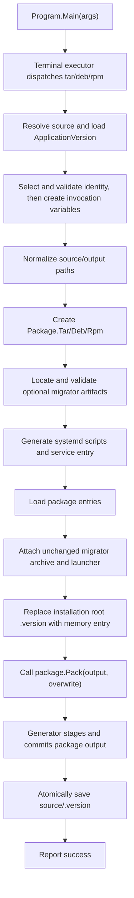

# Zongsoft.Tools.Packager implementation

[English](implementation.md) | [简体中文](implementation.zh-Hans.md)

This document is for maintainers. It describes the source structure, command pipeline, package model, file collection rules, systemd script generation, and current implementations of the `.tar.gz`, `.deb`, and `.rpm` formats.

For installation, configuration, and release workflows, see the [packager README](../README.md).

Application examples use the real [Zongsoft.Hosting.Web](https://github.com/Zongsoft/hosting/tree/main/web/default) host. Staging directories, the Bash working directory, and example versions follow the [README quick start](../README.md#quick-start). The host DLL is `Zongsoft.Hosting.Web.dll`; `--daemon:zongsoft.web` selects the package and service identity. Root-path examples use hosting's `.deploy/default/nginx/zongsoft.web.conf`.

## Design goals

`Zongsoft.Tools.Packager` generates Linux application packages in .NET, minimizing build-time dependencies on platform packaging tools.

The main design choices are:

- Expose one `dotnet-pack` entry point with `tar`, `deb`, and `rpm` subcommands.
- Share application metadata, variable expansion, file collection, script generation, and naming across formats.
- Use systemd as the default service model for .NET background and Web services.
- Write package primitives directly instead of invoking `tar`, `dpkg-deb`, `rpmbuild`, or `cpio`.
- Generate Linux packages on Windows, Linux, or macOS; preserve Unix permissions on Unix hosts and apply defaults on Windows.

## Source structure

| File | Responsibility |
| --- | --- |
| `Program.cs` | Initialize the terminal command tree and register `TarCommand`, `DebCommand`, and `RpmCommand`. |
| `PackCommand.Version.cs` | The nested `VersionFile` reads the source version, validates identity, selects an Edition, and saves after success. |
| `PackCommand.cs` | Template-method base for all three commands; declare common options and coordinate execution. |
| `PackCommand.Tar.cs` | Create `Package.Tar`. |
| `PackCommand.Deb.cs` | Create `Package.Deb`. |
| `PackCommand.Rpm.cs` | Create `Package.Rpm` and parse RPM-specific `provides` and `conflicts`. |
| `Package.cs` | Package, installation-script, and entry models, plus file collection. |
| `Package.Tar.cs` | Default installation path, filename, and entry point for `.tar.gz`. |
| `Package.Deb.cs` | Default installation path, filename, and entry point for `.deb`. |
| `Package.Rpm.cs` | Default installation path, filename, and RPM-specific properties. |
| `Generator.cs` | Compute generator identity from the current assembly for metadata in all three formats. |
| `Generator.Tar.cs` | Write gzip PAX tar, `install.sh`, and `uninstall.sh`. |
| `Generator.Deb.cs` | Write the Debian `ar` container, `control.tar.gz`, and `data.tar.gz`. |
| `Generator.Rpm.cs` | Write the RPM lead, signature/header, metadata header, and gzip cpio payload. |
| `Migrator.cs` | Locate external migration artifacts by final application identity, validate PAX metadata, attach unchanged files, and provide installation coordination scripts. |
| `Scriptor.Systemd.cs` | Generate or collect systemd units and generate installation/uninstallation scripts. |
| `Normalizer.cs` / `TextSource.cs` | Expand variables on demand and resolve files under the source directory or literal text. |
| `Utility.Search` / `Generator.Entries.cs` | Match path segments, handle directory metadata, and manage temporary payload streams. |
| `Variables.cs` | Variable collection and typed accessors for common variables. |
| `Utility.cs` | RID, installation path, path normalization, Unix timestamps, and file permissions. |
| `Dumper.cs` | Console splash, error, and warning output. |
| Linked `tools/.shared` source | `Utility.cs` compiles with this project's `partial Utility`, sharing recursive variables and command/text helpers. `ArtifactPublisher` manages staging and publication: atomic replacement for single files, grouped commit and recovery for multiple files. Boolean switches use Core `Switch`; enums use Core conversion without checking whether a member is defined. No shared DLL is produced. |

## Execution pipeline

Command structure:

```text
dotnet-pack
├── tar
├── deb
└── rpm
```

`PackCommand<TPackage>.OnExecuteAsync()` coordinates the pipeline:


```mermaid
flowchart TD
    A["Program.Main(args)"] --> B["Terminal executor dispatches tar/deb/rpm"]
    B --> C["Resolve source and load ApplicationVersion"]
    C --> D["Select and validate identity, then create invocation variables"]
    D --> E["Normalize source/output paths"]
    E --> F["Create Package.Tar/Deb/Rpm"]
    F --> M["Locate and validate optional migrator artifacts"]
    M --> G["Generate systemd scripts and service entry"]
    G --> H["Load package entries"]
    H --> N["Attach unchanged migrator archive and launcher"]
    N --> V["Replace installation root .version with memory entry"]
    V --> I["Call package.Pack(output, overwrite)"]
    I --> J["Generator stages and commits package output"]
    J --> S["Atomically save source/.version"]
    S --> OK["Report success"]
```

`PackCommand<TPackage>` performs common work; subclasses create the concrete `Package`:

```csharp
protected override Package.Deb CreatePackage(CommandContext context)
```

`RpmCommand` also reads:

- `--provides`
- `--conflicts`

These options are split on commas or semicolons and written into the RPM metadata header.

## Source and packaged versions

The packager reads only `.version` directly under `--source`, without recursive or ancestor lookup. `ApplicationVersion.Load/Save` manages the application's name and Edition versions. The hosting daemon without named editions can use:

```text
zongsoft.daemon@1.0.0
```

For the `web/default` host without named editions, use `Zongsoft.Hosting.Web@1.0.0`. With editions, put only the application name on the first line, followed by a bare version in each `[edition]` section. These source formats cannot be mixed.

- Missing or blank `--name` uses the source name. A supplied name must match case-insensitively; the source spelling is retained.
- Missing or empty `--edition` selects the top-level version if there are no named editions, or the only edition if exactly one exists. Multiple editions require an explicit selection. A supplied edition must exist, ignoring case; its spelling is retained. A source with only a top-level version rejects a named selection.
- `--version` overrides the selected version; otherwise the stored version is used. The final version must be nonzero. Without a source file, valid `--name` and `--version` are required; the optional Edition determines whether to create a single-version or named-edition file.

Complete variables are initialized only after identity is resolved. `$(name)`, `$(edition)`, and `$(version)` in output paths, payload selections, scripts, and migration paths therefore use final values. A source path depending on an identity variable not yet known fails with a variable diagnostic; the source is not inferred recursively. Invalid or unreadable source files stop packaging.

The installation-root `.version` uses **`ApplicationIdentifier`**, representing only the selected name, Edition, and version on one line. Its in-memory bytes are exactly those from `ApplicationIdentifier.Save(Stream)`, without an added newline, with mode `0644`. It replaces payload entries targeting the same installation location and is not removed by exclusions.

Only after every packaging step succeeds is the source saved in Core format. Only the selected Edition is updated; other Edition names, versions, and order remain. Comments and original whitespace are not preserved. Parsing, validation, or packaging failures leave the source unchanged. A source save failure returns an error identifying the already generated package and retains that package.

If an output artifact already exists and `--overwrite` is disabled, the publisher identifies the conflicting file, and the command reports its full path with guidance to use `--overwrite` or another `--output` directory. This applies to both the archive and the companion tar installer; the existing artifact and source version remain unchanged.

`Package.Entry` supports byte content internally, copies the supplied bytes, and sets `Size` to their actual length. `OpenRead()` returns an independent read-only stream for memory entries and opens `Source` for ordinary files. Tar/deb payloads, RPM SHA-256 hashes, and cpio payloads all read through this method; repeated reads are independent. The version entry is written to memory with `ApplicationIdentifier.Save(Stream)`, without appending or converting content or creating a temporary file. Its timestamp is the generation time.

`EntryCollection.SetVersion` runs after payload and migration collection, writes the unique version entry, and removes rooted aliases targeting the same installation-root path. Other `.version` files in subdirectories are unaffected. `VersionFile.Load(source, name, edition, version)` determines option presence from values, without separate Boolean flags: blank names count as absent; `version == null` uses the selected source version. It prepares the full save model in memory without writing during load. The packager explicitly opens/creates the source file and passes streams to `ApplicationVersion.Load(Stream)` / `Save(Stream)`, ensuring only the immediate `.version` is accessed. A missing file is created on save; a directory at that path or an I/O failure is rejected. Core path-overload directory detection and missing-path skipping are not used. `Save` runs only after `Pack` returns, including successful generation of the companion tar installer. A save failure throws an I/O exception containing package and source paths, returns a nonzero exit code, and suppresses overall success output.

Local validation can package current Core source at the same version and restore `Zongsoft.Core` through an isolated cache and package-source mapping, without adding cross-repository project references or changing Core APIs.

## Command option model

Required and conditionally required options:

| Option | Type | Description |
| --- | --- | --- |
| `--name` | `string` | Required without a source version file; otherwise validate against or use the source name. |
| `--version` | `string` | Expand, then convert to `System.Version`; required without a source file, otherwise override the selected version. The final version must be nonzero. |
| `--platform` | `string` | Expand, then convert to `Platform` to select the target platform. |
| `--framework` | `string` | Target framework, such as `net8.0`, `net9.0`, or `net10.0`. |

Common optional settings:

| Option | Default | Description |
| --- | --- | --- |
| `--source` | Current directory | Input directory. |
| `--migrator` | Empty | Original migration input name, optionally with a directory; bare names search source and ancestors using final Edition, Version, and Runtime. |
| `--output` | `source` | Always an output directory; relative paths use `source`. A filename cannot be specified. |
| `--exclude` | Empty | Comma- or semicolon-separated patterns skipped during entry collection. |
| `--edition` | Empty | Package Edition/channel, included in the package name and used as RPM release. |
| `--compilation` | `Release` | Configuration used to locate the host. |
| `--architecture` | `x64` | Target architecture. |
| `--overwrite` | `false` | Replace existing output files. |
| `--install-path` | Derived from package identity | Installation directory. |
| `--title` | Empty | Human-readable title. |
| `--summary` | Empty | Short description or file path. |
| `--description` | Empty | Long description or file path. |
| `--url` | `https://github.com/Zongsoft` | Project homepage. |
| `--license` | Empty | License text. |
| `--category` | Format default | Debian `Section` or RPM `Group`. |
| `--maintainer` | `Zongsoft Studio <zongsoft@gmail.com>` | Maintainer/vendor. |
| `--dependencies` | Empty | Dependency list. |

Systemd and lifecycle options:

| Option | Description |
| --- | --- |
| `--listen` | Bind address passed to `--urls` in generated services; a numeric value becomes `http://127.0.0.1:<port>`. |
| `--daemon` | Systemd unit filename/identity; `none`, `disable`, and `disabled` disable it. |
| `--daemon-environments` | Comma- or semicolon-separated variable names written into the generated service. |
| `--installing` / `--installed` | Before/after installation scripts. |
| `--uninstalling` / `--uninstalled` | Before/after uninstallation scripts. |
| `--preinstalling` / `--postinstalling` | Prepend/append to `installing`. |
| `--preinstalled` / `--postinstalled` | Prepend/append to `installed`. |
| `--preuninstalling` / `--postuninstalling` | Prepend/append to `uninstalling`. |
| `--preuninstalled` / `--postuninstalled` | Prepend/append to `uninstalled`. |

## Variables and normalization

### Variable sources

`PackCommand<TPackage>.GetVariables(context, directory)` loads descriptor defaults, environment variables, ancestor `.env` files for the supplied directory, and explicit command options, including extra options. Omitting `directory` skips `.env` loading for the initial source resolution. After verifying and resolving the source directory to an absolute path, variables are reloaded and source is fixed; `.env` does not determine source retroactively. Names are case-insensitive. Precedence is explicit options > nearer `.env` > farther `.env` > environment > defaults.

Shared `Utility.LoadEnvironmentVariables` reads each immediate `.env` from the filesystem root down to source, without searching child directories. `Profile.Load` preserves Core empty-value and import semantics; section levels and entry names join with underscores. Read/parse failures stop packaging; only missing files are skipped. Process environment variables are not changed.

`PackCommand` creates an invocation-local `Variables` view and passes it to packages, scripts, and text sources. It keeps no process-wide variable state. References expand recursively when accessed; unused unknown references do not prevent packaging. Unknown variables, cycles, and expansion deeper than 64 levels fail with a diagnostic naming the variable. Expansion itself does not read files.

Core command descriptors retain options that may contain variables as strings. `source` expands first using the complete raw variable set. Explicit `name`, `edition`, and `version` then expand; `version` is converted to `System.Version` for source `.version` selection. After identity is finalized, `platform`, `architecture`, and `overwrite` expand and convert when used. Bare `--overwrite` remains true; omission defaults to false.

Identity still comes from the source `.version` and explicit name/edition/version options; same-named environment or `.env` variables do not implicitly replace identity. Explicit options may reference other `.env` variables. Final identity and resolved source/output overwrite the variable collection. `--migrator` requires explicit activation; `--overwrite` can come from the environment or `.env` and be overridden on the command line.

### Variable syntax

`Normalizer` accepts:

```text
$(name)
%name%
```

Example:

```bash
export APP_NAME=Zongsoft.Hosting.Web
export APP_VERSION=1.0.0

dotnet-pack deb \
  --listen:8069 \
  --daemon:zongsoft.web \
  --name:"$APP_NAME" \
  --version:"$APP_VERSION" \
  --platform:linux \
  --framework:net10.0 \
  --source:./publish \
  --output:../packages/
```

Bash expands the identity options in this example. `--version` enters `OnExecuteAsync` as a string and becomes `System.Version` only after expansion; name and Edition are validated from supplied values. Packager expressions can also appear in subsequent paths, text, and migration configuration.

Unknown variables in source paths, output, payload, exclusions, text, or migration input fail; unused variables remain unexpanded. The result of `Normalizer.Normalize` can indicate failure, and callers must not treat failed results as valid input.

### Text and files

`TextSource.Read(source, value, variables, fileOnly)` handles summary, description, and lifecycle hooks:

- `text:` returns the following content literally, including shell `$(...)`, `%...%`, or path-like text.
- `file:` expands the following path and reads it as an absolute path or relative to source; a missing file fails.
- Without a prefix, expand variables first. Multiline values are text; existing files are read relative to source; clearly missing paths fail; other single-line values are text. Prefixes remove ambiguity.
- File content is neither expanded nor interpreted again as another file path.
- Pre/post hooks are file lists separated by `;` or `|`. Each item may use `file:`, but not `text:`. Filenames cannot contain these list separators.

## Package model

The abstract `Package` class holds metadata shared by all formats:

- `Name`
- `PackageIdentity`
- `PackageName`
- `Edition`
- `Version`
- `Platform`
- `Architecture`
- `Runtime`
- `Framework`
- `Title`
- `Summary`
- `Description`
- `Maintainer`
- `License`
- `Url`
- `Category`
- `InstallPath`
- `Dependencies`
- `Entries`
- `Scripts`
- `Migrator`

Package names follow:

```text
identity
identity-edition
```

`identity` defaults to `name`. A supplied, enabled `--daemon` instead uses the filename part of the daemon identity, removing an optional `.service` suffix.

`Package.GetFileName` generates output filenames for all three formats. Here `name` means the package `identity`, including the daemon precedence above:

```text
<name>@<version>-<architecture>.<extension>
<name>-<edition>@<version>-<architecture>.<extension>
```

Examples:

```text
zongsoft.web@1.0.0-x64.deb
zongsoft.web-enterprise@1.0.0-x64.rpm
```

Architecture uses `Architecture.ToString().ToLowerInvariant()`, such as `x64` or `arm64`. Extensions are `tar.gz`, `deb`, and `rpm`; filenames contain name, optional Edition, version, and architecture. The tar `.sh` entry uses the same stem. Runtime Identifier matches migration artifacts and is not part of installation-package filenames.

### Runtime Identifier

`Utility.GetRuntimeIdentifier()` combines platform and architecture:

```text
linux + x64   => linux-x64
linux + arm64 => linux-arm64
windows + x64 => win-x64
windows       => win
```

`Platform.Windows` declares `[Alias("Win")]` for command parsing; `Win` is not a separate enum member.

### Default installation path

`Utility.Unix.GetInstallPath(identity)` derives the default installation path:

```text
Zongsoft.Hosting.Web => /opt/zongsoft/hosting/web
zongsoft.web         => /opt/zongsoft/web
```

Rules:

- An empty name returns `/opt`.
- Lowercase the name.
- Replace every dot with `/` to form nested directories.
- Without dots, use `/opt/<name>`.
- The Web example sets `--daemon:zongsoft.web`, yielding `/opt/zongsoft/web`; `--name:Zongsoft.Hosting.Web` still locates the host DLL.

## Loading package entries

`Package.EntryCollection` loads entries.

### Default collection

With no positional arguments:

```text
Recursively collect all files under source
entryName = file path relative to source
```

For `.deb` and `.rpm`, the installation path prefixes `entryName`:

```text
InstallPath = /opt/zongsoft/web
EntryName   = opt/zongsoft/web/Zongsoft.Hosting.Web.dll
```

For `.tar.gz`, `EntryPrefix` is `null`: application files stay at the archive root, and `install.sh` copies them to the destination during installation.

### Explicit collection

Positional arguments use:

```text
path
path:alias
```

Parsing rules:

- Split path and alias at the last colon.
- A Windows drive-letter colon such as `C:` is not an alias separator.
- Relative paths use `source`.
- Absolute paths may be outside `source`; without an alias, only the filename is used in the package.
- Directories expand recursively and are entries themselves, preserving empty directories and source modes (0755 by default on Windows). Directory alias `:~` normalizes to an empty path, placing content directly at the installation root; hosting payload arguments use this form.
- Core `Searcher` supports `*` and `?` in any path segment; a standalone `**` matches zero or more directory levels. Results at each argument position are sorted Ordinal by paths relative to the fixed prefix, with `/` separators; the complete input sequence is not reordered. Windows matching is case-insensitive, Unix matching case-sensitive.
- Duplicate target paths produce a conflict warning and are skipped.

### Exclusions

`--exclude` applies during `Package.EntryCollection.Load()`:

- Split patterns on commas or semicolons.
- Expand variables, then normalize path separators to `/`.
- Relative patterns use `source`; matching considers the relative source path, final package path, and filename.
- Support `*`, `?`, and `**`; directory patterns such as `logs/` mean `logs/**`.
- Matching files are skipped without duplicate-entry warnings.
- Generated/attached systemd service files and the generated `.version` bypass this filter.

### Root-path aliases

An alias beginning with `/` or `\` marks an entry as `Rooted`.

Example:

```bash
dotnet-pack deb \
  --name:zongsoft.hosting.web \
  --daemon:none \
  --version:1.0.0 \
  --platform:linux \
  --framework:net10.0 \
  --source:./publish \
  --output:../packages/ \
  ../.deploy/default/nginx/zongsoft.web.conf:/etc/nginx/conf.d/zongsoft.web.conf
```

Handling by format:

| Format | Behavior |
| --- | --- |
| `.deb` | Payload path `etc/nginx/conf.d/zongsoft.web.conf` installs at `/etc/nginx/conf.d/zongsoft.web.conf`; rooted files under `/etc` enter `conffiles`. |
| `.rpm` | Payload path `/etc/nginx/conf.d/zongsoft.web.conf` is marked as a configuration file in the RPM header. |
| `.tar.gz` | Store at `.root/etc/nginx/conf.d/zongsoft.web.conf`; `install.sh` copies it to `${DESTDIR}/etc/nginx/conf.d/zongsoft.web.conf`. |

### File permissions

On Unix-like hosts:

```text
File.GetUnixFileMode(path) & rwx mask
```

On Windows, or when usable permissions cannot be read:

- `.sh`, `.dll`, `.exe`, and extensionless files use `0755`.
- Other files use `0644`.

## Systemd generator

All three package types currently use `Scriptor.Systemd`.

A supplied, enabled `--daemon` overrides only the package filename, system package name, and default installation path. `Package.Name` retains `--name` to locate the .NET host DLL.

### Service file resolution

An empty `--daemon` defaults to lowercase `Package.Name` as the service identity, without Edition.

The flow is:

1. Disable service generation for `--daemon:none`, `--daemon:disable`, or `--daemon:disabled`.
2. Otherwise look under `source` for the file specified by `--daemon`.
3. If it exists, add it to package entries.
4. Otherwise generate the `.service` file in memory and add it, without a fixed temporary path. Validate the service filename before adding the entry.

### Host lookup

Generating a `.service` requires locating the .NET host, in this order:

1. `<source>/<name>.dll`
2. `<source>/bin/<compilation>/<framework>/<name>.dll`
3. The unique `.exe` under `<source>`, inferring a same-named `.dll`
4. The unique `.exe` under `<source>/bin/<compilation>/<framework>`, inferring a same-named `.dll`

A failed lookup reports:

```text
The daemon host location failed.
```

### Generated service content

A regular service:

```ini
[Unit]
Description=<title-or-name>

[Service]
Type=simple
WorkingDirectory=<install-path>
ExecStartPre=mkdir -p <install-path>/logs
ExecStart=dotnet <install-path>/<host>
Restart=on-failure
RestartSec=10
KillSignal=SIGINT
SyslogIdentifier=<package-identity>
DynamicUser=no
PrivateTmp=no
ReadWritePaths=<install-path> <install-path>/logs /tmp

Environment=DOTNET_NOLOGO=true
<custom-environment-lines>

[Install]
WantedBy=multi-user.target
```

`Variables.Listen` supplies the bind value. Multiple complete URLs separated by semicolons are retained as one `--urls` value. HTTP and HTTPS can be combined; the host configures the default HTTPS server certificate. Omitting the option adds no `--urls`; an existing service's ExecStart is not rewritten.

A nonempty `--listen` produces:

```ini
ExecStart=dotnet <install-path>/<host> --urls <bind>
```

A numeric bind value becomes:

```text
http://127.0.0.1:<port>
```

### Lifecycle scripts

Script model mapping:

| `Package.InstallScripts` | Debian file | RPM tag | Tar path |
| --- | --- | --- | --- |
| `Installing` | `preinst` | `1023` | Merged into `install.sh` |
| `Installed` | `postinst` | `1024` | Merged into `install.sh` |
| `Uninstalling` | `prerm` | `1025` | Merged into `uninstall.sh` |
| `Uninstalled` | `postrm` | `1026` | Merged into `uninstall.sh` |

Without supplied scripts, defaults are:

- Stop the same-named systemd service before installation.
- Create `/etc/systemd/system/<service>` as a symbolic link after installation.
- Run `systemctl daemon-reload`, `systemctl enable`, and `systemctl start` afterward.
- Disable and stop the service before uninstallation.
- Remove the service link, reload systemd, and remove the installation directory after uninstallation.

With systemd disabled, default scripts become no-ops except that uninstallation still removes the installation directory.

Each format guards uninstallation differently:

- Debian `prerm` runs `Uninstalling` only for `remove` or `deconfigure`; `postrm` runs `Uninstalled` only for `remove` or `purge`. `upgrade`, `failed-upgrade`, `abort-install`, `abort-upgrade`, and `disappear` do not run uninstall cleanup.
- RPM `%preun` and `%postun` run uninstall scripts only when `$1=0`, meaning the last installed instance is being removed. `$1>0` preserves the installed payload.
- Tar enters uninstallation only through explicit `uninstall.sh` execution. The generator removes the resolved `TARGET`; the default `Uninstalled` script performs no additional directory deletion.

## Packager version metadata

Each package records the generator identity, logically `Packager:Zongsoft.Tools.Packager@<assembly-version>`. The value is `assembly-name@version`, read from the packager assembly independently of the host application version. No additional option or migration configuration is required.

| Format | Location | Inspection |
| --- | --- | --- |
| tar.gz | PAX global extended attribute `Packager` | A PAX-aware reader, such as Python `tarfile` and `pax_headers["Packager"]`. |
| deb | `Packager` field in `control` inside `control.tar.gz` | `dpkg-deb -f <package.deb> Packager` |
| rpm | Main header string tag `RPMVERSION` (1064) | `rpm -qp --queryformat '%{RPMVERSION}\n' <package.rpm>` |

RPM uses the generator-version tag for this identity; `PACKAGER` (1015) retains the `--maintainer` value. Format-header metadata adds no installed file and changes neither `.version` nor `migration.json`.

`Generator.GetIdentity` reads the assembly's simple name and `Version` with `Assembly.GetName()`, retaining the complete version text without hard-coding a tool version. All three generators call the same method, rather than reading the calling process or host assembly version. RPM's main-header digest covers the tag.

Tar writes a `PaxGlobalExtendedAttributesTarEntry`, not a `Package.Entries` item. Deb writes a control field; RPM writes tag 1064 without replacing the maintainer field. See the [RPM tag reference](https://rpm-software-management.github.io/rpm/manual/tags.html) and [PAX constructor reference](https://learn.microsoft.com/en-us/dotnet/api/system.formats.tar.paxglobalextendedattributestarentry.-ctor).

## `.tar.gz` implementation

Implementation: `Generator.Tar.cs`.

### Format overview

`.tar.gz` is:

```text
gzip(tar archive)
```

The implementation uses .NET `System.Formats.Tar`:

```csharp
new TarWriter(gzip, TarEntryFormat.Pax, false)
```

Entries therefore use PAX tar, supporting longer paths and extended metadata.

Generation also writes a companion `.sh` installer into the output directory:

```text
zongsoft.web@1.0.0-x64.tar.gz
zongsoft.web@1.0.0-x64.sh
```

The launcher locates the adjacent `.tar.gz`, extracts it to a temporary directory, and invokes its `install.sh`.

### Archive structure

```text
<application files>
.root/<rooted files>
install.sh
uninstall.sh
```

A `Packager` PAX global extended record starts the archive; it is not an installed file. Rooted files enter `.root/` only when root-path aliases exist. Lifecycle content is written into `install.sh` and `uninstall.sh`.

### File entries

Application files use:

```text
TarEntryType.RegularFile
name = entry.EntryName
mode = entry.Mode
mtime = entry.ModifiedTime
data = entry.OpenRead()
```

Rooted files use:

```text
name = .root/<entry.EntryName>
```

### install.sh / uninstall.sh

`install.sh` is a self-contained installer with mode `0755`. `uninstall.sh` is a self-contained uninstaller with mode `0755`, copied into the installation directory during installation.

Supported behavior:

- Default installation.
- Uninstallation by running `uninstall.sh` in the installation directory.
- `INSTALL_PATH` overrides for ordinary packages; actual installation of migration-enabled packages validates the fixed path.
- Staging with `DESTDIR`.
- Running merged lifecycle scripts.
- Installing and removing rooted files.

Installation flow:

```text
SOURCE_DIR = directory containing install.sh
INSTALL_PATH = environment override or package default
DESTDIR = optional staging directory
TARGET = DESTDIR + INSTALL_PATH
Run Installing content when DESTDIR is empty
Create TARGET
Copy ordinary archive files to TARGET
Copy uninstall.sh to TARGET
Copy rooted files to DESTDIR + /<root-path>
Run Installed content when DESTDIR is empty
```

Uninstallation flow:

```text
Run Uninstalling content when DESTDIR is empty
rm -rf TARGET
Remove rooted files
Run Uninstalled content when DESTDIR is empty
```

## `.deb` implementation

Implementation: `Generator.Deb.cs`.

### Debian binary package overview

A Debian binary package is a Unix `ar` container using format version `2.0`.

Members are:

```text
debian-binary
control.tar.gz
data.tar.gz
```

### ar container

The file starts with the global header:

```text
!<arch>\n
```

Each member has a 60-byte ASCII header:

```text
name/ timestamp uid gid mode size `\n
```

The implementation uses:

- `uid = 0`
- `gid = 0`
- `mode = 100644`
- One newline padding byte after an odd-sized member, so the next member starts on an even boundary.

### debian-binary

Fixed content:

```text
2.0\n
```

### control.tar.gz

This gzip + Ustar tar contains:

```text
control
preinst
postinst
prerm
postrm
conffiles
```

Details:

- `control` uses mode `0644`.
- Maintainer scripts are included only when nonempty, with mode `0755`.
- Scripts receive `#!/bin/sh` and `set -e` automatically.
- `conffiles` is included only when rooted files exist under `/etc/`.

### Control fields

Generated fields:

```text
Package: <package-name>
Version: <version>
Packager: <assembly-name>@<packager-version>
Section: <category-or-utils>
Priority: optional
Architecture: <debian-architecture>
Installed-Size: <payload-size-in-KiB>
Maintainer: <maintainer>
Homepage: <url>
License: <license>
Depends: <dependencies>
Description: <summary-or-title-or-name>
 <long-description-line>
 .
 <long-description-line>
```

Details:

- `Depends` is omitted when empty.
- The first `Description` line is the short description.
- Every long-description line starts with one space.
- Blank lines become ` .`.
- `License` and `Packager` are additional fields. `Packager`, application `Version`, and `Maintainer` hold distinct information.

### Debian architecture mapping

| .NET `Architecture` | Debian architecture |
| --- | --- |
| `X64` | `amd64` |
| `X86` | `i386` |
| `Arm64` | `arm64` |
| `Arm` | `armhf` |
| Other | `all` |

### data.tar.gz

The payload uses gzip + Ustar tar. Directory entries precede ordinary files, which are read through `OpenRead()`. Explicit directories retain modes and timestamps; synthesized parents use 0755. Directories have no content streams and are not written to conffiles.

For non-rooted entries, `.deb` uses the installation path without its leading `/` as `EntryPrefix`:

```text
InstallPath = /opt/zongsoft/web
EntryName   = opt/zongsoft/web/Zongsoft.Hosting.Web.dll
```

After extraction:

```text
/opt/zongsoft/web/Zongsoft.Hosting.Web.dll
```

Rooted entries skip the prefix:

```text
Alias     = /etc/nginx/conf.d/zongsoft.web.conf
EntryName = etc/nginx/conf.d/zongsoft.web.conf
```

Installed location:

```text
/etc/nginx/conf.d/zongsoft.web.conf
```

## `.rpm` implementation

Implementation: `Generator.Rpm.cs`.

### RPM file overview

Logical sections:

```text
Lead
Signature
Header
Payload
```

The implementation writes:

```text
lead
signature header
metadata header
gzip(newc cpio payload)
```

It does not generate GPG/PGP signatures; only basic signature tags such as package-body size and MD5 digest are written.

### Lead

The lead is 96 bytes:

| Offset | Content |
| --- | --- |
| `0..3` | RPM magic: `ed ab ee db` |
| `4` | Major version: `3` |
| `5` | Minor version: `0` |
| `6..7` | Package type: binary package |
| `8..9` | Architecture number |
| `10..75` | `<package-name>-<version>`, at most 65 ASCII bytes followed by NUL |
| `76..77` | OS number: Linux |
| `78..79` | Signature type: header-style signature |

Lead architecture numbers:

| .NET `Architecture` | RPM lead architecture number |
| --- | --- |
| `X64` | `1` |
| `X86` | `1` |
| `Arm64` | `12` |
| `Arm` | `12` |
| Other | `255` |

### Header encoding

RPM header layout:

```text
magic/version/reserved
index count
store size
index entries
store bytes
padding to 8 bytes (signature header only)
```

An index entry:

```text
tag    int32 big-endian
type   int32 big-endian
offset int32 big-endian
count  int32 big-endian
```

Supported types:

| Type | Meaning |
| --- | --- |
| `3` | int16 array |
| `4` | int32 array |
| `6` | string |
| `7` | binary |
| `8` | string array |
| `9` | international string |

Numbers are big-endian; strings are UTF-8 with a terminating `NUL`.

### Signature Header

The signature section uses the same index/store structure as the RPM header.

Only the signature header is padded to an 8-byte boundary. The compressed payload follows the main metadata header's store immediately. Padding there may allow RPM queries to succeed but cause rpm2cpio to read zero bytes before gzip and fail extraction.

Written tags:

| Tag | Content |
| --- | --- |
| `62` | Immutable signature region, BIN type, 16-byte trailer. |
| `269` | SHA-1 digest of the metadata header. |
| `273` | SHA-256 digest of the metadata header. |
| `1000` | Byte length of metadata header + payload. |
| `1004` | MD5 digest of metadata header + payload. |

The signature section ends on an 8-byte boundary. Both headers write indexes in ascending tag order; the main header's immutable-region tag is `63`. The region trailer sits at the end of the store, with a negative offset representing the region index byte count. Digests cover the complete metadata header, including magic, indexes, store, and trailer. These are integrity digests, not a publisher OpenPGP signature. See [RPM V4 format](https://rpm-software-management.github.io/rpm/manual/format_v4.html) and [header structure](https://rpm-software-management.github.io/rpm/manual/format_header.html).

### Metadata Header

Main contents:

- Package name, version, and release.
- Summary, description, build time, and build host.
- Package size, license, maintainer, category, and URL.
- OS and architecture.
- Installation/uninstallation scripts.
- File sizes, modes, mtimes, digests, usernames, group names, and configuration flags.
- Payload format, compressor, and compression level.
- Requires, Provides, and Conflicts.
- The dirname, basename, and dirindex path tables.

Common tags:

| Tag | Written content |
| --- | --- |
| `1000` | Package name. |
| `1001` | Version. |
| `1002` | Release: `1` without Edition, otherwise Edition. |
| `1004` | Summary. |
| `1005` | Description. |
| `1006` | Build time. |
| `1007` | Build host. |
| `1009` | Installed size. |
| `1014` | License. |
| `1015` | Maintainer/packager. |
| `1016` | Group. |
| `1020` | URL. |
| `1021` | OS, fixed to `linux`. |
| `1022` | RPM architecture. |
| `1023..1026` | Pre/post install and pre/post uninstall scripts. |
| `1028` | File-size array. |
| `1030` | File-mode array. |
| `1034` | File-modification-time array. |
| `1035` | File SHA-256 digest array. |
| `1037` | File flags; rooted files under `/etc` are configuration files. |
| `1039` / `1040` | User/group names, fixed to `root`. |
| `1048..1050` | Requires flags/name/version. |
| `1047`, `1112`, `1113` | Provides name/flags/version. |
| `1053..1055` | Conflicts flags/name/version. |
| `1056` | Install prefix. |
| `1064` | Generator identity, `assembly-name@version`. |
| `1116..1118` | File directory indexes, basenames, and directory names. |
| `1124` | Payload format, fixed to `cpio`. |
| `1125` | Payload compressor, fixed to `gzip`. |
| `1126` | Payload flags, fixed to `9`. |
| `5011` | File digest algorithm, `8` (SHA-256). |
| `5092` / `5093` | Compressed-payload SHA-256 digest / algorithm `8`. |

### RPM architecture mapping

| .NET `Architecture` | RPM architecture |
| --- | --- |
| `X64` | `x86_64` |
| `X86` | `i386` |
| `Arm64` | `aarch64` |
| `Arm` | `armv7hl` |
| Other | `noarch` |

### Requires, Provides, and Conflicts

Supported relationship expressions:

```text
name
name = version
name >= version
name <= version
name > version
name < version
name(= version)
name(>= version)
```

Relationship flags:

| Operator | Flags |
| --- | --- |
| `<` | `RPM_SENSE_LESS` |
| `>` | `RPM_SENSE_GREATER` |
| `=` | `RPM_SENSE_EQUAL` |
| `<=` | `LESS \| EQUAL` |
| `>=` | `GREATER \| EQUAL` |

Default Requires:

```text
rpmlib(CompressedFileNames) <= 3.0.4-1
rpmlib(FileDigests) <= 4.6.0-1
rpmlib(PayloadFilesHavePrefix) <= 4.0-1
```

Default Provides:

```text
<package-name> = <version>-<release>
```

### Payload

The payload is a gzip-compressed ASCII `cpio` newc archive. Header magic:

```text
070701
```

Generation proceeds as follows:

1. Collect directories from file paths, including at least `/`.
2. Write directory cpio entries with mode `0040000 | entry.Mode`; preserve source-directory modes and use 0755 for synthesized parents. Header and cpio use the same directory metadata.
3. Write file cpio entries with `.` prefixed to the absolute RPM path, such as `./opt/zongsoft/web/Zongsoft.Hosting.Web.dll`.
4. Use file mode `0100000 | entry.Mode`.
5. Write the terminating `TRAILER!!!` entry.
6. Pad uncompressed cpio data to a 512-byte boundary.
7. Compress with gzip.

The RPM header also stores file metadata for package-manager queries and validation.

## Comparing the three formats

| Feature | `.tar.gz` | `.deb` | `.rpm` |
| --- | --- | --- | --- |
| Outer container | gzip tar | Unix ar | RPM lead/signature/header |
| File payload | PAX tar | `data.tar.gz` | gzip newc cpio |
| Control metadata | PAX global attributes; `install.sh` and `uninstall.sh` | `control.tar.gz` | RPM metadata header |
| Lifecycle scripts | Merged into `install.sh` / `uninstall.sh` | `preinst/postinst/prerm/postrm` | Header script tags |
| Package-manager installation | No | `dpkg`/`apt` | `rpm`/`dnf`/`yum` |
| Default installation path | Copied by `install.sh` | Encoded in payload paths | Encoded in payload/header paths |
| Root alias | `.root/` + installer | Installed directly at root paths | Installed directly at root paths |
| Configuration flags | No package-manager flags | Rooted `/etc` files enter `conffiles` | Rooted `/etc` files receive config flags |
| Signatures | None | None | No GPG/PGP, only basic digests |

## Local searches and source links

Core Searcher handles local patterns. Results preserve logical names while reading actual targets. A selected directory link can expand as a payload root; internal directory links are skipped, and file links retain their original names while reading target content. Recursive patterns do not traverse directory links to match subsequent segments. Selected dangling or cyclic links fail before output writes; destination-path validation still applies.

Payload-relative paths use source. Each pattern's results are sorted Ordinal by logical relative path, preserving argument order. See [Core local searches](../../../framework/Zongsoft.Core/docs/searcher.md).

`Searcher.Search` selects files, directories, or both through `Searcher.Target` (Both by default). `Match.Origin` supplies the logical fixed directory prefix for relative output paths.

## Payload streams and directory entries

`Package.Entry.IsDirectory` distinguishes directories from files. Directories have no content stream and zero size. Generators fill in parent directories and reject file/directory target conflicts. Source links retain logical names while reading target content; selected directory links can be payload roots, but internal directory links are skipped. Target paths cannot contain `..`, newlines, or NUL. Tar creates rooted directories with `install -d` and their modes. Uninstallation uses `rmdir` only for explicit directories, preserves nonempty directories, and does not explicitly remove synthesized shared parents.

Debian control/data gzip tars use separate controlled temporary files, and ar streams them using actual lengths. RPM's uncompressed cpio and gzip payload use temporary files; compressed-payload SHA-256 and main-header + payload MD5 are computed through streams. Headers and payload are then written sequentially, avoiding full-package byte arrays. Small version content and header metadata remain in memory: metadata allocation grows with entry count, while payload allocation does not grow with file bytes. Temporary files use exclusive CreateNew and DeleteOnClose, with Unix mode 0600, and are released on success or failure. Sufficient temporary disk space is required; RPM peak usage includes both raw and compressed payloads. Existing integer size limits in RPM fields still apply.

## Debian relationship fields

`DebCommand` exposes `--provides`, `--replaces`, `--breaks`, `--conflicts`, `--recommends`, and `--suggests`, mapped to capitalized control fields. `--dependencies` writes Depends: for example, `--dependencies:"aspnetcore-runtime-10.0 (>= 10.0)"` produces `Depends: aspnetcore-runtime-10.0 (>= 10.0)`. RPM expressions without parentheses cannot be copied directly into Debian options. `Package.Deb` owns these rules and does not reuse the RPM parser. Lists split on commas or semicolons; relationships use parentheses, as in `name (>= version)`, with `<< <= = >= >>`. Depends/Recommends/Suggests allow `|` alternatives; Provides permits only `=` for version relationships. Empty fields are omitted. Invalid names, relationships, newlines, and NUL are rejected; binary control fields do not accept source-package architecture restrictions or build-profile expressions. See [Debian Policy relationship fields](https://www.debian.org/doc/debian-policy/ch-relationships.html).

## Current implementation limits

- Debian control/data and RPM cpio payloads use gzip; xz/zstd are not supported.
- RPM is written directly, without rpmbuild, spec files, or GPG signatures.
- File owner/group are fixed to root; build-host UID/GID are not inherited, and custom ownership options are unavailable.
- Systemd is the only script-generation strategy.
- File links read target content; selected directory links may expand, internal directory links are skipped, and symbolic links themselves are not preserved.
- Large packages depend on available temporary disk space and retain container-field size limits.

## Migration artifact integration

The independent [migrator tool](../../migrator/README.md) prepares migrations. Packager does not parse `.migration`/`.ini`, SQL, or execution plans, and does not carry its own native executor.

`--migrator` selects the original input name used during migration generation, optionally with a directory, such as `--migrator:../../packages/zongsoft`.

After variable expansion, a value without `/` or `\` searches from the final packaging source (`--source`) through parents to the filesystem root, without searching child directories. A value containing either separator selects an explicit directory: relative paths use source, absolute paths are used directly, and neither searches parents. `--migrator:zongsoft` enables ancestor lookup; `--migrator:./zongsoft` restricts lookup to source. Lookup starts at source, not the command's working directory.

Existing `-migrate`, `-migration`, `.migrate`, and `.migration` suffixes are recognized case-insensitively; otherwise `-migrate` is appended. Do not include Edition, version, RID, extension, wildcards, or path lists.

Artifacts match the installation package's final Edition, version, platform, and architecture, including values from the source `.version` and default x64. An absent Edition omits that segment. For enterprise, 1.0.0, Linux x64:

```text
zongsoft-migrate-enterprise@1.0.0_linux-x64.tar.gz
zongsoft-migrate-enterprise@1.0.0_linux-x64.sh
```

The migration name may differ from the host name, but Edition, version, and RID must match. Search continues to a parent only when both archive and script are absent. A partial pair fails immediately with the missing file's full path. A complete pair is immediately validated for archive metadata and RID; invalid metadata stops lookup. Both files must come from the same directory: no cross-directory pairing or substitution of versions, Editions, or architectures. When lookup reaches the root without a match, the diagnostic separates expected filenames from searched directories and lists directories on individually indented lines in search order. Shared `Utility.Indent` uses platform line endings and preserves nested indentation. An omitted, empty, or whitespace-only option disables migration integration and attaches no artifacts.

The unchanged files enter `.migration/` under the installation root without archive extraction; the script uses 0755 and archive 0600. Payload target conflicts fail. Installation calls the launcher with `apply` and `/var/lib/<package-name>/packager`; failure prevents startup. Systemd `ExecStartPre` calls the same launcher with `check`, which only compares completion markers without extraction or service connections. Migration runs even without a daemon; DESTDIR staging skips hooks. Uninstallation preserves state and databases/buckets. Targets need POSIX sh, tar/gzip, cmp, and the executor's system libraries; see the migration guide.

`Migrator.Load` separates location from archive validation. Private `Locate` follows `DirectoryInfo.Parent`, includes the root, and records search order. After selecting a same-directory pair, `Validate` checks PAX metadata. Explicit directories are checked once. All lookup and validation precede artifact attachment and package generation.

## Validation guidance

Cake's `--edition` selects the same configuration for restore, build, tests, and packaging. `restore` explicitly passes MSBuild `Configuration`, avoiding missing conditional dependencies when restoring Debug and then building Release with `--no-restore`. Debug references the local framework Core DLL; Release uses the declared Core NuGet package. The main test project adds a local DLL reference only in Debug and receives transitive package dependencies in Release. `dotnet cake --edition Release` defaults to packager regression tests, without invoking AOT builds or NuGet pushes.

`VersionFileTest`, `PackageVersionTest`, and `PackageArtifactTest` cover source versions and memory entries.

`Package_Provenance_RecordsGeneratorAndPreservesApplicationMetadata` covers generator identity, application version, and maintainer fields in all three formats.

Use packages produced by the [README quick start](../README.md#quick-start). The following commands run from the hosting checkout root and only inspect package contents. For installation and uninstallation, see [README package formats](../README.md#package-formats).

### tar.gz

```bash
tar -tzf ./packages/zongsoft.web@1.0.0-x64.tar.gz
tar -xOf ./packages/zongsoft.web@1.0.0-x64.tar.gz install.sh
tar -xOf ./packages/zongsoft.web@1.0.0-x64.tar.gz uninstall.sh
```

### deb

```bash
ar t ./packages/zongsoft.web@1.0.0-x64.deb
dpkg-deb --info ./packages/zongsoft.web@1.0.0-x64.deb
dpkg-deb --contents ./packages/zongsoft.web@1.0.0-x64.deb
```

### rpm

```bash
rpm -qip ./packages/zongsoft.web@1.0.0-x64.rpm
rpm -qlp ./packages/zongsoft.web@1.0.0-x64.rpm
rpm -qp --scripts ./packages/zongsoft.web@1.0.0-x64.rpm
rpm -qpc ./packages/zongsoft.web@1.0.0-x64.rpm
rpm2cpio ./packages/zongsoft.web@1.0.0-x64.rpm | cpio -t
```

## References

- Debian Policy Manual: [Binary packages](https://www.debian.org/doc/debian-policy/ch-binary.html)
- Debian Policy Manual: [Binary package format appendix](https://www.debian.org/doc/debian-policy/ap-pkg-binarypkg.html)
- Debian Handbook: [The Packaging System](https://www.debian.org/doc/manuals/debian-handbook/packaging-system.en.html)
- rpm.org: [RPM Package Format](https://rpm.org/docs/4.19.x/manual/format.html)
- Linux Standard Base: [RPM Package File Format](https://refspecs.linuxfoundation.org/LSB_3.1.1/LSB-Core-generic/LSB-Core-generic/pkgformat.html)
- GNU tar manual: [GNU tar](https://www.gnu.org/software/tar/manual/)
