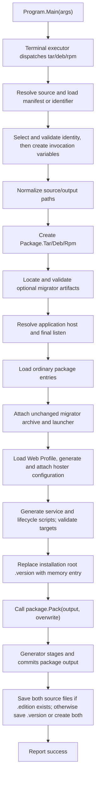

# Zongsoft.Tools.Packager implementation

[English](implementation.md) | [简体中文](implementation.zh-Hans.md)

This document is for maintainers. It describes the source structure, command pipeline, package model, file collection rules, systemd script generation, and current implementations of the `.tar.gz`, `.deb`, and `.rpm` formats.

For installation, configuration, and release workflows, see the [packager README](../README.md).

Application examples use the real [Zongsoft.Hosting.Web](https://github.com/Zongsoft/hosting/tree/main/web/default) host. Staging directories, the Bash working directory, and example versions follow the [README quick start](../README.md#quick-start). The host DLL is `Zongsoft.Hosting.Web.dll`; `--daemon:zongsoft.web` selects the package and service identity. Automatic Web configuration uses the host's web.profile; the root-alias section separately demonstrates ordinary payload with a user-supplied manual.conf.

Current hosting scripts omit `--framework`; the tool resolves it from Variables, while `--compilation` supplies the build configuration. Daemon declares `Environment,DOTNET_ENVIRONMENT` for generated services; Web also declares `ASPNETCORE_ENVIRONMENT`. Terminal disables daemon support, so the variable list does not set an interactive process environment. Building, deploying, and creating migration artifacts happen outside this tool; standalone `pack.cmd` only collects existing payloads. See the [quick start](../README.md#quick-start) for script setup and commands.

## Design goals

`Zongsoft.Tools.Packager` generates Linux application packages in .NET, minimizing build-time dependencies on platform packaging tools.

The main design choices are:

- Expose one `dotnet-pack` entry point with `tar`, `deb`, and `rpm` subcommands.
- Share application metadata, variable expansion, file collection, script generation, and naming across formats.
- Use systemd as the default service model for .NET background and Web services.
- Write package primitives directly instead of invoking `tar`, `dpkg-deb`, `rpmbuild`, or `cpio`.
- Generate Linux packages on Windows, Linux, or macOS; preserve Unix permissions on Unix hosts and apply defaults on Windows.

## Source structure

| File | Responsibility |
| --- | --- |
| `Program.cs` | Initialize the terminal command tree and register `TarCommand`, `DebCommand`, and `RpmCommand`. |
| `PackCommand.Version.cs` | The nested `VersionFile` reads the source version, validates identity, selects an Edition, and saves after success. |
| `PackCommand.cs` | Template-method base for all three commands; declare common options and coordinate execution. |
| `PackCommand.Tar.cs` | Create `Package.Tar`. |
| `PackCommand.Deb.cs` | Create `Package.Deb`. |
| `PackCommand.Rpm.cs` | Create `Package.Rpm` and parse RPM-specific `provides` and `conflicts`. |
| `Package.cs` | Package, installation-script, and entry models, plus file collection. |
| `Package.Tar.cs` | Default installation path, filename, and entry point for `.tar.gz`. |
| `Package.Deb.cs` | Default installation path, filename, and entry point for `.deb`. |
| `Package.Rpm.cs` | Default installation path, filename, and RPM-specific properties. |
| `Generator.cs` | Compute generator identity from the current assembly for metadata in all three formats. |
| `Generator.Tar.cs` | Write gzip PAX tar, `install.sh`, and `uninstall.sh`. |
| `Generator.Deb.cs` | Write the Debian `ar` container, `control.tar.gz`, and `data.tar.gz`. |
| `Generator.Rpm.cs` | Write the RPM lead, signature/header, metadata header, and gzip cpio payload. |
| `Migrator.cs` | Locate external migration artifacts by final application identity, validate PAX metadata, attach unchanged files, and provide installation coordination scripts. |
| `ApplicationHost.cs` | Resolve the application host, service and final listen once, shared by systemd generation and Web ~. |
| `Scriptor.Systemd.cs` | Generate/collect systemd units and compose application, migration and Web lifecycle scripts. |
| `Web/Definition*.cs` | Collect [Zongsoft.Core](https://github.com/Zongsoft/framework/tree/main/Zongsoft.Core) Profile declarations and resolve replacement, inheritance, variables and validation. |
| `Web/Configurator*.cs` | Configurator contract, Nginx directive model/validation, deterministic serialization and relocatable content. |
| `Web/Installation*.cs` | Validate generated targets and provide delivery, relocation, activation and removal scripts. |
| `Normalizer.cs` / `TextSource.cs` | Expand variables on demand and resolve files under the source directory or literal text. |
| `Utility.Search` / `Generator.Entries.cs` | Match path segments, handle directory metadata, and manage temporary payload streams. |
| `Variables.cs` | Variable collection and typed accessors for common variables. |
| `Dependency.cs` | Parses uniform dependency intervals and alternative groups for native Debian/RPM relationship output. |
| `Utility.cs` | RID, installation path, path normalization, Unix timestamps, and file permissions. |
| `Dumper.cs` | Console splash, error, and warning output. |
| Linked `tools/.shared` source | `Utility.cs` compiles with this project's `partial Utility`, sharing recursive variables and command/text helpers. `ArtifactPublisher` manages staging and publication: atomic replacement for single files, grouped commit and recovery for multiple files. Boolean switches use [Zongsoft.Core](https://github.com/Zongsoft/framework/tree/main/Zongsoft.Core) `Switch`; enums use [Zongsoft.Core](https://github.com/Zongsoft/framework/tree/main/Zongsoft.Core) conversion without checking whether a member is defined. No shared DLL is produced. |

## Execution pipeline

Command structure:

```text
dotnet-pack
├── tar
├── deb
└── rpm
```

`PackCommand<TPackage>.OnExecuteAsync()` coordinates the pipeline:


```mermaid
flowchart TD
    A["Program.Main(args)"] --> B["Terminal executor dispatches tar/deb/rpm"]
    B --> C["Resolve source and load manifest or identifier"]
    C --> D["Select and validate identity, then create invocation variables"]
    D --> E["Normalize source/output paths"]
    E --> F["Create Package.Tar/Deb/Rpm"]
    F --> M["Locate and validate optional migrator artifacts"]
    M --> G["Resolve application host and final listen"]
    G --> H["Load ordinary package entries"]
    H --> N["Attach unchanged migrator archive and launcher"]
    N --> W["Load Web Profile, generate and attach hoster configuration"]
    W --> L["Generate service and lifecycle scripts; validate targets"]
    L --> V["Replace installation root .version with memory entry"]
    V --> I["Call package.Pack(output, overwrite)"]
    I --> J["Generator stages and commits package output"]
    J --> S["Save both source files if .edition exists; otherwise save .version or create both"]
    S --> OK["Report success"]
```

`PackCommand<TPackage>` performs common work; subclasses create the concrete `Package`:

```csharp
protected override Package.Deb CreatePackage(CommandContext context, Variables variables)
```

`RpmCommand` also reads:

- `--provides`
- `--conflicts`

These options are split on commas or semicolons and written into the RPM metadata header.

## Source and packaged versions

`VersionFile` opens the source directory's direct `.edition` with `File.OpenRead` and `ApplicationManifest.Load(Stream)`. Only `FileNotFoundException` permits the fallback `.version`, parsed by `ApplicationIdentifier.Load(Stream)`; an empty identifier, corrupt file, directory placeholder or other I/O error stops the command. Neither parser searches other directories. Legacy multi-Edition `.version` files must be renamed to `.edition`.

Manifest selection is explicit nonblank Edition, then Current, then the sole Edition. Multiple Editions without a selection fail; no named Editions means the top-level version. Explicit selection must exist and retains canonical spelling. Identifier fallback allows an explicit Edition to replace or add the identifier's Edition. Source names must match explicit names case-insensitively; the explicit version overrides the selected nonzero version. Identity options alone determine identity, with environment and `.env` available only through explicit variable references.

The loaded manifest is updated in memory: replace the selected Edition in place, then set Current to it. Other entries, order and [Zongsoft.Core](https://github.com/Zongsoft/framework/tree/main/Zongsoft.Core)'s comment/blank-line layout survive. The save content is prepared before packaging; `Save(TextWriter)` receives a UTF-8-without-BOM writer with CRLF. Identifier bytes come from `ApplicationIdentifier.Save(Stream)`. Reading uses `ApplicationIdentifier.Load`, which accepts identifiers with or without a trailing LF or CRLF; validation checks the parsed identity rather than trailing newline bytes.

After all package output commits, manifest input writes both `.edition` and `.version` through `ArtifactPublisher` as a group, replacing any existing identifier or creating it if missing. The identifier records the final selected name, Edition and version. Identifier-only input atomically updates only `.version`. With neither input, valid explicit name/version are required and both files are staged and committed together without overwriting concurrently created files. Failures restore the pair. Source save failure retains the package and reports the affected paths; parse, validation and package failures never save source files.

`EntryCollection.Load` excludes the direct source `.edition`, including explicit aliases. File entries targeting the installation-root `.edition` are omitted too; other subdirectory files retain ordinary selection rules. `SetVersion` writes a unique installation-root `.version` memory entry in mode `0644`, replaces same-target ordinary and rooted entries, and bypasses exclusions. All encoders and RPM digests use `Entry.OpenRead()`; nested `.version` files remain ordinary payload.

Debug references the local [Zongsoft.Core](https://github.com/Zongsoft/framework/tree/main/Zongsoft.Core) build and Release references the centrally configured NuGet package. Both must provide `ApplicationManifest`, `Editions.Current` and `ProfileOptions.ImportBehavior`; Web loading uses `ProfileDirectiveBehavior.Existed` to require imports.

## Command option model

Required and conditionally required options:

| Option | Type | Description |
| --- | --- | --- |
| `--name` | `string` | Required without a source version file; otherwise validate against or use the source name. |
| `--version` | `string` | Expand, then convert to `System.Version`; required without a source file, otherwise override the selected version. The final version must be nonzero. |
| `--platform` | `string` | Expand, then convert to `Platform` to select the target platform. |

Common optional settings:

| Option | Default | Description |
| --- | --- | --- |
| `--source` | Current directory | Input directory. |
| `--migrator` | Empty | Original migration input name, optionally with a directory; bare names search source and ancestors plus each direct `.migration/` child using final Edition, Version, and Runtime. |
| `--output` | `source` | Always an output directory; relative paths use `source`. A filename cannot be specified. |
| `--exclude` | Empty | Comma- or semicolon-separated patterns skipped during entry collection. |
| `--edition` | Current or the sole Edition | Product Edition, included in the package name. |
| `--framework` | `framework` variable or empty | Optional .NET target framework used to locate the host under `bin/<compilation>/<framework>`; omitted or empty options use the merged variable. |
| `--compilation` | `Release` | Optional .NET build configuration used for that host lookup and available as a variable. |
| `--architecture` | `x64` | Target architecture. |
| `--overwrite` | `false` | Replace existing output files. |
| `--install-path` | Derived from package identity | Installation directory. |
| `--title` | Empty | Human-readable title. |
| `--summary` | Empty | Short description or file path. |
| `--description` | Empty | Long description or file path. |
| `--homepage` | `https://github.com/Zongsoft` | Project homepage. |
| `--license` | Empty | License text. |
| `--category` | Format default | Debian `Section` or RPM `Group`. |
| `--maintainer` | `Zongsoft` | Package maintainer. |
| `--manufacturer` | `Zongsoft` | Software manufacturer; missing, null, and empty values use the default, but whitespace alone does not. |
| `--dependencies` | Empty | Uniform `name[:range]` dependency list; interval syntax with `[v)` shorthand and `|` alternatives. |

Systemd and lifecycle options:

| Option | Description |
| --- | --- |
| `--listen` | Bind address passed to `--urls` in generated services; a numeric value becomes `http://127.0.0.1:<port>`. |
| `--daemon` | Systemd unit filename/identity; `none`, `disable`, and `disabled` disable it. |
| `--daemon-environments` | Comma- or semicolon-separated variable names written into the generated service. |
| `--installing` / `--installed` | Before/after installation scripts. |
| `--uninstalling` / `--uninstalled` | Before/after uninstallation scripts. |
| `--preinstalling` / `--postinstalling` | Prepend/append to `installing`. |
| `--preinstalled` / `--postinstalled` | Prepend/append to `installed`. |
| `--preuninstalling` / `--postuninstalling` | Prepend/append to `uninstalling`. |
| `--preuninstalled` / `--postuninstalled` | Prepend/append to `uninstalled`. |

## Variables and normalization

### Variable sources

`PackCommand<TPackage>.GetVariables(context, directory)` loads descriptor defaults, environment variables, ancestor `.env` files for the supplied directory, and explicit command options, including extra options. Omitting `directory` skips `.env` loading for the initial source resolution. After verifying and resolving the source directory to an absolute path, variables are reloaded and source is fixed; `.env` does not determine source retroactively. Names are case-insensitive. Precedence is explicit options > nearer `.env` > farther `.env` > environment > defaults.

Shared `Utility.LoadEnvironmentVariables` reads each immediate `.env` from the filesystem root down to source, without searching child directories. `Profile.Load` preserves [Zongsoft.Core](https://github.com/Zongsoft/framework/tree/main/Zongsoft.Core) empty-value and import semantics; section levels and entry names join with underscores. Read/parse failures stop packaging; only missing files are skipped. Process environment variables are not changed.

`Variables.From` declares `FRAMEWORK` in a case-insensitive set passed as `fallbackOptions` to shared `Utility.CreateVariables`. Both source bootstrap and final loading apply the rule directly in the existing option merge loop: only a declared option with a raw null/empty value preserves an existing nonempty variable. Without a nonempty fallback, the original assignment remains. Whitespace values, nonempty expressions that expand to empty, and nearer `.env` values that clear earlier values keep their existing behavior. This changes no source lookup scope or framework validation.

`PackCommand` creates an invocation-local `Variables` view and passes it to packages, scripts, and text sources. It keeps no process-wide variable state. References expand recursively when accessed; unused unknown references do not prevent packaging. Unknown variables, cycles, and expansion deeper than 64 levels fail with a diagnostic naming the variable. Expansion itself does not read files.

[Zongsoft.Core](https://github.com/Zongsoft/framework/tree/main/Zongsoft.Core) command descriptors retain options that may contain variables as strings. `source` expands first using the complete raw variable set. Explicit `name`, `edition`, and `version` then expand; `version` is converted to `System.Version` to select the version from the source `.edition` manifest or `.version` identifier. After identity is finalized, `platform`, `architecture`, and `overwrite` expand and convert when used. Bare `--overwrite` remains true; omission defaults to false.

Identity still comes from the source `.edition` manifest or `.version` identifier and explicit name/edition/version options; same-named environment or `.env` variables do not implicitly replace identity. Explicit options may reference other `.env` variables. Final identity and resolved source/output overwrite the variable collection. `--migrator` requires explicit activation; `--overwrite` can come from the environment or `.env` and be overridden on the command line.

### Variable syntax

`Normalizer` accepts:

```text
$(name)
%name%
```

Example:

```bash
export APP_NAME=Zongsoft.Hosting.Web
export APP_VERSION=1.0.0

dotnet-pack deb \
  --listen:8069 \
  --daemon:zongsoft.web \
  --name:"$APP_NAME" \
  --version:"$APP_VERSION" \
  --platform:linux \
  --framework:net10.0 \
  --source:./publish \
  --output:../packages/
```

Bash expands the identity options in this example. `--version` enters `OnExecuteAsync` as a string and becomes `System.Version` only after expansion; name and Edition are validated from supplied values. Packager expressions can also appear in subsequent paths, text, and migration configuration.

Unknown variables in source paths, output, payload, exclusions, text, or migration input fail; unused variables remain unexpanded. The result of `Normalizer.Normalize` can indicate failure, and callers must not treat failed results as valid input.

### Text and files

`TextSource.Read(source, value, variables, fileOnly)` handles summary, description, and lifecycle hooks:

- `text:` returns the following content literally, including shell `$(...)`, `%...%`, or path-like text.
- `file:` expands the following path and reads it as an absolute path or relative to source; a missing file fails.
- Without a prefix, expand variables first. Multiline values are text; existing files are read relative to source; clearly missing paths fail; other single-line values are text. Prefixes remove ambiguity.
- File content is neither expanded nor interpreted again as another file path.
- Pre/post hooks are file lists separated by `;` or `|`. Each item may use `file:`, but not `text:`. Filenames cannot contain these list separators.

## Package model

The abstract `Package` class holds metadata shared by all formats:

- `Name`
- `PackageIdentity`
- `PackageName`
- `Edition`
- `Version`
- `Platform`
- `Architecture`
- `Runtime`
- `Framework`
- `Title`
- `Summary`
- `Description`
- `Maintainer`
- `Manufacturer`
- `License`
- `Homepage`
- `Category`
- `InstallPath`
- `Dependencies`
- `Entries`
- `Scripts`
- `Migrator`

Package names follow:

```text
identity
identity-edition
```

`identity` defaults to `name`. A supplied, enabled `--daemon` instead uses the filename part of the daemon identity, removing an optional `.service` suffix.

`Package.GetFileName` generates output filenames for all three formats. Here `name` means the package `identity`, including the daemon precedence above:

```text
<name>@<version>-<architecture>.<extension>
<name>-<edition>@<version>-<architecture>.<extension>
```

Examples:

```text
zongsoft.web@1.0.0-x64.deb
zongsoft.web-enterprise@1.0.0-x64.rpm
```

Architecture uses `Architecture.ToString().ToLowerInvariant()`, such as `x64` or `arm64`. Extensions are `tar.gz`, `deb`, and `rpm`; filenames contain name, optional Edition, version, and architecture. The tar `.sh` entry uses the same stem. Runtime Identifier matches migration artifacts and is not part of installation-package filenames.

### Runtime Identifier

`Utility.GetRuntimeIdentifier()` combines platform and architecture:

```text
linux + x64   => linux-x64
linux + arm64 => linux-arm64
windows + x64 => win-x64
windows       => win
```

`Platform.Windows` declares `[Alias("Win")]` for command parsing; `Win` is not a separate enum member.

### Default installation path

`Utility.Unix.GetInstallPath(identity)` derives the default installation path:

```text
Zongsoft.Hosting.Web => /opt/zongsoft/hosting/web
zongsoft.web         => /opt/zongsoft/web
```

Rules:

- An empty name returns `/opt`.
- Lowercase the name.
- Replace every dot with `/` to form nested directories.
- Without dots, use `/opt/<name>`.
- The Web example sets `--daemon:zongsoft.web`, yielding `/opt/zongsoft/web`; `--name:Zongsoft.Hosting.Web` still locates the host DLL.

## Loading package entries

`Package.EntryCollection` loads entries.

### Default collection

With no positional arguments:

```text
Recursively collect all files under source
entryName = file path relative to source
```

For `.deb` and `.rpm`, the installation path prefixes `entryName`:

```text
InstallPath = /opt/zongsoft/web
EntryName   = opt/zongsoft/web/Zongsoft.Hosting.Web.dll
```

For `.tar.gz`, `EntryPrefix` is `null`: application files stay at the archive root, and `install.sh` copies them to the destination during installation.

### Explicit collection

Positional arguments use:

```text
path
path:alias
```

Parsing rules:

- Split path and alias at the last colon.
- A Windows drive-letter colon such as `C:` is not an alias separator.
- Relative paths use `source`.
- Absolute paths may be outside `source`; without an alias, only the filename is used in the package.
- Directories expand recursively and are entries themselves, preserving empty directories and source modes (0755 by default on Windows). Directory alias `:~` normalizes to an empty path, placing content directly at the installation root; hosting payload arguments use this form.
- [Zongsoft.Core](https://github.com/Zongsoft/framework/tree/main/Zongsoft.Core) `Searcher` supports `*` and `?` in any path segment; a standalone `**` matches zero or more directory levels. Results at each argument position are sorted Ordinal by paths relative to the fixed prefix, with `/` separators; the complete input sequence is not reordered. Windows matching is case-insensitive, Unix matching case-sensitive.
- Duplicate target paths produce a conflict warning and are skipped.

### Exclusions

`--exclude` applies during `Package.EntryCollection.Load()`:

- Split patterns on commas or semicolons.
- Expand variables, then normalize path separators to `/`.
- Relative patterns use `source`; matching considers the relative source path, final package path, and filename.
- Support `*`, `?`, and `**`; directory patterns such as `logs/` mean `logs/**`.
- Matching files are skipped without duplicate-entry warnings.
- Generated/attached systemd service files and the generated `.version` bypass this filter.

### Root-path aliases

An alias beginning with `/` or `\` marks an entry as `Rooted`.

The following example assumes the user has prepared `publish/manual.conf`. It demonstrates a root-path alias for supplied configuration without enabling `--web`:

```bash
dotnet-pack deb \
  --name:zongsoft.hosting.web \
  --daemon:none \
  --version:1.0.0 \
  --platform:linux \
  --framework:net10.0 \
  --source:./publish \
  --output:../packages/ \
  manual.conf:/etc/nginx/conf.d/zongsoft.web.conf
```

Handling by format:

| Format | Behavior |
| --- | --- |
| `.deb` | Payload path `etc/nginx/conf.d/zongsoft.web.conf` installs at `/etc/nginx/conf.d/zongsoft.web.conf`; rooted files under `/etc` enter `conffiles`. |
| `.rpm` | Payload path `/etc/nginx/conf.d/zongsoft.web.conf` is marked as a configuration file in the RPM header. |
| `.tar.gz` | Store at `.root/etc/nginx/conf.d/zongsoft.web.conf`; `install.sh` copies it to `${DESTDIR}/etc/nginx/conf.d/zongsoft.web.conf`. |

### File permissions

On Unix-like hosts:

```text
File.GetUnixFileMode(path) & rwx mask
```

On Windows, or when usable permissions cannot be read:

- `.sh`, `.dll`, `.exe`, and extensionless files use `0755`.
- Other files use `0644`.

## Systemd generator

All three package types currently use `Scriptor.Systemd`.

A supplied, enabled `--daemon` overrides only the package filename, system package name, and default installation path. `Package.Name` retains `--name` to locate the .NET host DLL.

### Service file resolution

An empty `--daemon` defaults to lowercase `Package.Name` as the service identity, without Edition.

The flow is:

1. Disable service generation for `--daemon:none`, `--daemon:disable`, or `--daemon:disabled`.
2. Otherwise look under `source` for the file specified by `--daemon`.
3. If it exists, add it to package entries.
4. Otherwise generate the `.service` file in memory and add it, without a fixed temporary path. Validate the service filename before adding the entry.

### Host lookup

Generating a `.service` requires locating the .NET host, in this order:

1. `<source>/<name>.dll`
2. The unique `.exe` under `<source>`, inferring a same-named `.dll`
3. `<source>/bin/<compilation>/<framework>/<name>.dll`
4. The unique `.exe` under `<source>/bin/<compilation>/<framework>`, inferring a same-named `.dll`

Steps 3 and 4 are skipped when `framework` or `compilation` is empty or whitespace. Neither option triggers compilation; ordinary file packaging, a .NET host in the source directory, and an existing service file do not require either option. A file-only package can use `--daemon:none` to skip host resolution entirely.

A failed lookup reports:

```text
The daemon host location failed.
```

### Generated service content

A regular service:

```ini
[Unit]
Description=<title-or-name>

[Service]
Type=simple
WorkingDirectory=<install-path>
ExecStartPre=mkdir -p <install-path>/logs
ExecStart=dotnet <install-path>/<host>
Restart=on-failure
RestartSec=10
KillSignal=SIGINT
SyslogIdentifier=<package-identity>
DynamicUser=no
PrivateTmp=no
ReadWritePaths=<install-path> <install-path>/logs /tmp

Environment=DOTNET_NOLOGO=true
<custom-environment-lines>

[Install]
WantedBy=multi-user.target
```

`Variables.Listen` supplies the bind value. Multiple complete URLs separated by semicolons are retained as one `--urls` value. HTTP and HTTPS can be combined; the host configures the default HTTPS server certificate. Omitting the option adds no `--urls`; an existing service's ExecStart is not rewritten.

A nonempty `--listen` produces:

```ini
ExecStart=dotnet <install-path>/<host> --urls <bind>
```

A numeric bind value becomes:

```text
http://127.0.0.1:<port>
```

### Lifecycle scripts

Script model mapping:

| `Package.InstallScripts` | Debian file | RPM tag | Tar path |
| --- | --- | --- | --- |
| `Installing` | `preinst` | `1023` | Merged into `install.sh` |
| `Installed` | `postinst` | `1024` | Merged into `install.sh` |
| `Uninstalling` | `prerm` | `1025` | Merged into `uninstall.sh` |
| `Uninstalled` | `postrm` | `1026` | Merged into `uninstall.sh` |

Without supplied scripts, defaults are:

- Stop the same-named systemd service before installation.
- Create `/etc/systemd/system/<service>` as a symbolic link after installation.
- Run `systemctl daemon-reload`, `systemctl enable`, and `systemctl start` afterward.
- Disable and stop the service before uninstallation.
- Remove the service link, reload systemd, and remove the installation directory after uninstallation.

With systemd disabled, application service operations become no-ops. Migration and Web delivery/activation/removal steps remain independent; uninstallation still removes the installation directory.

Each format guards uninstallation differently:

- Debian `prerm` runs `Uninstalling` only for `remove` or `deconfigure`; `postrm` runs `Uninstalled` only for `remove` or `purge`. `upgrade`, `failed-upgrade`, `abort-install`, `abort-upgrade`, and `disappear` do not run uninstall cleanup.
- RPM `%preun` and `%postun` run uninstall scripts only when `$1=0`, meaning the last installed instance is being removed. `$1>0` preserves the installed payload.
- Tar enters uninstallation only through explicit `uninstall.sh` execution. The generator removes the resolved `TARGET`; the default `Uninstalled` script performs no additional directory deletion.

## Web configuration and installation integration

See the [Web guide](web.md) for syntax and deployment requirements. Types remain in this project's Web namespace: Definition for declarations/effective models, Configurator.Context/Result and nested Configurator.Nginx. No dynamic plugin loader is introduced.

Definition.cs provides the Load/Resolve entry points. Definition.Loader.cs collects declarations, arranges sections and validates structure. Definition.Resolver.cs merges declarations, evaluates values and builds the effective model, with regions for bindings/resources, backend policies, health checks, headers, native directives and basic value parsing. Value conversion belongs to Resolver rather than a separate Values file. Definition.Model.cs holds the model types.

Loading uses [Zongsoft.Core](https://github.com/Zongsoft/framework/tree/main/Zongsoft.Core) Profile.Load with ImportBehavior=ProfileDirectiveBehavior.Existed. Importing/Imported collect declarations before replacement and retain Profile instance identity. Backend pools replace whole groups by input instance rather than enumerating all final merged entries. Structure is validated first, selected-hoster overrides next, and only consumed values are expanded. Web explicitly enables shared VariableEvaluator.allowEscapes; other callers retain their existing mode.

Resolver produces immutable site, route and policy records. Nginx builds a directive tree, validates native context/cardinality, static listener conflicts and regex proxy_pass, then emits UTF-8, Tab and CRLF. Installation-root references are typed ContentPart values, not text placeholders that can collide with input. Common literal values never silently become runtime expressions; unrepresentable values fail.

ApplicationHost resolves once before ordinary payload collection, sharing final listen with service generation and ~. Generated entries use Entry.OpenRead. Installation.Validate/ValidateEntry check normalized destination conflicts, aliases and ancestor/descendant paths in either insertion order. Failed publication does not save source versions; Profile input is never saved.

Package.InstallScripts.Delivered is separate from the four lifecycle phases. Tar runs it after payload copying and before the DESTDIR-gated Installed stage. Debian runs Delivered/Installed only in postinst configure; RPM runs them in %post. Generated .conf files are replaceable payloads without DEB conffile or RPM config flags.

Phase composition:

- Delivery: prune obsolete generated files and matching owned links; Tar reconstructs installation-root references with INSTALL_PATH. DESTDIR changes only write locations, never configuration paths or system links.
- Post-install: preinstalled → migration preparation/apply (if selected) → installed → Web activation → postinstalled. Failure stops later steps. Custom main hooks and daemon:none do not suppress Web steps.
- Pre-remove: preuninstalling → Web unlink/optional validation and reload → uninstalling → postuninstalling.
- Post-remove: payload removal → preuninstalled → uninstalled → .web cleanup → postuninstalled. Existing format guards skip old-version upgrade removal.

HOSTER_WEB_ACTIVATION is read at installation time. Activation targets default nginx.conf/nginx.service; nginx -T confirms inclusion. Stopped services are validated without starting; running services reload. Installation failures propagate. During ordinary removal, Nginx errors warn and continue, while file-operation failures still fail. Disabled activation never suppresses payload delivery, obsolete-file pruning or final removal.

Cleanup fragments are also generated when the new package has no Web result, so omitting --web can remove obsolete sites. Nginx is called only when current or old Web artifacts are involved. The .web layout itself is the container discovery contract, with no .hoster or extra templates.

Tests cover declarations/models, native output, actual three-format archive decoding and isolated Shell doubles. Shell fixtures replace system paths with temporary directories and use fake nginx/systemctl commands, without installing packages or touching real services. On Windows, `PACKAGER_TEST_GIT`, PATH, Git installation records, and common installation locations select Bash and cygpath from the same installation. The fixture sets `MSYS=winsymlinks:nativestrict` and converts Windows paths through `cygpath -u`, so mount aliases such as `/tmp` agree with resolved link targets. A temporary-directory probe checks required utilities and symbolic-link support before running shell tests; unsupported environments are reported as skipped rather than blocking the build or release. After that probe succeeds, script failures and assertion failures still fail tests. Regression tests cover mount mappings with spaces, portable installations, incomplete tool pairs, and unavailable tools. These tests do not establish real installation validation; target Linux, Nginx modules, certificate loading, and reload behavior require an isolated environment with actual dependencies. See the [Web configuration guide](web.md) for configuration contracts, module requirements, and deployment behavior.


## Application metadata

The option and variable name for the home page is `homepage`; `Package.Homepage` supplies tar PAX `Homepage`, Debian `Homepage`, and RPM `URL` (1020). Tar PAX `Maintainer`, Debian `Maintainer`, and RPM `PACKAGER` (1015) retain the package maintainer independently of the generator identity. `manufacturer` supplies `Package.Manufacturer`, with the shared default `Zongsoft` when absent, null, or empty after expansion. The accessor preserves literal whitespace before the normalizer can turn it into an empty string. The default for the `maintainer` option is also `Zongsoft`; the two values remain independent.

Tar writes manufacturer as the PAX global attribute `Manufacturer`, Debian writes the custom control field `Manufacturer`, and RPM writes the standard `VENDOR` string tag (1011). Debian keeps its existing text normalization, including omission of a whitespace-only manufacturer field. These fields add no payload entries. See [Debian user-defined fields](https://www.debian.org/doc/debian-policy/ch-controlfields.html#user-defined-fields) and the [RPM tag reference](https://rpm.org/docs/latest/manual/tags.html).

## Packager version metadata

The complete field mapping is in [README application metadata](../README.md#application-metadata). `Generator.GetSummary` chooses the first nonblank Summary, Title, or application Name; `GetDescription` uses a nonblank Description or that effective summary. All three generators use these helpers. Debian combines a normalized one-line synopsis with independent long-description continuation lines, preserving internal indentation and encoding blank lines as ` .`; if both texts are identical, only the synopsis is written. Tar escapes its two text values, while RPM retains literal text. Blank License and Homepage values are omitted in every format. Debian's required Maintainer fallback (`Unknown`) and native category defaults (`utils` / `Applications/System`) remain format-specific.

Debian adds `PackageSize` in invariant-culture bytes alongside its native KiB `Installed-Size`, and adds `InstallPath`. RPM adds the nonblank installation path as application string tag `1000002`, retaining deprecated tag `1056` for existing readers. The application tag is informational: adding `PREFIXES` would advertise relocation support that the lifecycle scripts do not provide. Modern RPM query formats do not expose unregistered application tags or the deprecated `DEFAULTPREFIX` name; readers must inspect the numeric header entries.

The effective application listener comes from the same `ApplicationHost` result used by service generation. `Package.Listen` exposes it only for a generated host. The generators omit absent/empty listeners, and hosts using an existing service or disabled daemon never advertise an ignored `--listen` value. Tar stores `Listen` in its PAX global attributes, Debian adds a control `Listen` field, and RPM stores a single string in application tag `1000001`. This tag is the Zongsoft package contract, not an upstream registered RPM tag; it stays outside the standard tag numbers ([upstream tag definitions](https://github.com/rpm-software-management/rpm/blob/master/include/rpm/rpmtag.h)). The RPM header digest covers it. No extra installed metadata file or payload entry is generated. `ListenerMetadataTest` checks all three formats, variable expansion, port normalization, service/metadata consistency and omission for unused settings.

Each package records the generator identity, logically `Packager:Zongsoft.Tools.Packager@<assembly-version>`. The value is `assembly-name@version`, read from the packager assembly independently of the host application version. No additional option or migration configuration is required.

| Format | Location | Inspection |
| --- | --- | --- |
| tar.gz | PAX global extended attribute `Packager` | A PAX-aware reader, such as Python `tarfile` and `pax_headers["Packager"]`. |
| deb | `Packager` field in `control` inside `control.tar.gz` | `dpkg-deb -f <package.deb> Packager` |
| rpm | Main header string tag `RPMVERSION` (1064) | `rpm -qp --queryformat '%{RPMVERSION}\n' <package.rpm>` |

RPM uses the generator-version tag for this identity; `PACKAGER` (1015) retains the `--maintainer` value. Format-header metadata adds no installed file and changes neither `.version` nor `migration.json`.

`Generator.GetIdentity` reads the assembly's simple name and `Version` with `Assembly.GetName()`, retaining the complete version text without hard-coding a tool version. All three generators call the same method, rather than reading the calling process or host assembly version. RPM's main-header digest covers the tag.

Tar writes a `PaxGlobalExtendedAttributesTarEntry`, not a `Package.Entries` item. Deb writes a control field; RPM writes tag 1064 without replacing the maintainer field. See the [RPM tag reference](https://rpm-software-management.github.io/rpm/manual/tags.html) and [PAX constructor reference](https://learn.microsoft.com/en-us/dotnet/api/system.formats.tar.paxglobalextendedattributestarentry.-ctor).

## `.tar.gz` implementation

Implementation: `Generator.Tar.cs`.

### Format overview

`.tar.gz` is:

```text
gzip(tar archive)
```

The implementation uses .NET `System.Formats.Tar`:

```csharp
new TarWriter(gzip, TarEntryFormat.Pax, false)
```

Entries therefore use PAX tar, supporting longer paths and extended metadata.

Generation also writes a companion `.sh` installer into the output directory:

```text
zongsoft.web@1.0.0-x64.tar.gz
zongsoft.web@1.0.0-x64.sh
```

The launcher locates the adjacent `.tar.gz`, extracts it to a temporary directory, and invokes its `install.sh`.

### Archive structure

```text
<application files>
.root/<rooted files>
install.sh
uninstall.sh
```

A PAX global extended record starts the archive; it is not an installed file. `GetTarMetadata` writes `Packager`, `PackageName`, `Version`, `Manufacturer`, `Architecture`, `Summary`, `Description`, and `PackageSize`. Nonblank `License`, `Homepage`, `Maintainer`, `InstallPath`, `Listen`, `Dependencies`, and `Category` values are also written. No `BuildTime` attribute is written.

`PackageName` uses `package.PackageName`, preserving the final system package name determined by the daemon identity and Edition; it does not use the application identity or archive filename. `Version` uses the full `package.Version.ToString()` and matches the generated `.version`. `Architecture` uses `package.Architecture.ToString().ToLowerInvariant()`, matching the filename's architecture value (for example `x64`, `arm64`, `x86`, or `arm`). All values remain readable after the archive is renamed, without additional options or payload entries.

`Summary` selects the first nonblank value from Summary, Title, and application Name; a blank Description falls back to the effective summary. Since the .NET PAX writer rejects literal line breaks in values, both fields escape backslashes, CR, and LF as `\\`, `\r`, and `\n`. Readers decode these sequences to restore the original text; Unicode remains literal. Optional blank values are omitted; the existing Manufacturer whitespace behavior remains unchanged. `Category` uses only the package value, without a format-specific default. `InstallPath` describes the default path and does not change installation-time overrides.

`Dependencies` uses `Dependency.Split` and `Dependency.Parse` to validate the shared input grammar, then joins required groups with `; ` while preserving ranges, native version endpoints, and alternatives. It is metadata only; the tar installer does not check or install dependencies. Invalid declarations fail before artifact publication. `PackageSize` uses `Package.GetPackageSize()` formatted with invariant culture: payload bytes, including generated entries and rooted files, excluding container headers and the tar install/uninstall scripts. Directories contribute zero; an empty payload records `0`. This is not filesystem disk usage.

Rooted files enter `.root/` only when root-path aliases exist. Lifecycle content is written into `install.sh` and `uninstall.sh`.

### File entries

Application files use:

```text
TarEntryType.RegularFile
name = entry.EntryName
mode = entry.Mode
mtime = entry.ModifiedTime
data = entry.OpenRead()
```

Rooted files use:

```text
name = .root/<entry.EntryName>
```

### install.sh / uninstall.sh

`install.sh` is a self-contained installer with mode `0755`. `uninstall.sh` is a self-contained uninstaller with mode `0755`, copied into the installation directory during installation.

Supported behavior:

- Default installation.
- Uninstallation by running `uninstall.sh` in the installation directory.
- `INSTALL_PATH` overrides for ordinary packages; actual installation of migration-enabled packages validates the fixed path.
- Staging with `DESTDIR`.
- Running merged lifecycle scripts.
- Installing and removing rooted files.

Installation flow:

```text
SOURCE_DIR = directory containing install.sh
INSTALL_PATH = environment override or package default
DESTDIR = optional staging directory
TARGET = DESTDIR + INSTALL_PATH
Run Installing content when DESTDIR is empty
Create TARGET
Copy ordinary archive files to TARGET
Copy uninstall.sh to TARGET
Copy rooted files to DESTDIR + /<root-path>
Run Delivered content, including Web pruning and relocation
Run Installed content when DESTDIR is empty
```

Uninstallation flow:

```text
Run Uninstalling content when DESTDIR is empty
rm -rf TARGET
Remove rooted files
Run Uninstalled content when DESTDIR is empty
```

## `.deb` implementation

Implementation: `Generator.Deb.cs`.

### Debian binary package overview

A Debian binary package is a Unix `ar` container using format version `2.0`.

Members are:

```text
debian-binary
control.tar.gz
data.tar.gz
```

### ar container

The file starts with the global header:

```text
!<arch>\n
```

Each member has a 60-byte ASCII header:

```text
name/ timestamp uid gid mode size `\n
```

The implementation uses:

- `uid = 0`
- `gid = 0`
- `mode = 100644`
- One newline padding byte after an odd-sized member, so the next member starts on an even boundary.

### debian-binary

Fixed content:

```text
2.0\n
```

### control.tar.gz

This gzip + Ustar tar contains:

```text
control
preinst
postinst
prerm
postrm
conffiles
```

Details:

- `control` uses mode `0644`.
- Maintainer scripts are included only when nonempty, with mode `0755`.
- Scripts receive `#!/bin/sh` and `set -e` automatically.
- `conffiles` is included only when rooted files exist under `/etc/`.

### Control fields

Generated fields:

```text
Package: <package-name>
Version: <version>
Packager: <assembly-name>@<packager-version>
Section: <category-or-utils>
Priority: optional
Architecture: <debian-architecture>
Installed-Size: <payload-size-in-KiB>
PackageSize: <payload-size-in-bytes>
Maintainer: <maintainer>
Manufacturer: <manufacturer>
Homepage: <homepage>
License: <license>
InstallPath: <default-installation-path>
Listen: <generated-host-listener>
Depends: <dependencies>
Description: <summary-or-title-or-name>
 <long-description-line>
 .
 <long-description-line>
```

Details:

- `Depends` is omitted when empty.
- The first `Description` line is the short description.
- Every long-description line starts with one space.
- Blank lines become ` .`.
- `License`, `Manufacturer`, `Packager`, `PackageSize`, `InstallPath`, and `Listen` are additional fields. Optional blank fields are omitted; `PackageSize` always records exact payload bytes, including `0`. `Installed-Size` retains the rounded KiB estimate with a minimum of 1. `Packager`, application `Version`, and `Maintainer` hold distinct information.

### Debian architecture mapping

| .NET `Architecture` | Debian architecture |
| --- | --- |
| `X64` | `amd64` |
| `X86` | `i386` |
| `Arm64` | `arm64` |
| `Arm` | `armhf` |
| Other | `all` |

### data.tar.gz

The payload uses gzip + Ustar tar. Directory entries precede ordinary files, which are read through `OpenRead()`. Explicit directories retain modes and timestamps; synthesized parents use 0755. Directories have no content streams and are not written to conffiles.

For non-rooted entries, `.deb` uses the installation path without its leading `/` as `EntryPrefix`:

```text
InstallPath = /opt/zongsoft/web
EntryName   = opt/zongsoft/web/Zongsoft.Hosting.Web.dll
```

After extraction:

```text
/opt/zongsoft/web/Zongsoft.Hosting.Web.dll
```

Rooted entries skip the prefix:

```text
Alias     = /etc/nginx/conf.d/zongsoft.web.conf
EntryName = etc/nginx/conf.d/zongsoft.web.conf
```

Installed location:

```text
/etc/nginx/conf.d/zongsoft.web.conf
```

## `.rpm` implementation

Implementation: `Generator.Rpm.cs`.

### RPM file overview

Logical sections:

```text
Lead
Signature
Header
Payload
```

The implementation writes:

```text
lead
signature header
metadata header
gzip(newc cpio payload)
```

It does not generate GPG/PGP signatures; only basic signature tags such as package-body size and MD5 digest are written.

### Lead

The lead is 96 bytes:

| Offset | Content |
| --- | --- |
| `0..3` | RPM magic: `ed ab ee db` |
| `4` | Major version: `3` |
| `5` | Minor version: `0` |
| `6..7` | Package type: binary package |
| `8..9` | Architecture number |
| `10..75` | `<package-name>-<version>`, at most 65 ASCII bytes followed by NUL |
| `76..77` | OS number: Linux |
| `78..79` | Signature type: header-style signature |

Lead architecture numbers:

| .NET `Architecture` | RPM lead architecture number |
| --- | --- |
| `X64` | `1` |
| `X86` | `1` |
| `Arm64` | `12` |
| `Arm` | `12` |
| Other | `255` |

### Header encoding

RPM header layout:

```text
magic/version/reserved
index count
store size
index entries
store bytes
padding to 8 bytes (signature header only)
```

An index entry:

```text
tag    int32 big-endian
type   int32 big-endian
offset int32 big-endian
count  int32 big-endian
```

Supported types:

| Type | Meaning |
| --- | --- |
| `3` | int16 array |
| `4` | int32 array |
| `6` | string |
| `7` | binary |
| `8` | string array |
| `9` | international string |

Numbers are big-endian; strings are UTF-8 with a terminating `NUL`.

### Signature Header

The signature section uses the same index/store structure as the RPM header.

Only the signature header is padded to an 8-byte boundary. The compressed payload follows the main metadata header's store immediately. Padding there may allow RPM queries to succeed but cause rpm2cpio to read zero bytes before gzip and fail extraction.

Written tags:

| Tag | Content |
| --- | --- |
| `62` | Immutable signature region, BIN type, 16-byte trailer. |
| `269` | SHA-1 digest of the metadata header. |
| `273` | SHA-256 digest of the metadata header. |
| `1000` / `270` | Byte length of metadata header + payload, unsigned 32-bit / 64-bit. |
| `1004` | MD5 digest of metadata header + payload. |

The signature section ends on an 8-byte boundary. Both headers write indexes in ascending tag order; the main header's immutable-region tag is `63`. The region trailer sits at the end of the store, with a negative offset representing the region index byte count. Digests cover the complete metadata header, including magic, indexes, store, and trailer. These are integrity digests, not a publisher OpenPGP signature. See [RPM V4 format](https://rpm-software-management.github.io/rpm/manual/format_v4.html) and [header structure](https://rpm-software-management.github.io/rpm/manual/format_header.html).

### Metadata Header

Main contents:

- Package name, version, and release.
- Summary, description, build time, and build host.
- Package size, license, manufacturer, maintainer, category, and homepage.
- OS and architecture.
- Installation/uninstallation scripts.
- File sizes, modes, mtimes, digests, usernames, group names, and configuration flags.
- Payload format, compressor, and compression level.
- Requires, Provides, and Conflicts.
- The dirname, basename, and dirindex path tables.

Common tags:

| Tag | Written content |
| --- | --- |
| `1000` | Package name. |
| `1001` | Version. |
| `1002` | Release: `1` without Edition, otherwise Edition. |
| `1004` | Summary. |
| `1005` | Description. |
| `1006` | Build time. |
| `1007` | Build host. |
| `1009` / `5009` | Payload file bytes, unsigned 32-bit / 64-bit. |
| `1011` | Manufacturer/vendor. |
| `1014` | License. |
| `1015` | Maintainer/packager. |
| `1016` | Group. |
| `1020` | URL. |
| `1021` | OS, fixed to `linux`. |
| `1022` | RPM architecture. |
| `1023..1026` | Pre/post install and pre/post uninstall scripts. |
| `1028` | Unsigned 32-bit file-size array. |
| `1030` | File-mode array. |
| `1034` | File-modification-time array. |
| `1035` | File SHA-256 digest array. |
| `1037` | File flags; rooted files under `/etc` are configuration files. |
| `1039` / `1040` | User/group names, fixed to `root`. |
| `1048..1050` | Requires flags/name/version. |
| `1047`, `1112`, `1113` | Provides name/flags/version. |
| `1053..1055` | Conflicts flags/name/version. |
| `1056` | Deprecated default installation path, retained for existing readers. |
| `1064` | Generator identity, `assembly-name@version`. |
| `1046` / `271` | Uncompressed cpio archive bytes, unsigned 32-bit / 64-bit. |
| `1000001` / `1000002` | Application string tags: effective generated-host listener / default installation path. |
| `1116..1118` | File directory indexes, basenames, and directory names. |
| `1124` | Payload format, fixed to `cpio`. |
| `1125` | Payload compressor, fixed to `gzip`. |
| `1126` | Payload flags, fixed to `9`. |
| `5011` | File digest algorithm, `8` (SHA-256). |
| `5092` / `5093` | Compressed-payload SHA-256 digest / algorithm `8`. |

### RPM architecture mapping

| .NET `Architecture` | RPM architecture |
| --- | --- |
| `X64` | `x86_64` |
| `X86` | `i386` |
| `Arm64` | `aarch64` |
| `Arm` | `armv7hl` |
| Other | `noarch` |

### Requires, Provides, and Conflicts

Requires uses the uniform dependency model described below. Provides and Conflicts retain these native relationship expressions:

```text
name
name = version
name >= version
name <= version
name > version
name < version
name(= version)
name(>= version)
```

Relationship flags:

| Operator | Flags |
| --- | --- |
| `<` | `RPM_SENSE_LESS` |
| `>` | `RPM_SENSE_GREATER` |
| `=` | `RPM_SENSE_EQUAL` |
| `<=` | `LESS \| EQUAL` |
| `>=` | `GREATER \| EQUAL` |

Default Requires:

```text
rpmlib(CompressedFileNames) <= 3.0.4-1
rpmlib(FileDigests) <= 4.6.0-1
rpmlib(PayloadFilesHavePrefix) <= 4.0-1
```

Rich Requires also add `rpmlib(RichDependencies) <= 4.12.0-1`. The complete parenthesized expression is stored as the requirement name, with flags `0` and an empty version. Feature requirements use `RPMLIB | LESS | EQUAL`; endpoints containing `~` or `^` additionally declare `TildeInVersions <= 4.10.0-1` or `CaretInVersions <= 4.15.0-1`. These are capability versions, not RPM product versions.

Default Provides:

```text
<package-name> = <version>-<release>
```

### Payload

The payload is a gzip-compressed ASCII `cpio` newc archive. Header magic:

```text
070701
```

Generation proceeds as follows:

1. Collect directories from file paths, including at least `/`.
2. Write directory cpio entries with mode `0040000 | entry.Mode`; preserve source-directory modes and use 0755 for synthesized parents. Header and cpio use the same directory metadata.
3. Write file cpio entries with `.` prefixed to the absolute RPM path, such as `./opt/zongsoft/web/Zongsoft.Hosting.Web.dll`.
4. Use file mode `0100000 | entry.Mode`.
5. Write the terminating `TRAILER!!!` entry.
6. Pad uncompressed cpio data to a 512-byte boundary.
7. Compress with gzip.

The RPM header also stores file metadata for package-manager queries and validation.

## Comparing the three formats

| Feature | `.tar.gz` | `.deb` | `.rpm` |
| --- | --- | --- | --- |
| Outer container | gzip tar | Unix ar | RPM lead/signature/header |
| File payload | PAX tar | `data.tar.gz` | gzip newc cpio |
| Control metadata | PAX global attributes; `install.sh` and `uninstall.sh` | `control.tar.gz` | RPM metadata header |
| Lifecycle scripts | Merged into `install.sh` / `uninstall.sh` | `preinst/postinst/prerm/postrm` | Header script tags |
| Package-manager installation | No | `dpkg`/`apt` | `rpm`/`dnf`/`yum` |
| Default installation path | Copied by `install.sh` | Encoded in payload paths | Encoded in payload/header paths |
| Root alias | `.root/` + installer | Installed directly at root paths | Installed directly at root paths |
| Configuration flags | No package-manager flags | Rooted `/etc` files enter `conffiles` | Rooted `/etc` files receive config flags |
| Signatures | None | None | No GPG/PGP, only basic digests |

## Local searches and source links

[Zongsoft.Core](https://github.com/Zongsoft/framework/tree/main/Zongsoft.Core) Searcher handles local patterns. Results preserve logical names while reading actual targets. A selected directory link can expand as a payload root; internal directory links are skipped, and file links retain their original names while reading target content. Recursive patterns do not traverse directory links to match subsequent segments. Selected dangling or cyclic links fail before output writes; destination-path validation still applies.

Payload-relative paths use source. Each pattern's results are sorted Ordinal by logical relative path, preserving argument order. See [Zongsoft.Core](https://github.com/Zongsoft/framework/tree/main/Zongsoft.Core) [local searches](../../../framework/Zongsoft.Core/docs/searcher.md).

`Searcher.Search` selects files, directories, or both through `Searcher.Target` (Both by default). `Match.Origin` supplies the logical fixed directory prefix for relative output paths.

## Payload streams and directory entries

`Package.Entry.IsDirectory` distinguishes directories from files. Directories have no content stream and zero size. Generators fill in parent directories and reject file/directory target conflicts. Source links retain logical names while reading target content; selected directory links can be payload roots, but internal directory links are skipped. Target paths cannot contain `..`, newlines, or NUL. Tar creates rooted directories with `install -d` and their modes. Uninstallation uses `rmdir` only for explicit directories, preserves nonempty directories, and does not explicitly remove synthesized shared parents.

Debian control/data gzip tars use separate controlled temporary files, and ar streams them using actual lengths. RPM's uncompressed cpio and gzip payload use temporary files; compressed-payload SHA-256 and main-header + payload MD5 are computed through streams. Headers and payload are then written sequentially, avoiding full-package byte arrays. Small version content and header metadata remain in memory: metadata allocation grows with entry count, while payload allocation does not grow with file bytes. Temporary files use exclusive CreateNew and DeleteOnClose, with Unix mode 0600, and are released on success or failure. Sufficient temporary disk space is required; RPM peak usage includes both raw and compressed payloads. Existing integer size limits in RPM fields still apply.

## Uniform dependencies

`Variables.Dependencies` expands variables before `Dependency.Split` separates top-level comma/semicolon groups. Bracketed intervals and RPM capability parentheses retain their internal punctuation. `Package.Dependencies` remains a string array; both encoders use `Dependency.Parse` to obtain AND groups of OR alternatives, with a name, original minimum/maximum strings, and inclusion flags for each alternative.

The grammar is `name[:range]`: a name alone is unversioned; a digit-starting bare version is an inclusive lower bound. Standard NuGet-style intervals are supported, plus `[v)` as an alias for `[v,)`. `[v]` is exact; `(v,)` is an exclusive lower bound, `(,v]` / `(,v)` are upper bounds, and `(,)` is unrestricted. Missing endpoints must use an open boundary. Package-name qualifiers such as `libc6:any` remain names; use brackets around native versions starting with letters. Versions retain native epoch, revision, and comparison semantics; no NuGet normalization, sorting, floating-version resolution, or contradictory-range merging is performed. Old comparison expressions, invalid brackets, floating `*`, empty alternatives, and control characters fail with localized diagnostics. Blank list items and repeated constraints retain the existing list behavior.

Debian converts an interval to one or two native comparisons, mapping strict bounds to `>>` / `<<`. It distributes OR across the alternatives' comparisons: `foo:[1,2) | bar:[3)` becomes `foo (>= 1) | bar (>= 3), foo (<< 2) | bar (>= 3)`. Expansion is limited to 1024 clauses per input group and fails before publishing an artifact when exceeded. Final names and versions pass the existing Debian relationship validator.

RPM uses ordinary flags/name/version entries for single comparisons. A finite range becomes `(foo >= 1 with foo < 2)`; alternatives become `((foo >= 1 with foo < 2) or bar >= 3)`. The `with` operator requires one package to satisfy both endpoints. Alternatives require RPM 4.13+; `with` requires RPM 4.14+. Debian has no corresponding single-provider operator: its virtual dependencies can be satisfied by different providers for each endpoint. Both formats retain their native version comparison and provider semantics; only the input notation is shared. See [Debian relationships](https://www.debian.org/doc/debian-policy/ch-relationships.html) and [RPM boolean dependencies](https://rpm.org/docs/latest/manual/boolean_dependencies).

## Debian relationship fields

`DebCommand` exposes `--provides`, `--replaces`, `--breaks`, `--conflicts`, `--recommends`, and `--suggests`, mapped to capitalized control fields. These options keep native syntax: lists split on commas or semicolons, and relationships use parentheses as in `name (>= version)`, with `<< <= = >= >>`. Recommends/Suggests allow `|` alternatives; Provides permits only `=` for version relationships. `--dependencies` instead uses the uniform parser: `--dependencies:"aspnetcore-runtime-10.0:[10.0)"` produces `Depends: aspnetcore-runtime-10.0 (>= 10.0)`. `Package.Deb` formats the parsed model and validates the resulting fields independently of RPM. Empty fields are omitted. Invalid names, relationships, newlines, and NUL are rejected; binary control fields do not accept source-package architecture restrictions or build-profile expressions. See [Debian Policy relationship fields](https://www.debian.org/doc/debian-policy/ch-relationships.html).

## Current implementation limits

- Debian control/data and RPM cpio payloads use gzip; xz/zstd are not supported.
- RPM is written directly, without rpmbuild, spec files, or GPG signatures.
- File owner/group are fixed to root; build-host UID/GID are not inherited, and custom ownership options are unavailable.
- Systemd is the only script-generation strategy.
- File links read target content; selected directory links may expand, internal directory links are skipped, and symbolic links themselves are not preserved.
- Large packages depend on available temporary disk space and retain container-field size limits. RPM's `newc` file size is an eight-digit hexadecimal value, so individual files above `uint.MaxValue` are rejected before publication. Aggregate package/archive/signature sizes use unsigned 32-bit values through `uint.MaxValue`, then standard 64-bit tags (`5009`, `271`, `270`); they are not clamped at `int.MaxValue`. Read installed size with `LONGSIZE`, which also covers a stored 32-bit `SIZE`. This does not implement RPM's alternative large-file payload encoding.

## Migration artifact integration

The independent [migrator tool](../../migrator/README.md) prepares migrations. Packager does not parse `.migration`/`.ini`, SQL, or execution plans, and does not carry its own native executor.

`--migrator` selects the original input name used during migration generation, optionally with a directory, such as `--migrator:../../packages/zongsoft`.

After variable expansion, a value without `/` or `\` searches from the final packaging source (`--source`) through parents to the filesystem root. Each level checks that directory first, then its direct `.migration/` child; other child directories are not searched. A value containing either separator selects an explicit directory: relative paths use source, absolute paths are used directly, and neither searches parents or an implicit `.migration/` child. With source `hosting/web/default/` and artifacts in `hosting/.migration/`, `--migrator:zongsoft` finds them; `--migrator:./zongsoft` checks only source. Lookup starts at source, not the command's working directory.

The file stem is `<name>[-<edition>](migrate)@<version>_<RID>`, using the name verbatim and omitting Edition when absent. Supply the generator's `--name` without the automatic `(migrate)` marker. Do not include Edition, version, RID, extension, wildcards, or path lists.

Artifacts match the installation package's final Edition, version, platform, and architecture, including values from the source `.edition` manifest or `.version` identifier and default x64. An absent Edition omits that segment. For enterprise, 1.0.0, Linux x64:

```text
zongsoft-enterprise(migrate)@1.0.0_linux-x64.tar.gz
zongsoft-enterprise(migrate)@1.0.0_linux-x64.sh
```

The migration name may differ from the host name, but Edition, version, and RID must match. Search continues to the next location only when both archive and script are absent. A partial pair fails immediately with the missing file's full path. A complete pair is immediately validated for archive metadata and RID; invalid metadata stops lookup. Both files must come from the same directory: no cross-directory pairing or substitution of versions, Editions, or architectures. When lookup reaches the root without a match, the diagnostic separates expected filenames from searched directories and lists every directory and `.migration/` child on individually indented lines in search order. Shared `Utility.Indent` uses platform line endings and preserves nested indentation. An omitted, empty, or whitespace-only option disables migration integration and attaches no artifacts.

The unchanged files enter `.migration/` under the installation root without archive extraction; the script uses 0755 and archive 0600. At execution time the migrator launcher creates a separate temporary directory, extracts the archive contents directly into its root and cleans it up afterward; it does not add another `.migration/` layer to the installation directory. Payload target conflicts fail. Installation calls the launcher with `apply` and `/var/lib/<package-name>/packager`; failure prevents startup. Systemd `ExecStartPre` calls the same launcher with `check`, which only compares completion markers without extraction or service connections. Migration runs even without a daemon; DESTDIR staging skips hooks. Uninstallation preserves state and databases/buckets. Targets need POSIX sh, tar/gzip, cmp, and the executor's system libraries; see the migration guide.

`Migrator.Load` separates location from archive validation. Private `Locate` follows `DirectoryInfo.Parent`, includes the root, and records each direct directory followed by its `.migration/` child in search order. After selecting a same-directory pair, `Validate` checks PAX metadata. Explicit directories are checked once without an implicit child lookup. All lookup and validation precede artifact attachment and package generation.

## Validation guidance

Cake's `--edition` selects the same configuration for restore, build, tests, and packaging. `restore` explicitly passes MSBuild `Configuration`, avoiding missing conditional dependencies when restoring Debug and then building Release with `--no-restore`. Debug references the local framework [Zongsoft.Core](https://github.com/Zongsoft/framework/tree/main/Zongsoft.Core) DLL; Release uses the declared [Zongsoft.Core](https://github.com/Zongsoft/framework/tree/main/Zongsoft.Core) NuGet package. The main test project adds a local DLL reference only in Debug and receives transitive package dependencies in Release. `dotnet cake --edition Release` defaults to packager regression tests, without invoking AOT builds or NuGet pushes.

`VersionFileTest`, `PackageVersionTest`, and `PackageArtifactTest` cover source versions and memory entries.

`Package_Provenance_RecordsGeneratorAndPreservesApplicationMetadata` covers generator identity, application version, manufacturer values and defaults, and independent homepage and maintainer fields in all three formats.

`PackageMetadataTest` reads actual three-format packages field by field for x64, x86, arm64, and arm. It checks all shared application metadata, generated/version/rooted payload byte totals, dependency encoding, independent summary/description selection, blank optional fields, native defaults, and both RPM installation-path tags. Header boundary tests cover sizes at 2 GiB, `uint.MaxValue`, 4 GiB, and larger 64-bit values without allocating large payloads.

`Tar_Metadata_IsReadableFromRenamedArchive` reads the final package name, including the daemon identity and Edition, and x64, arm64, x86, and arm architecture values from the PAX global header after renaming the archive. It also covers the added metadata, Unicode/multiline text, dependency ranges and alternatives, no BuildTime, and unchanged payload entries. Additional tar metadata tests cover payload byte totals and version identity, omitted empty optional values, summary/description fallback, and distinct escaping of backslashes, CR, and LF. Invalid dependency tests include tar and verify that existing artifacts survive failure. The provenance test also covers the package name without a daemon identity or Edition.

Use packages produced by the [README quick start](../README.md#quick-start). The following commands run from the hosting checkout root and only inspect package contents. For installation and uninstallation, see [README package formats](../README.md#package-formats).

### tar.gz

```bash
tar -tzf ./packages/zongsoft.web@1.0.0-x64.tar.gz
tar -xOf ./packages/zongsoft.web@1.0.0-x64.tar.gz install.sh
tar -xOf ./packages/zongsoft.web@1.0.0-x64.tar.gz uninstall.sh
```

### deb

```bash
ar t ./packages/zongsoft.web@1.0.0-x64.deb
dpkg-deb --info ./packages/zongsoft.web@1.0.0-x64.deb
dpkg-deb --contents ./packages/zongsoft.web@1.0.0-x64.deb
```

### rpm

```bash
rpm -qip ./packages/zongsoft.web@1.0.0-x64.rpm
rpm -qlp ./packages/zongsoft.web@1.0.0-x64.rpm
rpm -qp --scripts ./packages/zongsoft.web@1.0.0-x64.rpm
rpm -qpc ./packages/zongsoft.web@1.0.0-x64.rpm
rpm2cpio ./packages/zongsoft.web@1.0.0-x64.rpm | cpio -t
```

## References

- Debian Policy Manual: [Binary packages](https://www.debian.org/doc/debian-policy/ch-binary.html)
- Debian Policy Manual: [Binary package format appendix](https://www.debian.org/doc/debian-policy/ap-pkg-binarypkg.html)
- Debian Handbook: [The Packaging System](https://www.debian.org/doc/manuals/debian-handbook/packaging-system.en.html)
- rpm.org: [RPM Package Format](https://rpm.org/docs/4.19.x/manual/format.html)
- Linux Standard Base: [RPM Package File Format](https://refspecs.linuxfoundation.org/LSB_3.1.1/LSB-Core-generic/LSB-Core-generic/pkgformat.html)
- GNU tar manual: [GNU tar](https://www.gnu.org/software/tar/manual/)

Web packaging also emits .conf.template and, when fully representable, .bindings from the final hoster model. Lists in host/bind accept commas and semicolons; containerizer make renders the template and records frontend publication separately from application Listen. See [Web hosting](web.md).
