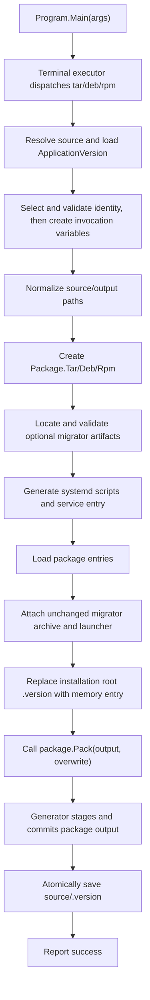

# Zongsoft.Tools.Packager 实现说明

[English](implementation.md) | [简体中文](implementation.zh-Hans.md)

本文档面向维护者，说明 `Zongsoft.Tools.Packager` 的源码结构、命令执行流水线、包模型、文件收集规则、systemd 脚本生成，以及 `.tar.gz`、`.deb`、`.rpm` 三种包格式的当前实现方式。

面向使用者的安装、配置和发布操作说明见[打包器 README](../README.zh-Hans.md)。

本文的应用示例引用 hosting 中真实的 [Zongsoft.Hosting.Web](https://github.com/Zongsoft/hosting/tree/main/web/default) 宿主，暂存目录、Bash 工作目录和版本约定见 [README 快速开始](../README.zh-Hans.md#快速开始)。宿主 DLL 为 `Zongsoft.Hosting.Web.dll`，`--daemon:zongsoft.web` 指定包和服务标识；根路径配置示例引用 hosting 的 `.deploy/default/nginx/zongsoft.web.conf`。

## 设计目标

`Zongsoft.Tools.Packager` 的目标是使用纯 .NET 代码生成 Linux 应用安装包，尽量减少对目标系统工具链的打包期依赖。

核心设计取向：

- 对外提供统一入口 `dotnet-pack`，通过 `tar`、`deb`、`rpm` 子命令选择输出格式。
- 在三种格式之间复用应用元数据、变量解析、文件收集、脚本生成和命名规则。
- 默认服务模型面向 systemd，适合 .NET 后台服务和 Web 服务。
- 直接写入包格式原语，而不是调用 `tar`、`dpkg-deb`、`rpmbuild`、`cpio`。
- 支持在 Windows、Linux、macOS 上生成 Linux 包；Unix 主机保留文件权限，Windows 主机使用默认权限规则。

## 源码结构

| 文件 | 职责 |
| --- | --- |
| `Program.cs` | 初始化终端命令树，注册 `TarCommand`、`DebCommand`、`RpmCommand`。 |
| `PackCommand.Version.cs` | 嵌套 `VersionFile` 负责源版本读取、身份校验、Edition 选择和成功后保存。 |
| `PackCommand.cs` | 三种打包命令的模板方法基类，声明通用命令选项并编排执行流程。 |
| `PackCommand.Tar.cs` | 创建 `Package.Tar`。 |
| `PackCommand.Deb.cs` | 创建 `Package.Deb`。 |
| `PackCommand.Rpm.cs` | 创建 `Package.Rpm`，解析 RPM 专用的 `provides`、`conflicts`。 |
| `Package.cs` | 包模型、安装脚本模型、包条目模型和文件收集逻辑。 |
| `Package.Tar.cs` | `.tar.gz` 包类型：默认安装路径、文件名、入口方法。 |
| `Package.Deb.cs` | `.deb` 包类型：默认安装路径、文件名、入口方法。 |
| `Package.Rpm.cs` | `.rpm` 包类型：默认安装路径、文件名、RPM 专用属性。 |
| `Generator.cs` | 从当前程序集计算生成工具身份，由三种格式的元数据写入共享。 |
| `Generator.Tar.cs` | 写入 gzip PAX tar、`install.sh`、`uninstall.sh`。 |
| `Generator.Deb.cs` | 写入 Debian `ar` 容器、`control.tar.gz`、`data.tar.gz`。 |
| `Generator.Rpm.cs` | 写入 RPM lead、signature/header、metadata header、gzip cpio payload。 |
| `Migrator.cs` | 按最终应用身份定位外部升迁产物，验证 PAX，原样收录并提供安装协调脚本。 |
| `Scriptor.Systemd.cs` | 生成或收集 systemd 单元文件，生成安装/卸载脚本。 |
| `Normalizer.cs` / `TextSource.cs` | 按需展开变量；统一解析源目录文件与直接文本。 |
| `Utility.Search` / `Generator.Entries.cs` | 路径段匹配、目录元数据、受控临时载荷流。 |
| `Variables.cs` | 变量集合和常用变量的强类型访问器。 |
| `Utility.cs` | RID、安装路径、路径规范化、Unix 时间戳、文件权限等辅助逻辑。 |
| `Dumper.cs` | 控制台输出启动画面、错误和警告消息。 |
| `tools/.shared` 链接源码 | `Utility.cs` 与本项目的 `partial Utility` 合并编译，共用递归变量与命令/文本方法；`ArtifactPublisher` 统一管理暂存与发布，单文件原子替换，多文件成组提交并在失败时恢复。布尔开关使用 Core `Switch`，枚举沿用 Core 转换且不检查成员定义，不生成共享 DLL。 |

## 执行流水线

入口命令结构：

```text
dotnet-pack
├── tar
├── deb
└── rpm
```

核心流程由 `PackCommand<TPackage>.OnExecuteAsync()` 编排：



`PackCommand<TPackage>` 做通用工作，子类只负责创建具体 `Package`：

```csharp
protected override Package.Deb CreatePackage(CommandContext context)
```

`RpmCommand` 额外读取：

- `--provides`
- `--conflicts`

这两个选项按逗号或分号拆分，最终写入 RPM metadata header。

## 源版本与包内版本

打包器只读取 `--source` 直属的 `.version`，不递归也不查找父目录。源文件使用 `ApplicationVersion.Load/Save` 管理应用名称与各 Edition 的版本。hosting 的 daemon 不区分 Edition 时可使用：

```text
zongsoft.daemon@1.0.0
```

hosting 的 `web/default` 宿主不区分 Edition 时可写为 `Zongsoft.Hosting.Web@1.0.0`；需要管理 Edition 时，首行只写应用名称，随后在各 `[edition]` 段落下写对应的裸版本号。两种源格式不能混用。

- `--name` 未指定或为空白时使用文件名称；非空时忽略大小写比较，必须一致，最终保留文件中的拼写。
- 未指定 `--edition` 或传入空值时，没有具名 Edition 则使用顶层版本，只有一个则自动选择，多个则要求明确指定。非空 Edition 必须在文件中存在，忽略大小写查找并保留文件拼写。单版本文件不允许指定具名 Edition。
- 指定 `--version` 时覆盖所选版本，否则使用文件中的对应版本；最终版本必须非零。源文件不存在时必须指定有效的 `--name`、`--version`；可选的 Edition 决定创建单版本还是具名版本文件。

确定身份后才初始化完整变量，使输出、载荷、安装脚本和升迁路径中的 `$(name)`、`$(edition)`、`$(version)` 使用最终值。源目录路径若依赖尚未确定的身份变量，则报变量错误，不循环推导。源文件存在但损坏或无法读取时退出打包。

包内安装根 `.version` 使用 **`ApplicationIdentifier`**，仅以一行表示本次名称、Edition 和版本。内容直接从内存写入，完全采用 `ApplicationIdentifier.Save(Stream)` 的输出，不追加换行；权限为 `0644`。指向该安装位置的载荷会被生成的版本条目替换，排除规则不影响自动生成的版本条目。

所有制包步骤成功后才按 Core 格式保存源文件，只更新所选 Edition，保留其他 Edition 的名称、版本和顺序；注释及原始空白布局不保留。解析、校验或制包失败不更新源文件。保存源文件失败时命令返回错误，明确指出安装包已生成，并保留该包。

`Package.Entry` 内部支持字节内容构造，复制输入字节并以实际字节数设置 `Size`。`OpenRead()` 对内存条目返回独立的只读流，对普通文件仍打开 `Source`。tar/deb 载荷、RPM SHA-256 摘要和 cpio 载荷均经此入口读取；重复读取互不影响。版本条目通过 `ApplicationIdentifier.Save(Stream)` 写入内存，不追加或转换任何内容，也不创建临时文件；时间戳采用生成时间。

`EntryCollection.SetVersion` 在载荷和升迁资源收集后写入唯一版本条目，并删除指向同一安装根路径的根别名条目。子目录中的其他 `.version` 不受影响。`VersionFile.Load(source, name, edition, version)` 直接依据值判断是否提供选项，不另传存在性布尔标记：空白名称按未提供处理，`version == null` 时从源文件所选版本补全。`VersionFile` 在内存准备完整的待保存模型，不在加载时写盘。源文件由打包器显式 `File.OpenRead` / `File.Create`，交给 `ApplicationVersion.Load(Stream)` / `Save(Stream)` 解析和序列化：确保只访问直属 `.version`，缺失时创建、目录占位或 I/O 故障时失败，不使用 Core 路径重载的目录识别和缺失路径跳过行为。`Pack` 返回后才调用 `Save`，包括 tar 附属安装入口的生成也必须成功；保存失败抛出包含包路径和源路径的 I/O 异常，命令返回非零且不打印整体成功。

本地验证使用当前 Core 源码制作相同版本号的 NuGet 包，通过隔离缓存和包源映射还原 `Zongsoft.Core`；不增加跨仓库项目引用或修改 Core API。

## 命令选项模型

通用必填及条件必填选项：

| 选项 | 类型 | 说明 |
| --- | --- | --- |
| `--name` | `string` | 源版本文件缺失时必填；否则校验名称或使用源名称。 |
| `--version` | `string` | 展开后转换为 `System.Version`；源版本文件缺失时必填，否则覆盖所选版本。最终版本不能为零。 |
| `--platform` | `string` | 展开后转换为 `Platform`，指定目标平台。 |
| `--framework` | `string` | 目标框架，如 `net8.0`、`net9.0`、`net10.0`。 |

常用可选项：

| 选项 | 默认值 | 说明 |
| --- | --- | --- |
| `--source` | 当前目录 | 输入目录。 |
| `--migrator` | 空 | 升迁制作时的输入名称，可带目录；裸名称从源目录向父目录查找，按最终 Edition、Version、Runtime 匹配。 |
| `--output` | `source` | 始终作为输出目录；相对路径基于 `source`，不支持指定文件名。 |
| `--exclude` | 空 | 加载打包项时跳过的文件模式列表，多个模式用逗号或分号分隔。 |
| `--edition` | 空 | 包版本/渠道标识，参与包名；RPM 中也作为 release。 |
| `--compilation` | `Release` | 查找宿主文件时使用的配置名。 |
| `--architecture` | `x64` | 目标架构。 |
| `--overwrite` | `false` | 是否覆盖已存在的输出文件。 |
| `--install-path` | 由包名推导 | 安装目录。 |
| `--title` | 空 | 人类可读标题。 |
| `--summary` | 空 | 短描述；可为文件路径。 |
| `--description` | 空 | 长描述；可为文件路径。 |
| `--url` | `https://github.com/Zongsoft` | 项目主页。 |
| `--license` | 空 | 许可证文本。 |
| `--category` | 格式默认 | Debian `Section` 或 RPM `Group`。 |
| `--maintainer` | `Zongsoft Studio <zongsoft@gmail.com>` | 维护者/供应商。 |
| `--dependencies` | 空 | 依赖列表。 |

systemd 与生命周期脚本选项：

| 选项 | 说明 |
| --- | --- |
| `--listen` | 生成服务时传给 `--urls` 的绑定地址；纯数字会转成 `http://127.0.0.1:<port>`。 |
| `--daemon` | systemd 单元文件名/标识；`none`、`disable`、`disabled` 表示禁用。 |
| `--daemon-environments` | 逗号或分号分隔的变量名，写入生成的服务文件。 |
| `--installing` / `--installed` | 安装前/安装后脚本。 |
| `--uninstalling` / `--uninstalled` | 卸载前/卸载后脚本。 |
| `--preinstalling` / `--postinstalling` | 拼接到 `installing` 前后。 |
| `--preinstalled` / `--postinstalled` | 拼接到 `installed` 前后。 |
| `--preuninstalling` / `--postuninstalling` | 拼接到 `uninstalling` 前后。 |
| `--preuninstalled` / `--postuninstalled` | 拼接到 `uninstalled` 前后。 |

## 变量与规范化

### 变量来源

`PackCommand<TPackage>.GetVariables(context, directory)` 依次加载描述符默认值、系统环境变量、指定目录的祖先链 `.env`、显式命令选项（包括额外选项）。省略 directory 时跳过 `.env`，供第一次解析 source 使用。源目录存在并绝对化后重新加载变量并固定 source；`.env` 不参与 source 的反向推导。变量名不区分大小写，优先级为显式选项 > 近层 `.env` > 远层 `.env` > 环境变量 > 默认值。

共享 `Utility.LoadEnvironmentVariables` 从文件系统根目录到 source 加载直属 `.env`，不搜索子目录。使用 `Profile.Load` 保留 Core 的空值和导入语义，各级段落与条目以下划线拼名；读取或解析异常终止制包，仅缺失文件跳过。不写入进程环境变量。

`PackCommand` 为每次调用建立独立的 `Variables` 视图，并传给包、脚本和文本来源；不保留进程级变量状态。访问值时递归展开引用，未使用的未知引用不会阻止制包。未知变量、循环引用及超过 64 层的展开失败，诊断指出变量名。展开不读取文件。

Core 命令描述符将可能含变量的选项保留为字符串；`source` 先由完整原始变量集展开。显式 `name`、`edition`、`version` 随后展开，`version` 再转为 `System.Version`，供源 `.version` 选择使用。确定最终身份后，`platform`、`architecture` 与 `overwrite` 在使用时展开并转换。裸 `--overwrite` 仍为 true，未指定时为 false。

身份仍由源 `.version` 与显式 name/edition/version 选项共同确定，不从同名环境变量或 `.env` 变量隐式替代身份；显式选项可引用 `.env` 中的其他变量。最终身份及已解析的 source/output 覆盖变量集合。`--migrator` 仍须显式启用，`--overwrite` 可从环境变量或 `.env` 提供并由命令行覆盖。

### 变量语法

`Normalizer` 支持两种变量引用形式：

```text
$(name)
%name%
```

示例：

```bash
export APP_NAME=Zongsoft.Hosting.Web
export APP_VERSION=1.0.0

dotnet-pack deb \
  --listen:8069 \
  --daemon:zongsoft.web \
  --name:"$APP_NAME" \
  --version:"$APP_VERSION" \
  --platform:linux \
  --framework:net10.0 \
  --source:./publish \
  --output:../packages/
```

此示例的身份选项由 Bash 展开；`--version` 作为字符串进入 `OnExecuteAsync`，展开后才按 `System.Version` 解析，名称与 Edition 按传入值校验。打包器变量表达式也可用于后续路径、文本和升迁配置。

源路径、输出、载荷、排除表达式、文本和升迁输入引用未知变量时均失败；未使用的变量不展开。`Normalizer.Normalize` 的结果结构可表示失败，调用方不得把错误值继续作为有效输入。

### 文本与文件

`TextSource.Read(source, value, variables, fileOnly)` 统一处理 summary、description 和生命周期钩子：

- `text:` 后内容原样返回，适用于含 Shell `$(...)`、`%...%` 或路径样式的字面文本。
- `file:` 后内容先展开变量，然后按绝对路径或相对 source 的路径读取；文件不存在报错。
- 无前缀时先展开变量；多行值为文本，已有文件按 source 读取，明显的缺失路径报错，其他单行值为文本。可用前缀消除歧义。
- 读取后的文件内容不展开变量，也不会再次解释成另一个文件路径。
- pre/post 钩子用 `;` 或 `|` 分隔，每项均为文件路径，允许 `file:`，不接受 `text:`；文件名本身不能包含这些列表分隔符。

## 包模型

`Package` 抽象类持有三种格式共享的元数据：

- `Name`
- `PackageIdentity`
- `PackageName`
- `Edition`
- `Version`
- `Platform`
- `Architecture`
- `Runtime`
- `Framework`
- `Title`
- `Summary`
- `Description`
- `Maintainer`
- `License`
- `Url`
- `Category`
- `InstallPath`
- `Dependencies`
- `Entries`
- `Scripts`
- `Migrator`

包名规则：

```text
identity
identity-edition
```

其中 `identity` 默认等于 `name`；如果指定了未禁用的 `--daemon`，则取 daemon 标识的文件名部分，并去掉可选 `.service` 后缀。

输出文件名由 `Package.GetFileName` 统一生成，三种格式使用以下规则；这里的 `name` 为包标识 `identity`，仍遵循上述 daemon 优先规则：

```text
<name>@<version>-<architecture>.<extension>
<name>-<edition>@<version>-<architecture>.<extension>
```

示例：

```text
zongsoft.web@1.0.0-x64.deb
zongsoft.web-enterprise@1.0.0-x64.rpm
```

文件名中的架构取 `Architecture.ToString().ToLowerInvariant()`，例如 `x64`、`arm64`；扩展名为 `tar.gz`、`deb`、`rpm`，文件名由名称、Edition（可选）、版本及架构组成。tar 的 `.sh` 入口采用同一文件主名。Runtime Identifier 用于匹配升迁产物，不参与安装包文件名。

### Runtime Identifier

`Utility.GetRuntimeIdentifier()` 根据平台和架构生成运行时标识：

```text
linux + x64   => linux-x64
linux + arm64 => linux-arm64
windows + x64 => win-x64
windows       => win
```

`Platform.Windows` 通过 `[Alias("Win")]` 为命令解析声明别名；它不是单独的枚举成员。

### 默认安装路径

`Utility.Unix.GetInstallPath(identity)` 根据包标识推导默认安装路径：

```text
Zongsoft.Hosting.Web => /opt/zongsoft/hosting/web
zongsoft.web         => /opt/zongsoft/web
```

规则：

- 名称为空时返回 `/opt`。
- 名称转为小写。
- 每个点号都替换为 `/`，形成多级目录。
- 无点号时安装到 `/opt/<name>`。
- Web 宿主示例指定 `--daemon:zongsoft.web`，因此使用 `/opt/zongsoft/web`；`--name:Zongsoft.Hosting.Web` 仍用于定位宿主 DLL。

## 打包项加载

打包项由 `Package.EntryCollection` 负责加载。

### 默认加载

如果没有位置参数：

```text
递归收集 source 下所有文件
entryName = 文件相对 source 的路径
```

对 `.deb` 和 `.rpm`，`entryName` 会加上安装路径前缀，例如：

```text
InstallPath = /opt/zongsoft/web
EntryName   = opt/zongsoft/web/Zongsoft.Hosting.Web.dll
```

对 `.tar.gz`，`EntryPrefix` 为 `null`，应用文件保留在归档根目录下，安装时由 `install.sh` 复制到目标目录。

### 显式加载

位置参数格式：

```text
path
path:alias
```

解析规则：

- 以最后一个冒号拆分路径和别名。
- Windows 盘符中的 `C:` 不作为别名分隔符。
- 相对路径基于 `source`。
- 绝对路径可以位于 `source` 外部；如果没有别名，最终只使用文件名。
- 目录递归展开，目录自身也是条目，保留空目录与源目录模式（Windows 默认 0755）。目录别名 `:~` 被归一化为空路径，将目录内容直接放到安装根目录，hosting 的载荷参数采用此写法。
- Core `Searcher` 统一支持任一路径段中的 `*`、`?`，独立段 `**` 匹配零层或多层目录。每个参数位置按相对于固定前缀的路径（`/` 分隔）Ordinal 排序，不重排全部输入；Windows 匹配忽略大小写，Unix 区分大小写。
- 重复的目标路径会触发冲突警告并跳过。

### 排除规则

`--exclude` 会在 `Package.EntryCollection.Load()` 收集文件时生效：

- 多个模式用逗号或分号拆分。
- 模式先经过变量展开，再统一为 `/` 路径分隔符。
- 相对模式基于 `source`，同时会匹配源文件相对路径、最终包内路径和文件名。
- 支持 `*`、`?`、`**`；目录模式如 `logs/` 等价于 `logs/**`。
- 命中的文件直接跳过，不产生重复条目冲突警告。
- systemd 生成/加入的服务文件和自动生成的 `.version` 文件不经过该过滤器。

### 根路径别名

如果 alias 以 `/` 或 `\` 开头，则条目标记为 `Rooted`。

示例：

```bash
dotnet-pack deb \
  --name:zongsoft.hosting.web \
  --daemon:none \
  --version:1.0.0 \
  --platform:linux \
  --framework:net10.0 \
  --source:./publish \
  --output:../packages/ \
  ../.deploy/default/nginx/zongsoft.web.conf:/etc/nginx/conf.d/zongsoft.web.conf
```

三种格式的处理方式：

| 格式 | 处理方式 |
| --- | --- |
| `.deb` | payload 路径为 `etc/nginx/conf.d/zongsoft.web.conf`，安装后位于 `/etc/nginx/conf.d/zongsoft.web.conf`；`/etc` 下 root 条目会写入 `conffiles`。 |
| `.rpm` | payload 路径为 `/etc/nginx/conf.d/zongsoft.web.conf`，RPM header 中标记配置文件。 |
| `.tar.gz` | 文件存放到 `.root/etc/nginx/conf.d/zongsoft.web.conf`，由 `install.sh` 复制到 `${DESTDIR}/etc/nginx/conf.d/zongsoft.web.conf`。 |

### 文件权限

Unix-like 主机：

```text
File.GetUnixFileMode(path) & rwx mask
```

Windows 主机或读取不到有效权限时：

- `.sh`、`.dll`、`.exe`、无扩展名文件使用 `0755`。
- 其他文件使用 `0644`。

## systemd 生成器

三种包类型当前都使用 `Scriptor.Systemd`。

如果 `--daemon` 被指定且未被禁用，daemon 标识只覆盖包文件名、系统包名和默认安装路径；`Package.Name` 仍保留 `--name` 值，用于定位 .NET 宿主 DLL。

### 服务文件解析

`--daemon` 为空时，默认使用 `Package.Name` 的小写形式作为服务标识，不附加 Edition。

流程：

1. 若 `--daemon:none`、`--daemon:disable` 或 `--daemon:disabled`，禁用服务生成。
2. 否则在 `source` 下查找 `--daemon` 指定的文件。
3. 如果文件存在，将其加入包条目。
4. 如果文件不存在，在内存中生成 `.service` 文件并加入包条目，不使用固定临时路径。服务文件名先校验，再加入条目。

### 宿主定位

生成 `.service` 文件时需要定位 .NET 宿主。查找顺序：

1. `<source>/<name>.dll`
2. `<source>/bin/<compilation>/<framework>/<name>.dll`
3. `<source>` 下唯一 `.exe`，并推断同名 `.dll`
4. `<source>/bin/<compilation>/<framework>` 下唯一 `.exe`，并推断同名 `.dll`

找不到宿主时输出：

```text
The daemon host location failed.
```

### 生成的服务内容

普通服务：

```ini
[Unit]
Description=<title-or-name>

[Service]
Type=simple
WorkingDirectory=<install-path>
ExecStartPre=mkdir -p <install-path>/logs
ExecStart=dotnet <install-path>/<host>
Restart=on-failure
RestartSec=10
KillSignal=SIGINT
SyslogIdentifier=<package-identity>
DynamicUser=no
PrivateTmp=no
ReadWritePaths=<install-path> <install-path>/logs /tmp

Environment=DOTNET_NOLOGO=true
<custom-environment-lines>

[Install]
WantedBy=multi-user.target
```

监听值由 `Variables.Listen` 提供；多个完整 URL 以分号分隔，作为同一个 `--urls` 值保留。HTTP/HTTPS 可同时指定，HTTPS 默认服务器证书由宿主配置。省略选项时不追加 `--urls`，已有 service 的 ExecStart 不改写。

如果 `--listen` 非空，则改为：

```ini
ExecStart=dotnet <install-path>/<host> --urls <bind>
```

其中纯数字绑定值会被转换成：

```text
http://127.0.0.1:<port>
```

### 生命周期脚本

脚本模型映射：

| `Package.InstallScripts` | Debian 文件 | RPM tag | Tar 路径 |
| --- | --- | --- | --- |
| `Installing` | `preinst` | `1023` | 融合到 `install.sh` |
| `Installed` | `postinst` | `1024` | 融合到 `install.sh` |
| `Uninstalling` | `prerm` | `1025` | 融合到 `uninstall.sh` |
| `Uninstalled` | `postrm` | `1026` | 融合到 `uninstall.sh` |

未提供脚本时，默认行为：

- 安装前停止同名 systemd 服务。
- 安装后创建 `/etc/systemd/system/<service>` 符号链接。
- 安装后执行 `systemctl daemon-reload`、`systemctl enable` 和 `systemctl start`。
- 卸载前禁用并停止服务。
- 卸载后删除服务符号链接、重载 systemd，并删除安装目录。

禁用 systemd 时，默认脚本退化为 no-op，卸载后仍会删除安装目录。

不同包格式会在写入生命周期脚本时应用各自的卸载保护：

- Debian 的 `prerm` 仅在 `remove` 或 `deconfigure` 时执行 `Uninstalling`，`postrm` 仅在 `remove` 或 `purge` 时执行 `Uninstalled`；`upgrade`、`failed-upgrade`、`abort-install`、`abort-upgrade` 和 `disappear` 不执行卸载清理。
- RPM 的 `%preun` 和 `%postun` 仅在 `$1=0`（最后一个已安装实例被删除）时执行卸载脚本；当 `$1>0` 时保留安装载荷。
- Tar 包只有显式执行 `uninstall.sh` 才进入卸载生命周期；生成器统一删除解析后的 `TARGET`，默认 `Uninstalled` 脚本无额外目录删除操作。

## 打包器版本元数据

每个安装包自动记录当前生成工具的身份，逻辑内容为 `Packager:Zongsoft.Tools.Packager@<assembly-version>`。值采用 `程序集名@版本号`，从打包器自身程序集读取，独立于宿主应用版本；无需指定额外选项或启用升迁。

| 格式 | 存放位置 | 查看方式 |
| --- | --- | --- |
| tar.gz | PAX 全局扩展属性 `Packager` | 使用支持 PAX 的归档读取器，例如 Python `tarfile` 的 `pax_headers["Packager"]`。 |
| deb | `control.tar.gz` 内 `control` 的 `Packager` 字段 | `dpkg-deb -f <安装包.deb> Packager` |
| rpm | 主 Header 的 `RPMVERSION` 字符串标签（1064） | `rpm -qp --queryformat '%{RPMVERSION}\n' <安装包.rpm>` |

RPM 用生成工具版本标签保存本工具身份；其 `PACKAGER` 标签（1015）保存 `--maintainer` 的维护者信息。元数据位于格式头中，不增加安装目录文件，也不改变 `.version` 或 `migration.json`。

`Generator.GetIdentity` 通过 `Assembly.GetName()` 读取自身程序集的简单名称和 `Version`，保留版本对象的完整文本，不写死工具版本号。三个生成器调用同一方法读取身份，不取调用进程或宿主程序集版本。主 Header 的 RPM 摘要覆盖该标签。

tar 通过 `PaxGlobalExtendedAttributesTarEntry` 写入一个全局扩展记录，不将其加入 `Package.Entries`；deb 写入控制字段；RPM 直接写入 1064 标签，不占用已有维护者字段。RPM 原生标签含义参见[官方标签说明](https://rpm-software-management.github.io/rpm/manual/tags.html)，PAX API 参见[官方构造说明](https://learn.microsoft.com/en-us/dotnet/api/system.formats.tar.paxglobalextendedattributestarentry.-ctor)。

## `.tar.gz` 实现

实现文件：`Generator.Tar.cs`

### 格式概要

`.tar.gz` 等价于：

```text
gzip(tar archive)
```

当前实现使用 .NET 的 `System.Formats.Tar`：

```csharp
new TarWriter(gzip, TarEntryFormat.Pax, false)
```

因此归档条目使用 PAX tar 格式，可支持更长路径和扩展元数据。

生成 `.tar.gz` 的同时，会在输出目录生成一个同名 `.sh` 安装脚本，例如：

```text
zongsoft.web@1.0.0-x64.tar.gz
zongsoft.web@1.0.0-x64.sh
```

该脚本定位同目录下的 `.tar.gz`，解压到临时目录，并调用解压后的 `install.sh` 完成安装。

### 归档结构

```text
<application files>
.root/<rooted files>
install.sh
uninstall.sh
```

归档开头包含 `Packager` PAX 全局扩展记录，它不是安装文件。rooted 文件只有存在根路径别名时写入 `.root/`。生命周期脚本内容写入 `install.sh` 和 `uninstall.sh`。

### 文件条目

应用文件写入为：

```text
TarEntryType.RegularFile
name = entry.EntryName
mode = entry.Mode
mtime = entry.ModifiedTime
data = entry.OpenRead()
```

rooted 文件写入为：

```text
name = .root/<entry.EntryName>
```

### install.sh / uninstall.sh

`install.sh` 是自包含安装器，权限 `0755`。`uninstall.sh` 是自包含卸载器，权限 `0755`，安装时会复制到目标安装目录。

支持：

- 默认安装。
- 从安装目录执行 `uninstall.sh` 卸载。
- 普通包允许 `INSTALL_PATH` 覆盖应用安装路径；升迁包实际安装时校验固定路径。
- `DESTDIR` 暂存安装。
- 执行融合后的生命周期脚本。
- 安装/卸载 rooted 文件。

安装流程：

```text
SOURCE_DIR = install.sh 所在目录
INSTALL_PATH = 环境变量或包默认安装路径
DESTDIR = 可选暂存目录
TARGET = DESTDIR + INSTALL_PATH
DESTDIR 为空时执行 Installing 生命周期内容
创建 TARGET
复制普通归档文件到 TARGET
复制 uninstall.sh 到 TARGET
复制 rooted 文件到 DESTDIR + /<root-path>
DESTDIR 为空时执行 Installed 生命周期内容
```

卸载流程：

```text
DESTDIR 为空时执行 Uninstalling 生命周期内容
rm -rf TARGET
删除 rooted 文件
DESTDIR 为空时执行 Uninstalled 生命周期内容
```

## `.deb` 实现

实现文件：`Generator.Deb.cs`

### Debian 二进制包概要

Debian 二进制包是 Unix `ar` 容器，现代格式版本为 `2.0`。

当前写入：

```text
debian-binary
control.tar.gz
data.tar.gz
```

### ar 容器

文件以全局头开始：

```text
!<arch>\n
```

每个成员写入 60 字节 ASCII 头：

```text
name/ timestamp uid gid mode size `\n
```

当前实现：

- `uid = 0`
- `gid = 0`
- `mode = 100644`
- 成员长度为奇数时补一个换行字节，使下个成员按偶数边界开始。

### debian-binary

内容固定：

```text
2.0\n
```

### control.tar.gz

`control.tar.gz` 使用 gzip + Ustar tar，包含：

```text
control
preinst
postinst
prerm
postrm
conffiles
```

说明：

- `control` 权限为 `0644`。
- 维护者脚本只有内容非空时写入，权限为 `0755`。
- 维护者脚本自动加 `#!/bin/sh` 和 `set -e`。
- `conffiles` 只在存在 rooted 且路径位于 `/etc/` 下的文件时写入。

### control 字段

当前生成字段：

```text
Package: <package-name>
Version: <version>
Packager: <assembly-name>@<packager-version>
Section: <category-or-utils>
Priority: optional
Architecture: <debian-architecture>
Installed-Size: <payload-size-in-KiB>
Maintainer: <maintainer>
Homepage: <url>
License: <license>
Depends: <dependencies>
Description: <summary-or-title-or-name>
 <long-description-line>
 .
 <long-description-line>
```

说明：

- `Depends` 仅在依赖非空时写入。
- `Description` 第一行是短描述。
- 长描述每行前置一个空格。
- 空行写为 ` .`。
- `License` 与 `Packager` 作为额外字段写入；`Packager` 与宿主 `Version`、`Maintainer` 分别保存不同信息。

### Debian 架构映射

| .NET `Architecture` | Debian architecture |
| --- | --- |
| `X64` | `amd64` |
| `X86` | `i386` |
| `Arm64` | `arm64` |
| `Arm` | `armhf` |
| 其他 | `all` |

### data.tar.gz

`data.tar.gz` 使用 gzip + Ustar tar，先写目录条目，再经 `OpenRead()` 写入普通文件。显式目录保留模式和时间戳，自动补齐的父目录使用 0755；目录不打开内容流，也不写入 conffiles。

对非 rooted 条目，`.deb` 的 `EntryPrefix` 是去掉开头 `/` 的安装路径：

```text
InstallPath = /opt/zongsoft/web
EntryName   = opt/zongsoft/web/Zongsoft.Hosting.Web.dll
```

Debian 解包后文件位于：

```text
/opt/zongsoft/web/Zongsoft.Hosting.Web.dll
```

对 rooted 条目，prefix 被跳过，因此：

```text
Alias     = /etc/nginx/conf.d/zongsoft.web.conf
EntryName = etc/nginx/conf.d/zongsoft.web.conf
```

安装后位于：

```text
/etc/nginx/conf.d/zongsoft.web.conf
```

## `.rpm` 实现

实现文件：`Generator.Rpm.cs`

### RPM 文件概要

RPM 文件由以下逻辑部分组成：

```text
Lead
Signature
Header
Payload
```

当前实现写入：

```text
lead
signature header
metadata header
gzip(newc cpio payload)
```

当前不生成 GPG/PGP 签名，只写入基本 signature tag，例如包体大小和 MD5 digest。

### Lead

lead 固定 96 字节：

| 偏移 | 内容 |
| --- | --- |
| `0..3` | RPM magic：`ed ab ee db` |
| `4` | major version：`3` |
| `5` | minor version：`0` |
| `6..7` | package type：binary package |
| `8..9` | architecture number |
| `10..75` | `<package-name>-<version>`，最多 65 字节 ASCII 内容，随后保留 NUL |
| `76..77` | OS number：Linux |
| `78..79` | signature type：header-style signature |

lead 架构号映射：

| .NET `Architecture` | RPM lead architecture number |
| --- | --- |
| `X64` | `1` |
| `X86` | `1` |
| `Arm64` | `12` |
| `Arm` | `12` |
| 其他 | `255` |

### Header 编码

RPM header 结构：

```text
magic/version/reserved
index count
store size
index entries
store bytes
padding to 8 bytes (signature header only)
```

index entry：

```text
tag    int32 big-endian
type   int32 big-endian
offset int32 big-endian
count  int32 big-endian
```

当前支持的 type：

| Type | 含义 |
| --- | --- |
| `3` | int16 array |
| `4` | int32 array |
| `6` | string |
| `7` | binary |
| `8` | string array |
| `9` | international string |

数值使用 big-endian，字符串使用 UTF-8 并以 `NUL` 结尾。

### Signature Header

signature section 使用与 RPM header 相同的索引/存储区结构。

只有 signature header 尾部补齐到 8 字节。主 metadata header 的 store 后紧跟压缩 payload；否则 rpm 查询可能成功，但 rpm2cpio 会读到 gzip 之前的零字节，无法解包。

当前写入：

| Tag | 内容 |
| --- | --- |
| `62` | Signature 不可变区域，BIN 类型、16 字节 trailer。 |
| `269` | metadata header 的 SHA-1 digest。 |
| `273` | metadata header 的 SHA-256 digest。 |
| `1000` | metadata header + payload 的字节长度。 |
| `1004` | metadata header + payload 的 MD5 digest。 |

signature section 末尾按 8 字节对齐。两个 header 的索引均按 tag 升序写入；主 header 的不可变区域 tag 为 `63`。区域 trailer 位于 store 尾部，其负偏移为区域索引字节数，摘要覆盖完整 metadata header（包含 magic、索引、store 与 trailer）。这是完整性摘要，不是发布者的 OpenPGP 签名。格式依据 [RPM V4 格式](https://rpm-software-management.github.io/rpm/manual/format_v4.html) 和 [Header 结构](https://rpm-software-management.github.io/rpm/manual/format_header.html)。

### Metadata Header

当前写入的主要内容：

- 包名、版本、release。
- 摘要、描述、构建时间、构建主机。
- 包大小、许可证、维护者、分类、URL。
- OS 和架构。
- 安装/卸载脚本。
- 文件大小、模式、mtime、digest、用户名、组名、配置文件标记。
- payload 格式、压缩器和压缩级别。
- Requires、Provides、Conflicts。
- dirname、basename、dirindex 三组文件路径表。

常用 tag：

| Tag | 当前写入内容 |
| --- | --- |
| `1000` | 包名。 |
| `1001` | 版本。 |
| `1002` | release；未指定 edition 时为 `1`，否则为 edition。 |
| `1004` | 摘要。 |
| `1005` | 描述。 |
| `1006` | 构建时间。 |
| `1007` | 构建主机。 |
| `1009` | 安装大小。 |
| `1014` | 许可证。 |
| `1015` | 维护者/打包者。 |
| `1016` | 分组。 |
| `1020` | URL。 |
| `1021` | OS，固定 `linux`。 |
| `1022` | RPM 架构。 |
| `1023..1026` | pre/post install、pre/post uninstall 脚本。 |
| `1028` | 文件大小数组。 |
| `1030` | 文件模式数组。 |
| `1034` | 文件修改时间数组。 |
| `1035` | 文件 SHA-256 digest 数组。 |
| `1037` | 文件 flags；`/etc` rooted 文件标记为配置文件。 |
| `1039` / `1040` | 用户名/组名，固定 `root`。 |
| `1048..1050` | Requires flags/name/version。 |
| `1047`, `1112`, `1113` | Provides name/flags/version。 |
| `1053..1055` | Conflicts flags/name/version。 |
| `1056` | Install prefix。 |
| `1064` | 生成工具身份，`程序集名@版本号`。 |
| `1116..1118` | 文件目录索引、文件基本名、目录名。 |
| `1124` | Payload format，固定 `cpio`。 |
| `1125` | Payload compressor，固定 `gzip`。 |
| `1126` | Payload flags，固定 `9`。 |
| `5011` | 文件摘要算法，`8`（SHA-256）。 |
| `5092` / `5093` | 压缩 payload 的 SHA-256 digest / 算法 `8`。 |

### RPM 架构映射

| .NET `Architecture` | RPM architecture |
| --- | --- |
| `X64` | `x86_64` |
| `X86` | `i386` |
| `Arm64` | `aarch64` |
| `Arm` | `armv7hl` |
| 其他 | `noarch` |

### Requires、Provides、Conflicts

关系表达式支持：

```text
name
name = version
name >= version
name <= version
name > version
name < version
name(= version)
name(>= version)
```

关系标志：

| 操作符 | Flags |
| --- | --- |
| `<` | `RPM_SENSE_LESS` |
| `>` | `RPM_SENSE_GREATER` |
| `=` | `RPM_SENSE_EQUAL` |
| `<=` | `LESS \| EQUAL` |
| `>=` | `GREATER \| EQUAL` |

默认 Requires：

```text
rpmlib(CompressedFileNames) <= 3.0.4-1
rpmlib(FileDigests) <= 4.6.0-1
rpmlib(PayloadFilesHavePrefix) <= 4.0-1
```

默认 Provides：

```text
<package-name> = <version>-<release>
```

### Payload

payload 是 gzip 压缩后的 ASCII `cpio` newc 归档。newc header magic：

```text
070701
```

生成流程：

1. 根据文件路径收集目录，至少包含 `/`。
2. 写入目录 cpio 条目，模式 `0040000 | entry.Mode`；源目录保留模式，合成父目录为 0755。Header 与 cpio 使用相同目录元数据。
3. 写入文件 cpio 条目，路径为 `.` + RPM 绝对路径，例如 `./opt/zongsoft/web/Zongsoft.Hosting.Web.dll`。
4. 文件模式为 `0100000 | entry.Mode`。
5. 写入 `TRAILER!!!` 结束条目。
6. 原始 cpio 数据补齐到 512 字节边界。
7. 使用 gzip 压缩。

RPM header 同时保存一份文件元数据，供包管理器查询和校验。

## 三种格式对比

| 特性 | `.tar.gz` | `.deb` | `.rpm` |
| --- | --- | --- | --- |
| 外层容器 | gzip tar | Unix ar | RPM lead/signature/header |
| 文件载荷 | PAX tar | `data.tar.gz` | gzip newc cpio |
| 控制元数据 | PAX 全局属性；`install.sh` 与 `uninstall.sh` | `control.tar.gz` | RPM metadata header |
| 生命周期脚本 | 融合到 `install.sh` / `uninstall.sh` | `preinst/postinst/prerm/postrm` | header script tags |
| 包管理器安装 | 否 | `dpkg`/`apt` | `rpm`/`dnf`/`yum` |
| 默认安装路径 | `install.sh` 复制 | payload 内含路径 | payload/header 内含路径 |
| root alias | `.root/` + installer | 直接安装到根路径 | 直接安装到根路径 |
| 配置文件标记 | 无包管理器标记 | `/etc` rooted 文件写入 `conffiles` | `/etc` rooted 文件标记 config flag |
| 签名 | 无 | 无 | 无 GPG/PGP，仅基础 digest |

## 本地搜索与源链接

本地模式由 Core Searcher 处理。搜索结果保留逻辑名称，读取实际目标。选中目录链接作为载荷根时允许展开，内部目录链接跳过，文件链接按原名称读取目标内容。递归模式不穿过目录链接匹配后续段。选中链接悬空或循环会在输出写入前失败；目标路径校验继续执行。

载荷相对路径以 source 为基准。单模式结果按逻辑相对路径执行 Ordinal 排序，多参数顺序不变。参见 [Core 本地搜索](../../../framework/Zongsoft.Core/docs/searcher.zh-Hans.md)。

`Searcher.Search` 通过 `Searcher.Target` 选择文件、目录或两者（默认 Both）；`Match.Origin` 提供逻辑固定目录前缀，用于计算相对输出路径。

## 载荷流与目录条目

`Package.Entry.IsDirectory` 区分目录与文件。目录没有内容流、大小为零；生成器统一补齐父目录，文件与目录目标冲突时失败。链接源使用逻辑名称及目标内容，选中的目录链接可作为载荷根，内部目录链接跳过；目标路径不能包含 `..`、换行或 NUL。tar 根别名目录使用 `install -d` 按模式创建，卸载仅对显式目录执行 `rmdir`，非空目录保留，合成的共享父目录不主动删除。

Debian 的 control/data gzip tar 分别写入受控临时文件，ar 依据实际长度流式复制。RPM 原始 cpio 与 gzip payload 使用临时文件，压缩载荷 SHA-256、主 Header + payload MD5 均通过流计算，最后顺序写入各 Header 与载荷，避免完整包体数组。小版本内容和 Header 元数据仍保留内存处理；元数据内存随条目数增长，载荷不随文件字节数增加托管分配。临时文件使用独占 CreateNew、DeleteOnClose，Unix 模式 0600；正常结束及异常均释放。需要足够临时磁盘空间，RPM 峰值包括原始及压缩载荷；RPM 字段的整数大小上限仍然适用。

## Debian 关系字段

`DebCommand` 提供 `--provides`、`--replaces`、`--breaks`、`--conflicts`、`--recommends`、`--suggests`，分别写入同名首字母大写的 control 字段；`--dependencies` 写 Depends，例如 `--dependencies:"aspnetcore-runtime-10.0 (>= 10.0)"` 写出 `Depends: aspnetcore-runtime-10.0 (>= 10.0)`；RPM 示例中不带括号的版本关系不能直接用于 Debian。`Package.Deb` 独占规则，不复用 RPM 解析器。列表以逗号或分号分隔；关系写为 `name (>= version)` 等括号语法，支持 `<< <= = >= >>`。Depends/Recommends/Suggests 可用 `|` 表达替代项，Provides 的版本关系仅允许 `=`。无值不写字段，拒绝非法包名、关系、换行和 NUL；二进制 control 不接受源包的架构限制及构建 profile 表达式。规则依据 [Debian Policy 关系字段](https://www.debian.org/doc/debian-policy/ch-relationships.html)。

## 当前实现边界

- Debian 固定 gzip control/data tar，RPM 固定 gzip cpio，暂不提供 xz/zstd。
- RPM 直接写格式，不调用 rpmbuild，不提供 spec 或 GPG 签名。
- 文件所有者/组固定为 root，不继承构建机 UID/GID，也不提供自定义所有者选项。
- systemd 是当前唯一脚本生成策略。
- 文件链接读取目标内容，选中的目录链接可展开；载荷内部目录链接跳过，不保留符号链接本身。
- 大载荷制包依赖临时磁盘容量，既有容器字段的大小上限仍然适用。

## 升迁产物集成

升迁由独立的 [migrator 工具](../../migrator/README.zh-Hans.md) 预先制作。packager 不解析 `.migration`/`.ini`、SQL 或执行计划，也不携带原生执行器。

`--migrator` 指定制作升迁时的输入名称，可带目录，例如 `--migrator:../../packages/zongsoft`。

先展开变量，再判断是否包含目录分隔符 `/` 或 `\`：不包含时，从最终打包源目录（`--source`）逐级向父目录查找，直到文件系统根目录，不遍历子目录；包含时，相对路径基于源目录，绝对路径直接使用，均不向上查找。`--migrator:zongsoft` 启用向上查找，`--migrator:./zongsoft` 仅限定在源目录；查找起点不是运行命令时的工作目录。

既有 `-migrate`、`-migration`、`.migrate`、`.migration` 后缀忽略大小写识别，未带后缀时追加 `-migrate`。不能填写 Edition、版本、RID、扩展名、通配符或路径列表。

工具使用本次安装包最终确定的 Edition、版本、平台和架构定位产物，包括从源 `.version` 取得的值及默认 x64。无 Edition 时省略对应部分。例如 enterprise、1.0.0、Linux x64 对应：

```text
zongsoft-migrate-enterprise@1.0.0_linux-x64.tar.gz
zongsoft-migrate-enterprise@1.0.0_linux-x64.sh
```

名称可以不同于宿主名称，但 Edition、版本和 RID 必须匹配。每一级目录只有在压缩包和脚本都不存在时才继续向上；只找到其中一份立即报错并指出缺失文件的完整路径。找到完整配套后立即校验归档元数据和 RID，校验失败不再向上查找。两份文件必须来自同一目录，不拼配不同目录、不选择其他版本、Edition 或架构。到根目录仍未找到时，错误将预期文件名与已检查目录分行显示，目录按查找顺序逐行缩进列出。共享 `Utility.Indent` 使用平台换行并保留嵌套详情的缩进。未指定选项，或选项值为空、空字符串、全空白字符时，均不启用升迁，也不收录升迁产物。

两个文件原样存入安装根 `.migration/`，不展开归档；脚本为 0755，压缩包为 0600。与载荷目标冲突时报错。安装时调用脚本 `apply` 并传入 `/var/lib/<包名>/packager`；失败阻止启动。systemd 的 `ExecStartPre` 调用同一脚本 `check`，只比较完成标记，不解压、不连接服务。无 daemon 时仍执行升迁，DESTDIR 暂存不执行钩子，卸载保留状态与数据库/桶。目标机需要 POSIX sh、tar/gzip、cmp 和运行器所需系统库；详见升迁指南。

定位与归档校验在 `Migrator.Load` 中分离：私有 `Locate` 方法沿 `DirectoryInfo.Parent` 遍历目录，包含根目录并记录检查顺序；选中同目录配套后由 `Validate` 检查 PAX 元数据。显式目录只检查一次。所有定位与校验均先于产物收录和制包。

## 验证建议

Cake 的 `--edition` 同时用于依赖还原、编译、测试和制包；`restore` 显式传递 MSBuild 的 `Configuration`，避免按 Debug 还原后以 Release 配合 `--no-restore` 编译时遗漏条件依赖。主项目 Debug 引用本地 framework 的 Core DLL，Release 引用声明的 Core NuGet 包；主测试项目仅在 Debug 添加本地 DLL 引用，Release 通过主项目获得传递包依赖。`dotnet cake --edition Release` 默认执行打包器回归测试，不调用 AOT 构建或 NuGet 推送。

源版本与内存条目的回归由 VersionFileTest、PackageVersionTest 和 PackageArtifactTest 覆盖。

打包器版本元数据回归 `Package_Provenance_RecordsGeneratorAndPreservesApplicationMetadata` 覆盖三格式生成工具身份、应用版本和维护者字段。

使用 [README](../README.zh-Hans.md#快速开始) 中生成的真实项目安装包；以下命令从 hosting 仓库根目录执行，只检查包内容。安装与卸载用法见 [README 包格式](../README.zh-Hans.md#包格式)。

### tar.gz

```bash
tar -tzf ./packages/zongsoft.web@1.0.0-x64.tar.gz
tar -xOf ./packages/zongsoft.web@1.0.0-x64.tar.gz install.sh
tar -xOf ./packages/zongsoft.web@1.0.0-x64.tar.gz uninstall.sh
```

### deb

```bash
ar t ./packages/zongsoft.web@1.0.0-x64.deb
dpkg-deb --info ./packages/zongsoft.web@1.0.0-x64.deb
dpkg-deb --contents ./packages/zongsoft.web@1.0.0-x64.deb
```

### rpm

```bash
rpm -qip ./packages/zongsoft.web@1.0.0-x64.rpm
rpm -qlp ./packages/zongsoft.web@1.0.0-x64.rpm
rpm -qp --scripts ./packages/zongsoft.web@1.0.0-x64.rpm
rpm -qpc ./packages/zongsoft.web@1.0.0-x64.rpm
rpm2cpio ./packages/zongsoft.web@1.0.0-x64.rpm | cpio -t
```

## 参考资料

- Debian Policy Manual: [Binary packages](https://www.debian.org/doc/debian-policy/ch-binary.html)
- Debian Policy Manual: [Binary package format appendix](https://www.debian.org/doc/debian-policy/ap-pkg-binarypkg.html)
- Debian Handbook: [The Packaging System](https://www.debian.org/doc/manuals/debian-handbook/packaging-system.en.html)
- rpm.org: [RPM Package Format](https://rpm.org/docs/4.19.x/manual/format.html)
- Linux Standard Base: [RPM Package File Format](https://refspecs.linuxfoundation.org/LSB_3.1.1/LSB-Core-generic/LSB-Core-generic/pkgformat.html)
- GNU tar manual: [GNU tar](https://www.gnu.org/software/tar/manual/)
