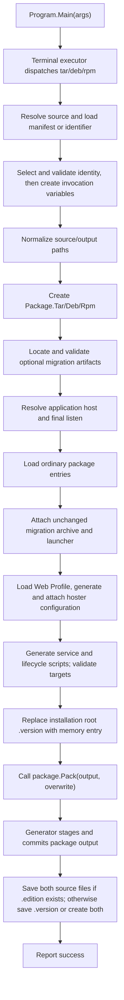

# Zongsoft.Tools.Packager 实现说明

[English](implementation.md) | [简体中文](implementation.zh-Hans.md)

本文档面向维护者，说明 `Zongsoft.Tools.Packager` 的源码结构、命令执行流水线、包模型、文件收集规则、systemd 脚本生成，以及 `.tar.gz`、`.deb`、`.rpm` 三种包格式的当前实现方式。

面向使用者的安装、配置和发布操作说明见[打包器 README](../README.zh-Hans.md)。

本文的应用示例引用 hosting 中真实的 [Zongsoft.Hosting.Web](https://github.com/Zongsoft/hosting/tree/main/web/default) 宿主，暂存目录、Bash 工作目录和版本约定见 [README 快速开始](../README.zh-Hans.md#快速开始)。宿主 DLL 为 `Zongsoft.Hosting.Web.dll`，`--daemon:zongsoft.web` 指定包和服务标识。自动 Web 配置使用宿主的 web.profile；根路径别名一节另以用户自备的 manual.conf 演示普通载荷。

hosting 当前脚本省略 `--framework`，框架由工具从变量来源读取，编译配置由 `--compilation` 指定。生成服务时，daemon 声明 `Environment,DOTNET_ENVIRONMENT`，Web 另声明 `ASPNETCORE_ENVIRONMENT`；terminal 禁用 daemon，声明变量列表不代表设置交互进程环境。脚本中的编译、部署和升迁制作均发生在本工具调用之外，独立 `pack.cmd` 只收集已有载荷。脚本设置及实际命令见 [快速开始](../README.zh-Hans.md#快速开始)。

## 设计目标

`Zongsoft.Tools.Packager` 的目标是使用纯 .NET 代码生成 Linux 应用安装包，尽量减少对目标系统工具链的打包期依赖。

核心设计取向：

- 对外提供统一入口 `dotnet-pack`，通过 `tar`、`deb`、`rpm` 子命令选择输出格式。
- 在三种格式之间复用应用元数据、变量解析、文件收集、脚本生成和命名规则。
- 默认服务模型面向 systemd，适合 .NET 后台服务和 Web 服务。
- 直接写入包格式原语，而不是调用 `tar`、`dpkg-deb`、`rpmbuild`、`cpio`。
- 支持在 Windows、Linux、macOS 上生成 Linux 包；Unix 主机保留文件权限，Windows 主机使用默认权限规则。

## 源码结构

| 文件 | 职责 |
| --- | --- |
| `Program.cs` | 初始化终端命令树，注册 `TarCommand`、`DebCommand`、`RpmCommand`。 |
| `PackCommand.Version.cs` | 嵌套 `VersionFile` 负责源版本读取、身份校验、Edition 选择和成功后保存。 |
| `PackCommand.cs` | 三种打包命令的模板方法基类，声明通用命令选项并编排执行流程。 |
| `PackCommand.Tar.cs` | 创建 `Package.Tar`。 |
| `PackCommand.Deb.cs` | 创建 `Package.Deb`。 |
| `PackCommand.Rpm.cs` | 创建 `Package.Rpm`，解析 RPM 专用的 `provides`、`conflicts`。 |
| `Package.cs` | 包模型、安装脚本模型、包条目模型和文件收集逻辑。 |
| `Package.Tar.cs` | `.tar.gz` 包类型：默认安装路径、文件名、入口方法。 |
| `Package.Deb.cs` | `.deb` 包类型：默认安装路径、文件名、入口方法。 |
| `Package.Rpm.cs` | `.rpm` 包类型：默认安装路径、文件名、RPM 专用属性。 |
| `Generator.cs` | 从当前程序集计算生成工具身份，由三种格式的元数据写入共享。 |
| `Generator.Tar.cs` | 写入 gzip PAX tar、`install.sh`、`uninstall.sh`。 |
| `Generator.Deb.cs` | 写入 Debian `ar` 容器、`control.tar.gz`、`data.tar.gz`。 |
| `Generator.Rpm.cs` | 写入 RPM lead、signature/header、metadata header、gzip cpio payload。 |
| `Migration.cs` | 按最终应用身份定位外部升迁产物，验证 PAX，原样收录并提供安装协调脚本。 |
| `ApplicationHost.cs` | 一次解析应用宿主、已有或待生成服务及最终 listen，服务生成和 Web 的 ~ 共用此结果。 |
| `Scriptor.Systemd.cs` | 生成或收集 systemd 单元文件，组合应用、升迁和 Web 生命周期。 |
| `Web/Definition*.cs` | 用 [Zongsoft.Core](https://github.com/Zongsoft/framework/tree/main/Zongsoft.Core) Profile 收集来源声明，处理整体后端覆盖、继承、变量及字段校验。 |
| `Web/Configurator*.cs` | 配置器契约、Nginx 指令树与校验、稳定序列化、可重定位内容片段。 |
| `Web/Installation*.cs` | 生成载荷冲突校验、交付重定位、激活与卸载脚本。 |
| `Utility.cs` / `TextSource.cs` | 按需展开变量；统一解析源目录文件与直接文本。 |
| `Utility.Search` / `Generator.Entries.cs` | 路径段匹配、目录元数据、受控临时载荷流。 |
| `PackageOptions.cs` | 制作选项的类型化访问、模板求值及工具默认值；变量来源由 Core 评估器管理。 |
| `Dependency.cs` | 解析统一依赖区间和替代分组；由 Debian/RPM 编码器按原生关系语法输出。 |
| `Utility.cs` | RID、安装路径、路径规范化、Unix 时间戳、文件权限等辅助逻辑。 |
| `Dumper.cs` | 控制台输出启动画面、错误和警告消息。 |
| `tools/.shared` 链接源码 | `Utility.cs` 与本项目的 `partial Utility` 合并编译，共用递归变量与命令/文本方法；`ArtifactPublisher` 统一管理暂存与发布，单文件原子替换，多文件成组提交并在失败时恢复。布尔开关使用 [Zongsoft.Core](https://github.com/Zongsoft/framework/tree/main/Zongsoft.Core) `Switch`，枚举沿用 [Zongsoft.Core](https://github.com/Zongsoft/framework/tree/main/Zongsoft.Core) 转换且不检查成员定义，不生成共享 DLL。 |

## 执行流水线

入口命令结构：

```text
dotnet-pack
├── tar
├── deb
└── rpm
```

核心流程由 `PackCommand<TPackage>.OnExecuteAsync()` 编排：


```mermaid
flowchart TD
    A["Program.Main(args)"] --> B["Terminal executor dispatches tar/deb/rpm"]
    B --> C["Resolve source and load manifest or identifier"]
    C --> D["Select and validate identity, then create invocation variables"]
    D --> E["Normalize source/output paths"]
    E --> F["Create Package.Tar/Deb/Rpm"]
    F --> M["Locate and validate optional migration artifacts"]
    M --> G["Resolve application host and final listen"]
    G --> H["Load ordinary package entries"]
    H --> N["Attach unchanged migration archive and launcher"]
    N --> W["Load Web Profile, generate and attach hoster configuration"]
    W --> L["Generate service and lifecycle scripts; validate targets"]
    L --> V["Replace installation root .version with memory entry"]
    V --> I["Call package.Pack(output, overwrite)"]
    I --> J["Generator stages and commits package output"]
    J --> S["Save both source files if .edition exists; otherwise save .version or create both"]
    S --> OK["Report success"]
```

`PackCommand<TPackage>` 做通用工作，子类只负责创建具体 `Package`：

```csharp
protected override Package.Deb CreatePackage(CommandContext context, PackageOptions options)
```

`RpmCommand` 额外读取：

- `--provides`
- `--conflicts`

这两个选项按逗号或分号拆分，最终写入 RPM metadata header。

## 源版本与包内版本

`VersionFile` 使用 `File.OpenRead` 和 `ApplicationManifest.Load(Stream)` 读取源目录直属 `.edition`。仅 `FileNotFoundException` 才允许回退 `.version` 并调用 `ApplicationIdentifier.Load(Stream)`；空标识、损坏文件、目录占位和其他 I/O 错误立即失败。不搜索其他目录。

清单依次选择显式非空 Edition、Current、唯一 Edition；多个且无选择时报错，无具名 Edition 时用顶层版本。显式选择须存在并保留清单拼写。标识回退允许显式 Edition 替换或补充文件中的 Edition。显式名称须与源名称忽略大小写一致；显式版本覆盖所选版本，最终版本非零。身份只取显式选项及源文件，环境和 `.env` 可通过显式变量引用使用。

载入的清单在内存中原位替换选中 Edition，再将 Current 设为该项，保留其他条目、顺序和 [Zongsoft.Core](https://github.com/Zongsoft/framework/tree/main/Zongsoft.Core) 的注释及空行布局。制包前准备待保存内容；`Save(TextWriter)` 使用 UTF-8 无 BOM、CRLF 写入器。标识字节采用 `ApplicationIdentifier.Save(Stream)`；读取使用 `ApplicationIdentifier.Load`，末尾有无 LF、CRLF 换行均可，验证只检查解析后的身份，不限制末尾换行。

所有包产物提交成功后才保存源文件：已有清单通过 `ArtifactPublisher` 成组回写 `.edition` 和 `.version`，覆盖已有标识或创建缺失标识，标识记录最终选定的名称、Edition 和版本；仅有标识时只原子更新 `.version`；两者均无时要求显式有效名称和版本，成组暂存及提交两文件，不覆盖并发创建的文件。双文件保存失败回滚。源保存失败保留包并报告受影响路径；解析、校验及制包失败不保存源文件。

`EntryCollection.Load` 排除源直属 `.edition`（含显式别名），指向安装根 `.edition` 的文件项也排除；其他子目录文件沿用普通选择规则。`SetVersion` 写入唯一的安装根 `.version` 内存项，权限 `0644`，替换同目标普通及根别名项，不受排除规则影响。全部编码器及 RPM 摘要通过 `Entry.OpenRead()` 读取；子目录中的 `.version` 保持普通载荷行为。

Debug 引用本地 [Zongsoft.Core](https://github.com/Zongsoft/framework/tree/main/Zongsoft.Core) 构建，Release 引用集中配置的 NuGet 包，两者须提供 `ApplicationManifest`、`Editions.Current` 和 `ProfileOptions.Directives`；Web 加载通过 `ProfileDirectiveBehavior.Strict` 要求导入文件存在。

## 命令选项模型

通用必填及条件必填选项：

| 选项 | 类型 | 说明 |
| --- | --- | --- |
| `--name` | `string` | 源版本文件缺失时必填；否则校验名称或使用源名称。 |
| `--version` | `string` | 展开后转换为 `System.Version`；源版本文件缺失时必填，否则覆盖所选版本。最终版本不能为零。 |
| `--platform` | `string` | 展开后转换为 `Platform`，指定目标平台。 |

常用可选项：

| 选项 | 默认值 | 说明 |
| --- | --- | --- |
| `--source` | 当前目录 | 输入目录。 |
| `--migration` | 空 | 升迁制作时的输入名称，可带目录；裸名称从源目录向父目录查找，每层还查直属 `.migration/`，按最终 Edition、Version、Runtime 匹配。 |
| `--output` | `source` | 始终作为输出目录；相对路径基于 `source`，不支持指定文件名。 |
| `--exclude` | 空 | 加载打包项时跳过的文件模式列表，多个模式用逗号或分号分隔。 |
| `--edition` | Current 或唯一 Edition | 产品 Edition，参与包名。 |
| `--framework` | `framework` 变量或空 | 可选 .NET 目标框架，用于查找 `bin/<compilation>/<framework>` 中的宿主；省略选项时按变量来源查找；显式空值终止回退。 |
| `--compilation` | `Release` | 可选 .NET 构建配置，用于上述宿主目录查找，也可作为变量引用。 |
| `--architecture` | `x64` | 目标架构。 |
| `--overwrite` | `false` | 是否覆盖已存在的输出文件。 |
| `--install-path` | 由包名推导 | 安装目录。 |
| `--title` | 空 | 人类可读标题。 |
| `--summary` | 空 | 短描述；可为文件路径。 |
| `--description` | 空 | 长描述；可为文件路径。 |
| `--homepage` | `https://github.com/Zongsoft` | 项目主页。 |
| `--license` | 空 | 许可证文本。 |
| `--category` | 格式默认 | Debian `Section` 或 RPM `Group`。 |
| `--maintainer` | `Zongsoft` | 软件包维护者。 |
| `--manufacturer` | `Zongsoft` | 软件生产厂家；未指定、null、空字符串使用默认值，纯空白不触发默认值。 |
| `--dependencies` | 空 | 统一的 `name[:range]` 依赖列表；区间语法支持 `[v)` 简写及 `|` 替代项。 |

systemd 与生命周期脚本选项：

| 选项 | 说明 |
| --- | --- |
| `--listen` | 生成服务时传给 `--urls` 的绑定地址；纯数字会转成 `http://127.0.0.1:<port>`。 |
| `--daemon` | systemd 单元文件名/标识；`none`、`disable`、`disabled` 表示禁用。 |
| `--daemon-environments` | 逗号或分号分隔的变量名，写入生成的服务文件。 |
| `--installing` / `--installed` | 安装前/安装后脚本。 |
| `--uninstalling` / `--uninstalled` | 卸载前/卸载后脚本。 |
| `--preinstalling` / `--postinstalling` | 拼接到 `installing` 前后。 |
| `--preinstalled` / `--postinstalled` | 拼接到 `installed` 前后。 |
| `--preuninstalling` / `--postuninstalling` | 拼接到 `uninstalling` 前后。 |
| `--preuninstalled` / `--postuninstalled` | 拼接到 `uninstalled` 前后。 |

## 变量与规范化

### 变量来源

`PackCommand<TPackage>.CreateEvaluator(context, directory)` 组合命令选项、指定目录由近及远的祖先链 `.env` 和系统环境，工具启用 Fallback，默认值由 Core 在全部普通变量缺失后查询。省略 directory 时跳过 `.env`，供第一次解析 source 使用。源目录存在并绝对化后重新加载变量并固定 source；`.env` 不参与 source 的反向推导。配置及命令选项名不区分大小写，环境变量按平台规则查询；全局变量优先级为显式选项 > 近层 `.env` > 远层 `.env` > 环境变量 > 默认值。

共享 `Utility.LoadEnvironmentProfiles` 从文件系统根目录到 source 加载直属 `.env`，不搜索子目录。使用 `Profile.Load` 保留 [Zongsoft.Core](https://github.com/Zongsoft/framework/tree/main/Zongsoft.Core) 的空值和导入语义，章节层级以点号连接为命名空间，条目名中的点号和连字符改为下划线；读取或解析异常终止制包，仅缺失文件跳过。不写入进程环境变量。

变量契约使用 `Zongsoft.Common.IVariables`。命令选项直接使用 `context.Options`，工具计算值保存在 Core `Variables` 中，`.env` 保留 `Profile.ToVariables()` 视图，系统环境直接使用 `Variables.Environments()` 实时读取，不复制、不改写名称或值。环境来源只提供默认命名空间，Windows 忽略大小写，Unix/Linux 区分大小写；参与模板的路径值使用 `/`，其余转义遵循 Core。`TemplateEvaluatorOptions.Fallback` 显式设为 true；同一命名空间按 Providers 顺序查询，全部未找到才逐级进入父命名空间及全局，最后允许来源自身已声明的默认值。首个命中即生效，包括 null。指令参数评估沿用父评估器的 Fallback、Recursive、Culture 和 MaximumDepth；不带命名空间的模板无需额外语法。默认空间用 `${name}`，具名空间用 `${io.rustfs:access_key}`；章节层级以点号连接，条目名及命令选项名中的点号和连字符转换为下划线，非法配置名称不提供变量，配置名称冲突仅在查询时失败。

命令选项集合 context.Options 只注册一次，放在配置及系统环境之前。Core VariablesExtension.TryGetValue 按每一级命名空间查询全部来源，普通查询均传入 false；全局也全部未找到后，才以全局命名空间传入 true 查询已声明的默认值。因此全局优先级为显式选项、近层 .env、远层 .env、系统环境、命令默认值。HasDefaultValue 区别未声明与显式 null，缺省不合成类型零值。工具直接读取、递归模板和指令参数评估共享 Fallback 设置；计算出的覆盖值放在最前面的 Variables 中。

模板直接通过 Core `TemplateEvaluator.Evaluate` / `TryEvaluate` 求值，启用 `Recursive`，默认上限为 64（根模板和递归字符串均计层）。所有输入遵循 Core 转义；`\${name}` 输出字面引用，`\\` 输出字面反斜杠。路径优先使用相对路径，绝对路径使用 `/`，例如 `../.shared/${product}.env` 或 `D:/deploy/${scheme}`。未知变量、循环和深度超限按 Core 错误契约处理。

`.env` 的指令参数通过 `Directives.Processing` 求值，查找顺序为显式选项、当前文件已读内容（含已完成导入）、已加载的祖先 `.env` 和环境/默认值。不读取后文，不隐式查找导入父文件的局部变量。制作清单的回调先查本次命令的实际值，再查当前 Profile，全部未命中后才查描述符默认值。每条 import 使用完整参数导入一个文件，原始声明和条目值不被模板结果改写。Profile 只负责读取和导入，模板评估由工具显式发起。


所有变量（包括 `framework`）统一遵循首个命中生效：null、空字符串、false 和 0 都不会触发下层回退。只有未提供该值时才继续查找；需要有效值的业务操作负责校验并在无法继续时报告错误。

`PackCommand` 为每次调用建立独立的 `PackageOptions` 选项对象，并传给包、脚本和文本来源；不保留进程级变量状态。访问值时递归展开引用，未使用的未知引用不会阻止制包。未知变量、循环引用及超过 64 层的展开失败，诊断指出变量名。展开不读取文件。

[Zongsoft.Core](https://github.com/Zongsoft/framework/tree/main/Zongsoft.Core) 命令描述符将可能含变量的选项保留为字符串；`source` 先由完整原始变量集展开。显式 `name`、`edition`、`version` 随后展开，`version` 再转为 `System.Version`，用于从源目录的 `.edition` 清单文件或 `.version` 版本标识文件选择版本。确定最终身份后，`platform`、`architecture` 与 `overwrite` 在使用时展开并转换。裸 `--overwrite` 仍为 true，未指定时为 false。

身份仍由源目录的 `.edition` 清单文件或 `.version` 版本标识文件与显式 name/edition/version 选项共同确定，不从同名环境变量或 `.env` 变量隐式替代身份；显式选项可引用 `.env` 中的其他变量。最终身份及已解析的 source/output 覆盖变量集合。`--migration` 仍须显式启用，`--overwrite` 可从环境变量或 `.env` 提供并由命令行覆盖。

### 变量语法

Core `TemplateEvaluator` 支持两种变量引用形式：

```text
${name}
${namespace:name}
```

示例：

```bash
export APP_NAME=Zongsoft.Hosting.Web
export APP_VERSION=1.0.0

dotnet-pack deb \
  --listen:8069 \
  --daemon:zongsoft.web \
  --name:"$APP_NAME" \
  --version:"$APP_VERSION" \
  --platform:linux \
  --framework:net10.0 \
  --source:./publish \
  --output:../packages/
```

此示例的身份选项由 Bash 展开；`--version` 作为字符串进入 `OnExecuteAsync`，展开后才按 `System.Version` 解析，名称与 Edition 按传入值校验。打包器变量表达式也可用于后续路径、文本和升迁配置。

源路径、输出、载荷、排除表达式、文本和升迁输入引用未知变量时均失败；未使用的变量不展开。`TryEvaluate` 返回 Core 异常，调用方不得把失败结果继续作为有效输入。

### 文本与文件

`TextSource.Read(source, value, options, fileOnly)` 统一处理 summary、description 和生命周期钩子：

- `text:` 后内容原样返回，适用于含 Shell `${___}`、`${___}` 或路径样式的字面文本。
- `file:` 后内容先展开变量，然后按绝对路径或相对 source 的路径读取；文件不存在报错。
- 无前缀时先展开变量；多行值为文本，已有文件按 source 读取，明显的缺失路径报错，其他单行值为文本。可用前缀消除歧义。
- 读取后的文件内容不展开变量，也不会再次解释成另一个文件路径。
- pre/post 钩子用 `;` 或 `|` 分隔，每项均为文件路径，允许 `file:`，不接受 `text:`；文件名本身不能包含这些列表分隔符。

## 包模型

`Package` 抽象类持有三种格式共享的元数据：

- `Name`
- `PackageIdentity`
- `PackageName`
- `Edition`
- `Version`
- `Platform`
- `Architecture`
- `Runtime`
- `Framework`
- `Title`
- `Summary`
- `Description`
- `Maintainer`
- `Manufacturer`
- `License`
- `Homepage`
- `Category`
- `InstallPath`
- `Dependencies`
- `Entries`
- `Scripts`
- `Migration`

包名规则：

```text
identity
identity-edition
```

其中 `identity` 默认等于 `name`；如果指定了未禁用的 `--daemon`，则取 daemon 标识的文件名部分，并去掉可选 `.service` 后缀。

输出文件名由 `Package.GetFileName` 统一生成，三种格式使用以下规则；这里的 `name` 为包标识 `identity`，仍遵循上述 daemon 优先规则：

```text
<name>@<version>-<architecture>.<extension>
<name>-<edition>@<version>-<architecture>.<extension>
```

示例：

```text
zongsoft.web@1.0.0-x64.deb
zongsoft.web-enterprise@1.0.0-x64.rpm
```

文件名中的架构取 `Architecture.ToString().ToLowerInvariant()`，例如 `x64`、`arm64`；扩展名为 `tar.gz`、`deb`、`rpm`，文件名由名称、Edition（可选）、版本及架构组成。tar 的 `.sh` 入口采用同一文件主名。Runtime Identifier 用于匹配升迁产物，不参与安装包文件名。

### Runtime Identifier

`Utility.GetRuntimeIdentifier()` 根据平台和架构生成运行时标识：

```text
linux + x64   => linux-x64
linux + arm64 => linux-arm64
windows + x64 => win-x64
windows       => win
```

`Platform.Windows` 通过 `[Alias("Win")]` 为命令解析声明别名；它不是单独的枚举成员。

### 默认安装路径

`Utility.Unix.GetInstallPath(identity)` 根据包标识推导默认安装路径：

```text
Zongsoft.Hosting.Web => /opt/zongsoft/hosting/web
zongsoft.web         => /opt/zongsoft/web
```

规则：

- 名称为空时返回 `/opt`。
- 名称转为小写。
- 每个点号都替换为 `/`，形成多级目录。
- 无点号时安装到 `/opt/<name>`。
- Web 宿主示例指定 `--daemon:zongsoft.web`，因此使用 `/opt/zongsoft/web`；`--name:Zongsoft.Hosting.Web` 仍用于定位宿主 DLL。

## 打包项加载

打包项由 `Package.EntryCollection` 负责加载。

### 默认加载

如果没有位置参数：

```text
递归收集 source 下所有文件
entryName = 文件相对 source 的路径
```

对 `.deb` 和 `.rpm`，`entryName` 会加上安装路径前缀，例如：

```text
InstallPath = /opt/zongsoft/web
EntryName   = opt/zongsoft/web/Zongsoft.Hosting.Web.dll
```

对 `.tar.gz`，`EntryPrefix` 为 `null`，应用文件保留在归档根目录下，安装时由 `install.sh` 复制到目标目录。

### 显式加载

位置参数格式：

```text
path
path:alias
```

解析规则：

- 以最后一个冒号拆分路径和别名。
- Windows 盘符中的 `C:` 不作为别名分隔符。
- 相对路径基于 `source`。
- 绝对路径可以位于 `source` 外部；如果没有别名，最终只使用文件名。
- 目录递归展开，目录自身也是条目，保留空目录与源目录模式（Windows 默认 0755）。目录别名 `:~` 被归一化为空路径，将目录内容直接放到安装根目录，hosting 的载荷参数采用此写法。
- [Zongsoft.Core](https://github.com/Zongsoft/framework/tree/main/Zongsoft.Core) `Searcher` 统一支持任一路径段中的 `*`、`?`，独立段 `**` 匹配零层或多层目录。每个参数位置按相对于固定前缀的路径（`/` 分隔）Ordinal 排序，不重排全部输入；Windows 匹配忽略大小写，Unix 区分大小写。
- 重复的目标路径会触发冲突警告并跳过。

### 排除规则

`--exclude` 会在 `Package.EntryCollection.Load()` 收集文件时生效：

- 多个模式用逗号或分号拆分。
- 模式先经过变量展开，再统一为 `/` 路径分隔符。
- 相对模式基于 `source`，同时会匹配源文件相对路径、最终包内路径和文件名。
- 支持 `*`、`?`、`**`；目录模式如 `logs/` 等价于 `logs/**`。
- 命中的文件直接跳过，不产生重复条目冲突警告。
- systemd 生成/加入的服务文件和自动生成的 `.version` 文件不经过该过滤器。

### 根路径别名

如果 alias 以 `/` 或 `\` 开头，则条目标记为 `Rooted`。

以下示例假设 `publish/manual.conf` 已由用户准备，仅演示自备配置的根路径别名，不启用 `--web`：

```bash
dotnet-pack deb \
  --name:zongsoft.hosting.web \
  --daemon:none \
  --version:1.0.0 \
  --platform:linux \
  --framework:net10.0 \
  --source:./publish \
  --output:../packages/ \
  manual.conf:/etc/nginx/conf.d/zongsoft.web.conf
```

三种格式的处理方式：

| 格式 | 处理方式 |
| --- | --- |
| `.deb` | payload 路径为 `etc/nginx/conf.d/zongsoft.web.conf`，安装后位于 `/etc/nginx/conf.d/zongsoft.web.conf`；`/etc` 下 root 条目会写入 `conffiles`。 |
| `.rpm` | payload 路径为 `/etc/nginx/conf.d/zongsoft.web.conf`，RPM header 中标记配置文件。 |
| `.tar.gz` | 文件存放到 `.root/etc/nginx/conf.d/zongsoft.web.conf`，由 `install.sh` 复制到 `${DESTDIR}/etc/nginx/conf.d/zongsoft.web.conf`。 |

### 文件权限

Unix-like 主机：

```text
File.GetUnixFileMode(path) & rwx mask
```

Windows 主机或读取不到有效权限时：

- `.sh`、`.dll`、`.exe`、无扩展名文件使用 `0755`。
- 其他文件使用 `0644`。

## systemd 生成器

三种包类型当前都使用 `Scriptor.Systemd`。

如果 `--daemon` 被指定且未被禁用，daemon 标识只覆盖包文件名、系统包名和默认安装路径；`Package.Name` 仍保留 `--name` 值，用于定位 .NET 宿主 DLL。

### 服务文件解析

`--daemon` 为空时，默认使用 `Package.Name` 的小写形式作为服务标识，不附加 Edition。

流程：

1. 若 `--daemon:none`、`--daemon:disable` 或 `--daemon:disabled`，禁用服务生成。
2. 否则在 `source` 下查找 `--daemon` 指定的文件。
3. 如果文件存在，将其加入包条目。
4. 如果文件不存在，在内存中生成 `.service` 文件并加入包条目，不使用固定临时路径。服务文件名先校验，再加入条目。

### 宿主定位

生成 `.service` 文件时需要定位 .NET 宿主。查找顺序：

1. `<source>/<name>.dll`
2. `<source>` 下唯一 `.exe`，并推断同名 `.dll`
3. `<source>/bin/<compilation>/<framework>/<name>.dll`
4. `<source>/bin/<compilation>/<framework>` 下唯一 `.exe`，并推断同名 `.dll`

`framework` 或 `compilation` 为空或全空白时跳过第 3、4 步。两个选项都不触发编译，普通文件打包、源目录中的 .NET 宿主和现成服务文件均不要求提供两项。纯文件包使用 `--daemon:none` 可直接跳过宿主解析。

找不到宿主时输出：

```text
The daemon host location failed.
```

### 生成的服务内容

普通服务：

```ini
[Unit]
Description=<title-or-name>

[Service]
Type=simple
WorkingDirectory=<install-path>
ExecStartPre=mkdir -p <install-path>/logs
ExecStart=dotnet <install-path>/<host>
Restart=on-failure
RestartSec=10
KillSignal=SIGINT
SyslogIdentifier=<package-identity>
DynamicUser=no
PrivateTmp=no
ReadWritePaths=<install-path> <install-path>/logs /tmp

Environment=DOTNET_NOLOGO=true
<custom-environment-lines>

[Install]
WantedBy=multi-user.target
```

监听值由 `PackageOptions.Listen` 提供；多个完整 URL 以分号分隔，作为同一个 `--urls` 值保留。HTTP/HTTPS 可同时指定，HTTPS 默认服务器证书由宿主配置。省略选项时不追加 `--urls`，已有 service 的 ExecStart 不改写。

如果 `--listen` 非空，则改为：

```ini
ExecStart=dotnet <install-path>/<host> --urls <bind>
```

其中纯数字绑定值会被转换成：

```text
http://127.0.0.1:<port>
```

### 生命周期脚本

脚本模型映射：

| `Package.InstallScripts` | Debian 文件 | RPM tag | Tar 路径 |
| --- | --- | --- | --- |
| `Installing` | `preinst` | `1023` | 融合到 `install.sh` |
| `Installed` | `postinst` | `1024` | 融合到 `install.sh` |
| `Uninstalling` | `prerm` | `1025` | 融合到 `uninstall.sh` |
| `Uninstalled` | `postrm` | `1026` | 融合到 `uninstall.sh` |

未提供脚本时，默认行为：

- 安装前停止同名 systemd 服务。
- 安装后创建 `/etc/systemd/system/<service>` 符号链接。
- 安装后执行 `systemctl daemon-reload`、`systemctl enable` 和 `systemctl start`。
- 卸载前禁用并停止服务。
- 卸载后删除服务符号链接、重载 systemd，并删除安装目录。

禁用 systemd 时，应用服务操作退化为 no-op；升迁以及 Web 交付、激活、卸载步骤保持独立，卸载后仍会删除安装目录。

不同包格式会在写入生命周期脚本时应用各自的卸载保护：

- Debian 的 `prerm` 仅在 `remove` 或 `deconfigure` 时执行 `Uninstalling`，`postrm` 仅在 `remove` 或 `purge` 时执行 `Uninstalled`；`upgrade`、`failed-upgrade`、`abort-install`、`abort-upgrade` 和 `disappear` 不执行卸载清理。
- RPM 的 `%preun` 和 `%postun` 仅在 `$1=0`（最后一个已安装实例被删除）时执行卸载脚本；当 `$1>0` 时保留安装载荷。
- Tar 包只有显式执行 `uninstall.sh` 才进入卸载生命周期；生成器统一删除解析后的 `TARGET`，默认 `Uninstalled` 脚本无额外目录删除操作。

## Web 配置与安装集成

使用语法及部署要求见 [Web 指南](web.zh-Hans.md)。Web 类型位于同一项目的 Web 子命名空间，采用 Definition 输入/有效模型、Configurator.Context/Result 和嵌套 Configurator.Nginx，不添加动态插件加载。

Definition.cs 提供 Load/Resolve 入口；Definition.Loader.cs 收集声明、组织段落并校验结构；Definition.Resolver.cs 集中合并声明、求值和生成有效模型，按绑定与资源、后端策略、健康检查、请求头、原始指令及基础值解析分区。字段值转换属于 Resolver，不单独拆分 Values 文件；Definition.Model.cs 保存模型类型。

加载通过 [Zongsoft.Core](https://github.com/Zongsoft/framework/tree/main/Zongsoft.Core) Profile.Load（Directives = { ProfileDirectiveOptions.Import(ProfileDirectiveBehavior.Strict) }），用 Loading 收集合并前的引用者声明，Loaded 收集各完成来源（包括根配置），保留 Profile 实例身份。同一层级的后端池按输入实例整组替换，不能直接枚举最终合并条目。公共字段及层级先校验，随后确定所选托管器覆盖关系，最后仅展开实际消费的值。指令参数及被消费的配置值直接使用 Core TemplateEvaluator，遵循相同的模板转义规则。

Resolver 生成不可变站点、路径及策略记录；Nginx 生成器建立指令树，校验原始叶指令上下文/基数、静态监听冲突和正则 proxy_pass，再序列化为 UTF-8、Tab、CRLF。安装根是有类型的 ContentPart，不是可被用户文本碰撞的占位符。公共字面值不被当作 Nginx 运行时表达式；不能安全表示的值明确报错。

ApplicationHost 在普通载荷加载前解析一次，服务与 ~ 共享最终 listen。Web 生成条目经 Entry.OpenRead 编码；Installation.Validate/ValidateEntry 在最终目标空间检查普通条目、别名、祖先/子路径冲突，检查与加入顺序无关。输出失败不保存源版本，Profile 输入从不写回。

Package.InstallScripts 的 Delivered 独立于四个生命周期。Tar 复制载荷后先执行 Delivered，再按 DESTDIR 门禁执行 Installed；Debian postinst 仅在 configure 中执行 Delivered/Installed；RPM 在 %post 中执行。生成 .conf 是普通可覆盖载荷，不具有 DEB conffile 或 RPM config 标志。

阶段组合如下：

- 交付：清理弃用生成文件及目标归属匹配的链接，Tar 按 INSTALL_PATH 重建含安装根引用的配置。DESTDIR 只改变写入位置，不改变配置内路径，不操作系统链接。
- 安装完成：preinstalled → 升迁准备/apply（若指定）→ installed → Web 激活 → postinstalled；前项失败阻止后项。自定义主钩子及 daemon:none 不取消 Web 步骤。
- 卸载前：preuninstalling → Web 解除加载/按开关校验与重载 → uninstalling → postuninstalling。
- 卸载后：载荷删除 → preuninstalled → uninstalled → .web 清理 → postuninstalled；升级旧版本卸载由现有格式门禁跳过。

激活使用 HOSTER_WEB_ACTIVATION，读取安装时值。固定默认 nginx.conf/nginx.service；nginx -T 确认所生成链接确实被加载。停止状态只校验，运行状态才重载。安装严格失败；普通卸载中的 Nginx 失败警告继续，文件操作失败仍报错。开关关闭不阻止真实文件交付、弃用清理或最终卸载清理。

无新 Web 结果也生成旧产物清理片段，避免取消 --web 后遗留站点。只有当前或旧产物实际涉及 Web 时才调用 Nginx。默认 .web 布局本身就是容器化发现契约，不生成 .hoster 或额外模板。

测试分为声明/有效模型、原生输出、三格式实际解包及隔离 Shell 替身。Shell 夹具把所有系统路径替换为临时目录，并使用假的 nginx/systemctl；不安装包、不操作真实服务。Windows 上依次通过 `PACKAGER_TEST_GIT`、PATH、Git 安装信息及常见安装目录，选择同一套安装中的 Bash 与 cygpath；设置 `MSYS=winsymlinks:nativestrict`，并通过 `cygpath -u` 转换 Windows 路径，使 `/tmp` 等挂载别名与解析后的链接目标一致。运行 Shell 测试前，在临时目录中检查所需工具及符号链接能力；环境不支持时注明原因并跳过，不阻断构建或发布。环境检查通过后，脚本执行失败和断言失败仍正常报错。回归测试覆盖带空格的挂载路径、便携安装、不完整工具组合及工具不可用。这些测试不等于真实安装验证；目标 Linux、Nginx 模块、证书加载和重载应在具备实际依赖的隔离环境中验证。配置契约、模块要求和部署行为见 [Web 配置指南](web.zh-Hans.md)。


## 应用元数据

主页的选项名和变量名为 `homepage`；`Package.Homepage` 提供 tar PAX `Homepage`、Debian `Homepage` 与 RPM `URL`（1020）的值。tar PAX `Maintainer`、Debian `Maintainer` 与 RPM `PACKAGER`（1015）保存包维护者，与生成工具身份独立。`manufacturer` 提供 `Package.Manufacturer`，未定义、null 或展开后为空字符串时使用共享默认值 `Zongsoft`。访问器在通用规范化把纯空白归为空字符串之前保留该原始值。`maintainer` 选项的默认值也为 `Zongsoft`，两者独立保存。

tar 以 PAX 全局属性 `Manufacturer` 保存厂家，Debian 写入自定义 control 字段 `Manufacturer`，RPM 写入标准 `VENDOR` 字符串标签（1011）。Debian 沿用既有文本规范化，包括不写入纯空白的厂家字段；这些元数据不增加载荷条目。参见 [Debian 自定义字段](https://www.debian.org/doc/debian-policy/ch-controlfields.html#user-defined-fields)与 [RPM 标签说明](https://rpm.org/docs/latest/manual/tags.html)。

## 打包器版本元数据

完整字段映射见 [README 应用元数据](../README.zh-Hans.md#应用元数据)。`Generator.GetSummary` 按 Summary、Title、应用 Name 顺序选择首个非空白值；`GetDescription` 使用非空白 Description，否则回退到有效摘要。三格式共用这两个方法。Debian 组合规范化的单行摘要及独立长描述续行，保留内部缩进，空行写为 ` .`；两个文本相同时仅写摘要。Tar 对两个文本字段转义，RPM 保留原始文本。三格式均省略空白 License 与 Homepage；Debian 必填 Maintainer 的 `Unknown` 回退，以及原生分类默认值 `utils` / `Applications/System`，保留格式差异。

Debian 在原生 KiB 单位的 `Installed-Size` 之外，增加按不变区域格式输出的字节数 `PackageSize`，并增加 `InstallPath`。RPM 将非空白安装路径写入应用字符串标签 `1000002`，同时保留已弃用的 `1056`，兼容既有读取器。应用标签仅作声明；使用 `PREFIXES` 会声明生命周期脚本未提供的重定位能力。现代 RPM 查询格式不暴露未注册的应用标签或已弃用的 `DEFAULTPREFIX` 名称，读取器须按编号检查 Header 条目。

应用有效监听地址来自生成服务共用的 `ApplicationHost` 结果，`Package.Listen` 仅在宿主为 Generated 时提供该值。未指定或空值省略；已有服务及禁用 daemon 不声明实际被忽略的 `--listen`。Tar 在 PAX 全局属性中写入 `Listen`，Debian 添加 control `Listen` 字段，RPM 在应用标签 `1000001` 中写入单个字符串。该编号是 Zongsoft 包契约，不是上游注册的 RPM 标签，位于标准标签编号之外（[上游标签定义](https://github.com/rpm-software-management/rpm/blob/master/include/rpm/rpmtag.h)）；RPM Header 摘要覆盖该字段。不生成额外安装元数据文件或载荷条目。`ListenerMetadataTest` 覆盖三格式、变量展开、端口规范化、服务与元数据一致性以及未使用设置的省略。

每个安装包自动记录当前生成工具的身份，逻辑内容为 `Packager:Zongsoft.Tools.Packager@<assembly-version>`。值采用 `程序集名@版本号`，从打包器自身程序集读取，独立于宿主应用版本；无需指定额外选项或启用升迁。

| 格式 | 存放位置 | 查看方式 |
| --- | --- | --- |
| tar.gz | PAX 全局扩展属性 `Packager` | 使用支持 PAX 的归档读取器，例如 Python `tarfile` 的 `pax_headers["Packager"]`。 |
| deb | `control.tar.gz` 内 `control` 的 `Packager` 字段 | `dpkg-deb -f <安装包.deb> Packager` |
| rpm | 主 Header 的 `RPMVERSION` 字符串标签（1064） | `rpm -qp --queryformat '%{RPMVERSION}\n' <安装包.rpm>` |

RPM 用生成工具版本标签保存本工具身份；其 `PACKAGER` 标签（1015）保存 `--maintainer` 的维护者信息。元数据位于格式头中，不增加安装目录文件，也不改变 `.version` 或 `migration.json`。

`Generator.GetIdentity` 通过 `Assembly.GetName()` 读取自身程序集的简单名称和 `Version`，保留版本对象的完整文本，不写死工具版本号。三个生成器调用同一方法读取身份，不取调用进程或宿主程序集版本。主 Header 的 RPM 摘要覆盖该标签。

tar 通过 `PaxGlobalExtendedAttributesTarEntry` 写入一个全局扩展记录，不将其加入 `Package.Entries`；deb 写入控制字段；RPM 直接写入 1064 标签，不占用已有维护者字段。RPM 原生标签含义参见[官方标签说明](https://rpm-software-management.github.io/rpm/manual/tags.html)，PAX API 参见[官方构造说明](https://learn.microsoft.com/en-us/dotnet/api/system.formats.tar.paxglobalextendedattributestarentry.-ctor)。

## `.tar.gz` 实现

实现文件：`Generator.Tar.cs`

### 格式概要

`.tar.gz` 等价于：

```text
gzip(tar archive)
```

当前实现使用 .NET 的 `System.Formats.Tar`：

```csharp
new TarWriter(gzip, TarEntryFormat.Pax, false)
```

因此归档条目使用 PAX tar 格式，可支持更长路径和扩展元数据。

生成 `.tar.gz` 的同时，会在输出目录生成一个同名 `.sh` 安装脚本，例如：

```text
zongsoft.web@1.0.0-x64.tar.gz
zongsoft.web@1.0.0-x64.sh
```

该脚本定位同目录下的 `.tar.gz`，解压到临时目录，并调用解压后的 `install.sh` 完成安装。

### 归档结构

```text
<application files>
.root/<rooted files>
install.sh
uninstall.sh
```

归档开头包含 PAX 全局扩展记录，它不是安装文件。`GetTarMetadata` 写入 `Packager`、`PackageName`、`Version`、`Manufacturer`、`Architecture`、`Summary`、`Description`、`PackageSize`；还写入非空白的 `License`、`Homepage`、`Maintainer`、`InstallPath`、`Listen`、`Dependencies`、`Category`。不写入 `BuildTime` 属性。

`PackageName` 使用 `package.PackageName`，保留 daemon 身份和 Edition 确定的最终系统包名，不使用应用身份或归档文件名。`Version` 保留 `package.Version.ToString()` 的完整文本，与生成的 `.version` 一致。`Architecture` 使用 `package.Architecture.ToString().ToLowerInvariant()`，与文件名的架构值一致（如 `x64`、`arm64`、`x86` 或 `arm`）。全部属性在归档改名后仍可读取，不增加选项或载荷条目。

`Summary` 按 Summary、Title、应用 Name 顺序选择首个非空白值；Description 为空白时回退到有效摘要。由于 .NET PAX 写入器不接受属性值中的实际换行，这两个字段将反斜杠、CR、LF 分别转义为 `\\`、`\r`、`\n`，读取时解码还原原文，Unicode 保持原样。可选空白值省略，既有 Manufacturer 的纯空白行为保持不变。`Category` 只使用包模型值，不设置格式默认分类；`InstallPath` 描述默认路径，不改变安装时覆盖规则。

`Dependencies` 使用 `Dependency.Split` 与 `Dependency.Parse` 校验统一输入语法，再以 `; ` 连接各组，保留区间、原生版本端点及替代项。该字段仅作声明，tar 安装器不检查或安装依赖；非法声明在产物发布前失败。`PackageSize` 使用 `Package.GetPackageSize()` 按不变区域格式输出字节数，包含生成条目和 rooted 文件，不含容器头及 tar 安装/卸载脚本。目录贡献为零，空载荷记录 `0`，不表示文件系统实际占用。

rooted 文件只有存在根路径别名时写入 `.root/`。生命周期脚本内容写入 `install.sh` 和 `uninstall.sh`。

### 文件条目

应用文件写入为：

```text
TarEntryType.RegularFile
name = entry.EntryName
mode = entry.Mode
mtime = entry.ModifiedTime
data = entry.OpenRead()
```

rooted 文件写入为：

```text
name = .root/<entry.EntryName>
```

### install.sh / uninstall.sh

`install.sh` 是自包含安装器，权限 `0755`。`uninstall.sh` 是自包含卸载器，权限 `0755`，安装时会复制到目标安装目录。

支持：

- 默认安装。
- 从安装目录执行 `uninstall.sh` 卸载。
- 普通包允许 `INSTALL_PATH` 覆盖应用安装路径；升迁包实际安装时校验固定路径。
- `DESTDIR` 暂存安装。
- 执行融合后的生命周期脚本。
- 安装/卸载 rooted 文件。

安装流程：

```text
SOURCE_DIR = install.sh 所在目录
INSTALL_PATH = 环境变量或包默认安装路径
DESTDIR = 可选暂存目录
TARGET = DESTDIR + INSTALL_PATH
DESTDIR 为空时执行 Installing 生命周期内容
创建 TARGET
复制普通归档文件到 TARGET
复制 uninstall.sh 到 TARGET
复制 rooted 文件到 DESTDIR + /<root-path>
执行 Delivered 内容，包括 Web 弃用清理和路径重定位
DESTDIR 为空时执行 Installed 生命周期内容
```

卸载流程：

```text
DESTDIR 为空时执行 Uninstalling 生命周期内容
rm -rf TARGET
删除 rooted 文件
DESTDIR 为空时执行 Uninstalled 生命周期内容
```

## `.deb` 实现

实现文件：`Generator.Deb.cs`

### Debian 二进制包概要

Debian 二进制包是 Unix `ar` 容器，现代格式版本为 `2.0`。

当前写入：

```text
debian-binary
control.tar.gz
data.tar.gz
```

### ar 容器

文件以全局头开始：

```text
!<arch>\n
```

每个成员写入 60 字节 ASCII 头：

```text
name/ timestamp uid gid mode size `\n
```

当前实现：

- `uid = 0`
- `gid = 0`
- `mode = 100644`
- 成员长度为奇数时补一个换行字节，使下个成员按偶数边界开始。

### debian-binary

内容固定：

```text
2.0\n
```

### control.tar.gz

`control.tar.gz` 使用 gzip + Ustar tar，包含：

```text
control
preinst
postinst
prerm
postrm
conffiles
```

说明：

- `control` 权限为 `0644`。
- 维护者脚本只有内容非空时写入，权限为 `0755`。
- 维护者脚本自动加 `#!/bin/sh` 和 `set -e`。
- `conffiles` 只在存在 rooted 且路径位于 `/etc/` 下的文件时写入。

### control 字段

当前生成字段：

```text
Package: <package-name>
Version: <version>
Packager: <assembly-name>@<packager-version>
Section: <category-or-utils>
Priority: optional
Architecture: <debian-architecture>
Installed-Size: <payload-size-in-KiB>
PackageSize: <payload-size-in-bytes>
Maintainer: <maintainer>
Manufacturer: <manufacturer>
Homepage: <homepage>
License: <license>
InstallPath: <default-installation-path>
Listen: <generated-host-listener>
Depends: <dependencies>
Description: <summary-or-title-or-name>
 <long-description-line>
 .
 <long-description-line>
```

说明：

- `Depends` 仅在依赖非空时写入。
- `Description` 第一行是短描述。
- 长描述每行前置一个空格。
- 空行写为 ` .`。
- `License`、`Manufacturer`、`Packager`、`PackageSize`、`InstallPath` 与 `Listen` 作为额外字段写入。可选空白字段省略，`PackageSize` 始终记录精确载荷字节数，空载荷为 `0`；`Installed-Size` 保留向上取整的 KiB 估计值，最小为 1。`Packager` 与宿主 `Version`、`Maintainer` 分别保存不同信息。

### Debian 架构映射

| .NET `Architecture` | Debian architecture |
| --- | --- |
| `X64` | `amd64` |
| `X86` | `i386` |
| `Arm64` | `arm64` |
| `Arm` | `armhf` |
| 其他 | `all` |

### data.tar.gz

`data.tar.gz` 使用 gzip + Ustar tar，先写目录条目，再经 `OpenRead()` 写入普通文件。显式目录保留模式和时间戳，自动补齐的父目录使用 0755；目录不打开内容流，也不写入 conffiles。

对非 rooted 条目，`.deb` 的 `EntryPrefix` 是去掉开头 `/` 的安装路径：

```text
InstallPath = /opt/zongsoft/web
EntryName   = opt/zongsoft/web/Zongsoft.Hosting.Web.dll
```

Debian 解包后文件位于：

```text
/opt/zongsoft/web/Zongsoft.Hosting.Web.dll
```

对 rooted 条目，prefix 被跳过，因此：

```text
Alias     = /etc/nginx/conf.d/zongsoft.web.conf
EntryName = etc/nginx/conf.d/zongsoft.web.conf
```

安装后位于：

```text
/etc/nginx/conf.d/zongsoft.web.conf
```

## `.rpm` 实现

实现文件：`Generator.Rpm.cs`

### RPM 文件概要

RPM 文件由以下逻辑部分组成：

```text
Lead
Signature
Header
Payload
```

当前实现写入：

```text
lead
signature header
metadata header
gzip(newc cpio payload)
```

当前不生成 GPG/PGP 签名，只写入基本 signature tag，例如包体大小和 MD5 digest。

### Lead

lead 固定 96 字节：

| 偏移 | 内容 |
| --- | --- |
| `0..3` | RPM magic：`ed ab ee db` |
| `4` | major version：`3` |
| `5` | minor version：`0` |
| `6..7` | package type：binary package |
| `8..9` | architecture number |
| `10..75` | `<package-name>-<version>`，最多 65 字节 ASCII 内容，随后保留 NUL |
| `76..77` | OS number：Linux |
| `78..79` | signature type：header-style signature |

lead 架构号映射：

| .NET `Architecture` | RPM lead architecture number |
| --- | --- |
| `X64` | `1` |
| `X86` | `1` |
| `Arm64` | `12` |
| `Arm` | `12` |
| 其他 | `255` |

### Header 编码

RPM header 结构：

```text
magic/version/reserved
index count
store size
index entries
store bytes
padding to 8 bytes (signature header only)
```

index entry：

```text
tag    int32 big-endian
type   int32 big-endian
offset int32 big-endian
count  int32 big-endian
```

当前支持的 type：

| Type | 含义 |
| --- | --- |
| `3` | int16 array |
| `4` | int32 array |
| `6` | string |
| `7` | binary |
| `8` | string array |
| `9` | international string |

数值使用 big-endian，字符串使用 UTF-8 并以 `NUL` 结尾。

### Signature Header

signature section 使用与 RPM header 相同的索引/存储区结构。

只有 signature header 尾部补齐到 8 字节。主 metadata header 的 store 后紧跟压缩 payload；否则 rpm 查询可能成功，但 rpm2cpio 会读到 gzip 之前的零字节，无法解包。

当前写入：

| Tag | 内容 |
| --- | --- |
| `62` | Signature 不可变区域，BIN 类型、16 字节 trailer。 |
| `269` | metadata header 的 SHA-1 digest。 |
| `273` | metadata header 的 SHA-256 digest。 |
| `1000` / `270` | metadata header + payload 的字节长度，无符号 32 位 / 64 位。 |
| `1004` | metadata header + payload 的 MD5 digest。 |

signature section 末尾按 8 字节对齐。两个 header 的索引均按 tag 升序写入；主 header 的不可变区域 tag 为 `63`。区域 trailer 位于 store 尾部，其负偏移为区域索引字节数，摘要覆盖完整 metadata header（包含 magic、索引、store 与 trailer）。这是完整性摘要，不是发布者的 OpenPGP 签名。格式依据 [RPM V4 格式](https://rpm-software-management.github.io/rpm/manual/format_v4.html) 和 [Header 结构](https://rpm-software-management.github.io/rpm/manual/format_header.html)。

### Metadata Header

当前写入的主要内容：

- 包名、版本、release。
- 摘要、描述、构建时间、构建主机。
- 包大小、许可证、生产厂家、维护者、分类、主页地址。
- OS 和架构。
- 安装/卸载脚本。
- 文件大小、模式、mtime、digest、用户名、组名、配置文件标记。
- payload 格式、压缩器和压缩级别。
- Requires、Provides、Conflicts。
- dirname、basename、dirindex 三组文件路径表。

常用 tag：

| Tag | 当前写入内容 |
| --- | --- |
| `1000` | 包名。 |
| `1001` | 版本。 |
| `1002` | release；未指定 edition 时为 `1`，否则为 edition。 |
| `1004` | 摘要。 |
| `1005` | 描述。 |
| `1006` | 构建时间。 |
| `1007` | 构建主机。 |
| `1009` / `5009` | 载荷文件字节数，无符号 32 位 / 64 位。 |
| `1011` | 生产厂家/供应商。 |
| `1014` | 许可证。 |
| `1015` | 维护者/打包者。 |
| `1016` | 分组。 |
| `1020` | URL。 |
| `1021` | OS，固定 `linux`。 |
| `1022` | RPM 架构。 |
| `1023..1026` | pre/post install、pre/post uninstall 脚本。 |
| `1028` | 无符号 32 位文件大小数组。 |
| `1030` | 文件模式数组。 |
| `1034` | 文件修改时间数组。 |
| `1035` | 文件 SHA-256 digest 数组。 |
| `1037` | 文件 flags；`/etc` rooted 文件标记为配置文件。 |
| `1039` / `1040` | 用户名/组名，固定 `root`。 |
| `1048..1050` | Requires flags/name/version。 |
| `1047`, `1112`, `1113` | Provides name/flags/version。 |
| `1053..1055` | Conflicts flags/name/version。 |
| `1056` | 已弃用的默认安装路径，兼容既有读取器。 |
| `1064` | 生成工具身份，`程序集名@版本号`。 |
| `1046` / `271` | 未压缩 cpio 归档字节数，无符号 32 位 / 64 位。 |
| `1000001` / `1000002` | 应用字符串标签：生成宿主有效监听地址 / 默认安装路径。 |
| `1116..1118` | 文件目录索引、文件基本名、目录名。 |
| `1124` | Payload format，固定 `cpio`。 |
| `1125` | Payload compressor，固定 `gzip`。 |
| `1126` | Payload flags，固定 `9`。 |
| `5011` | 文件摘要算法，`8`（SHA-256）。 |
| `5092` / `5093` | 压缩 payload 的 SHA-256 digest / 算法 `8`。 |

### RPM 架构映射

| .NET `Architecture` | RPM architecture |
| --- | --- |
| `X64` | `x86_64` |
| `X86` | `i386` |
| `Arm64` | `aarch64` |
| `Arm` | `armv7hl` |
| 其他 | `noarch` |

### Requires、Provides、Conflicts

Requires 使用下文的统一依赖模型。Provides、Conflicts 保留以下原生关系表达式：

```text
name
name = version
name >= version
name <= version
name > version
name < version
name(= version)
name(>= version)
```

关系标志：

| 操作符 | Flags |
| --- | --- |
| `<` | `RPM_SENSE_LESS` |
| `>` | `RPM_SENSE_GREATER` |
| `=` | `RPM_SENSE_EQUAL` |
| `<=` | `LESS \| EQUAL` |
| `>=` | `GREATER \| EQUAL` |

默认 Requires：

```text
rpmlib(CompressedFileNames) <= 3.0.4-1
rpmlib(FileDigests) <= 4.6.0-1
rpmlib(PayloadFilesHavePrefix) <= 4.0-1
```

布尔 Requires 还会添加 `rpmlib(RichDependencies) <= 4.12.0-1`。完整的括号表达式存入依赖名称，flags 为 `0`、version 为空。能力依赖使用 `RPMLIB | LESS | EQUAL`；端点含 `~` 或 `^` 时，还分别声明 `TildeInVersions <= 4.10.0-1` 或 `CaretInVersions <= 4.15.0-1`。这些是能力标识版本，不是 RPM 产品版本。

默认 Provides：

```text
<package-name> = <version>-<release>
```

### Payload

payload 是 gzip 压缩后的 ASCII `cpio` newc 归档。newc header magic：

```text
070701
```

生成流程：

1. 根据文件路径收集目录，至少包含 `/`。
2. 写入目录 cpio 条目，模式 `0040000 | entry.Mode`；源目录保留模式，合成父目录为 0755。Header 与 cpio 使用相同目录元数据。
3. 写入文件 cpio 条目，路径为 `.` + RPM 绝对路径，例如 `./opt/zongsoft/web/Zongsoft.Hosting.Web.dll`。
4. 文件模式为 `0100000 | entry.Mode`。
5. 写入 `TRAILER!!!` 结束条目。
6. 原始 cpio 数据补齐到 512 字节边界。
7. 使用 gzip 压缩。

RPM header 同时保存一份文件元数据，供包管理器查询和校验。

## 三种格式对比

| 特性 | `.tar.gz` | `.deb` | `.rpm` |
| --- | --- | --- | --- |
| 外层容器 | gzip tar | Unix ar | RPM lead/signature/header |
| 文件载荷 | PAX tar | `data.tar.gz` | gzip newc cpio |
| 控制元数据 | PAX 全局属性；`install.sh` 与 `uninstall.sh` | `control.tar.gz` | RPM metadata header |
| 生命周期脚本 | 融合到 `install.sh` / `uninstall.sh` | `preinst/postinst/prerm/postrm` | header script tags |
| 包管理器安装 | 否 | `dpkg`/`apt` | `rpm`/`dnf`/`yum` |
| 默认安装路径 | `install.sh` 复制 | payload 内含路径 | payload/header 内含路径 |
| root alias | `.root/` + installer | 直接安装到根路径 | 直接安装到根路径 |
| 配置文件标记 | 无包管理器标记 | `/etc` rooted 文件写入 `conffiles` | `/etc` rooted 文件标记 config flag |
| 签名 | 无 | 无 | 无 GPG/PGP，仅基础 digest |

## 本地搜索与源链接

本地模式由 [Zongsoft.Core](https://github.com/Zongsoft/framework/tree/main/Zongsoft.Core) Searcher 处理。搜索结果保留逻辑名称，读取实际目标。选中目录链接作为载荷根时允许展开，内部目录链接跳过，文件链接按原名称读取目标内容。递归模式不穿过目录链接匹配后续段。选中链接悬空或循环会在输出写入前失败；目标路径校验继续执行。

载荷相对路径以 source 为基准。单模式结果按逻辑相对路径执行 Ordinal 排序，多参数顺序不变。参见 [Zongsoft.Core](https://github.com/Zongsoft/framework/tree/main/Zongsoft.Core) [本地搜索](../../../framework/Zongsoft.Core/docs/searcher.zh-Hans.md)。

`Searcher.Search` 通过 `Searcher.Target` 选择文件、目录或两者（默认 Both）；`Match.Origin` 提供逻辑固定目录前缀，用于计算相对输出路径。

## 载荷流与目录条目

`Package.Entry.IsDirectory` 区分目录与文件。目录没有内容流、大小为零；生成器统一补齐父目录，文件与目录目标冲突时失败。链接源使用逻辑名称及目标内容，选中的目录链接可作为载荷根，内部目录链接跳过；目标路径不能包含 `..`、换行或 NUL。tar 根别名目录使用 `install -d` 按模式创建，卸载仅对显式目录执行 `rmdir`，非空目录保留，合成的共享父目录不主动删除。

Debian 的 control/data gzip tar 分别写入受控临时文件，ar 依据实际长度流式复制。RPM 原始 cpio 与 gzip payload 使用临时文件，压缩载荷 SHA-256、主 Header + payload MD5 均通过流计算，最后顺序写入各 Header 与载荷，避免完整包体数组。小版本内容和 Header 元数据仍保留内存处理；元数据内存随条目数增长，载荷不随文件字节数增加托管分配。临时文件使用独占 CreateNew、DeleteOnClose，Unix 模式 0600；正常结束及异常均释放。需要足够临时磁盘空间，RPM 峰值包括原始及压缩载荷；RPM 字段的整数大小上限仍然适用。

## 统一依赖

`PackageOptions.Dependencies` 先展开变量，再由 `Dependency.Split` 分割顶层逗号/分号组；区间及 RPM capability 括号内的标点保持完整。`Package.Dependencies` 仍为字符串数组，两种编码器均调用 `Dependency.Parse` 得到 AND 组及组内 OR 替代项，每项包含名称、原始上下界字符串及是否包含边界的标志。

语法为 `name[:range]`：单独包名表示不限版本，以数字开头的裸版本表示包含下界。支持标准 NuGet 风格区间，并将 `[v)` 作为 `[v,)` 的别名；`[v]` 表示精确版本，`(v,)` 表示不含下界，`(,v]` / `(,v)` 表示上界，`(,)` 表示不限版本。缺省端点必须使用开边界。`libc6:any` 等包名限定仍属于名称；字母开头的原生版本请使用括号。保留原生 epoch、修订号及版本比较语义，不进行 NuGet 归一化、排序、浮动版本解析或矛盾区间合并。旧比较表达式、错误括号、浮动 `*`、空替代项及控制字符使用本地化诊断报错；空列表项及重复约束保留既有列表行为。

Debian 将区间转换为一或两个原生比较，严格边界映射为 `>>` / `<<`；对替代项的比较应用分配律：`foo:[1,2) | bar:[3)` 转换为 `foo (>= 1) | bar (>= 3), foo (<< 2) | bar (>= 3)`。每个输入组最多展开为 1024 个关系组，超限在发布产物前报错。最终名称及版本通过既有 Debian 关系校验。

RPM 的单比较使用普通 flags/name/version 条目；有限区间转换为 `(foo >= 1 with foo < 2)`，替代项转换为 `((foo >= 1 with foo < 2) or bar >= 3)`。`with` 要求同一个包满足两个端点；替代依赖需要 RPM 4.13+，`with` 需要 RPM 4.14+。Debian 没有对应的单提供者运算符，其虚拟依赖的两个端点可能由不同提供者分别满足。两种格式均保留自身的版本比较及提供者语义，统一的是输入表示法。参见 [Debian 关系字段](https://www.debian.org/doc/debian-policy/ch-relationships.html)和 [RPM 布尔依赖](https://rpm.org/docs/latest/manual/boolean_dependencies)。

## Debian 关系字段

`DebCommand` 提供 `--provides`、`--replaces`、`--breaks`、`--conflicts`、`--recommends`、`--suggests`，分别写入同名首字母大写的 control 字段。这些选项保留原生语法：列表以逗号或分号分隔，关系写为 `name (>= version)` 等括号形式，支持 `<< <= = >= >>`；Recommends/Suggests 可用 `|` 表达替代项，Provides 的版本关系仅允许 `=`。`--dependencies` 则使用统一解析器：`--dependencies:"aspnetcore-runtime-10.0:[10.0)"` 写出 `Depends: aspnetcore-runtime-10.0 (>= 10.0)`。`Package.Deb` 格式化解析模型并独立校验输出字段，不复用 RPM 解析器。无值不写字段，拒绝非法包名、关系、换行和 NUL；二进制 control 不接受源包的架构限制及构建 profile 表达式。规则依据 [Debian Policy 关系字段](https://www.debian.org/doc/debian-policy/ch-relationships.html)。

## 当前实现边界

- Debian 固定 gzip control/data tar，RPM 固定 gzip cpio，暂不提供 xz/zstd。
- RPM 直接写格式，不调用 rpmbuild，不提供 spec 或 GPG 签名。
- 文件所有者/组固定为 root，不继承构建机 UID/GID，也不提供自定义所有者选项。
- systemd 是当前唯一脚本生成策略。
- 文件链接读取目标内容，选中的目录链接可展开；载荷内部目录链接跳过，不保留符号链接本身。
- 大载荷制包依赖临时磁盘容量，容器字段的大小上限仍然适用。RPM `newc` 文件大小为八位十六进制值，单文件超过 `uint.MaxValue` 时在产物发布前拒绝；包/归档/签名的总大小在 `uint.MaxValue` 内使用无符号 32 位，超限使用标准 64 位标签（`5009`、`271`、`270`），不再按 `int.MaxValue` 截断。安装大小使用 `LONGSIZE` 查询，它也能读取 32 位 `SIZE`。此改动未实现 RPM 的另一种大文件载荷编码。

## 升迁产物集成

升迁由独立的 [migrator 工具](../../migrator/README.zh-Hans.md) 预先制作。packager 不解析 `.migration`/`.ini`、SQL 或执行计划，也不携带原生执行器。

`--migration` 指定制作升迁时的输入名称，可带目录，例如 `--migration:../../packages/zongsoft`。

先展开变量，再判断是否包含目录分隔符 `/` 或 `\`：不包含时，从最终打包源目录（`--source`）逐级向父目录查找，直到文件系统根目录；每层先查目录本身，再查直属 `.migration/`，不遍历其他子目录。包含分隔符时只定位显式目录：相对路径基于源目录，绝对路径直接使用，既不向上查找，也不隐式检查 `.migration/`。源目录为 `hosting/web/default/`、产物位于 `hosting/.migration/` 时，`--migration:zongsoft` 即可找到；`--migration:./zongsoft` 只查源目录。查找起点不是运行命令时的工作目录。

文件前缀为 `<name>[-<edition>](migrate)@<version>_<RID>`，名称原样使用，无 Edition 时省略对应部分。选项填写制作升迁时的 `--name`，不包含自动生成的 `(migrate)` 标记。不能填写 Edition、版本、RID、扩展名、通配符或路径列表。

工具使用本次安装包最终确定的 Edition、版本、平台和架构定位产物，包括从源目录的 `.edition` 清单文件或 `.version` 版本标识文件取得的值及默认 x64。无 Edition 时省略对应部分。例如 enterprise、1.0.0、Linux x64 对应：

```text
zongsoft-enterprise(migrate)@1.0.0_linux-x64.tar.gz
zongsoft-enterprise(migrate)@1.0.0_linux-x64.sh
```

名称可以不同于宿主名称，但 Edition、版本和 RID 必须匹配。每个查找位置只有在压缩包和脚本都不存在时才继续下一位置；只找到其中一份立即报错并指出缺失文件的完整路径。找到完整配套后立即校验归档元数据和 RID，校验失败不再继续查找。两份文件必须来自同一目录，不拼配不同目录、不选择其他版本、Edition 或架构。到根目录仍未找到时，错误将预期文件名与已检查目录分行显示，各级目录及其 `.migration/` 按查找顺序逐行缩进列出。共享 `Utility.Indent` 使用平台换行并保留嵌套详情的缩进。未指定选项，或选项值为空、空字符串、全空白字符时，均不启用升迁，也不收录升迁产物。

两个文件原样存入安装根 `.migration/`，不展开归档；脚本为 0755，压缩包为 0600。升迁启动脚本执行时另建临时目录，归档内容直接展开到该目录根部，结束后清理，不在安装目录中增加一层 `.migration/`。与载荷目标冲突时报错。安装时调用脚本 `apply` 并传入 `/var/lib/<包名>/packager`；失败阻止启动。systemd 的 `ExecStartPre` 调用同一脚本 `check`，只比较完成标记，不解压、不连接服务。无 daemon 时仍执行升迁，DESTDIR 暂存不执行钩子，卸载保留状态与数据库/桶。目标机需要 POSIX sh、tar/gzip、cmp 和运行器所需系统库；详见升迁指南。

定位与归档校验在 `Migration.Load` 中分离：私有 `Locate` 方法沿 `DirectoryInfo.Parent` 遍历目录，包含根目录，按目录本身、直属 `.migration/` 的顺序记录检查位置；选中同目录配套后由 `Validate` 检查 PAX 元数据。显式目录只检查一次，不隐式查找子目录。所有定位与校验均先于产物收录和制包。

## 验证建议

Cake 的 `--edition` 同时用于依赖还原、编译、测试和制包；`restore` 显式传递 MSBuild 的 `Configuration`，避免按 Debug 还原后以 Release 配合 `--no-restore` 编译时遗漏条件依赖。主项目 Debug 引用本地 framework 的 [Zongsoft.Core](https://github.com/Zongsoft/framework/tree/main/Zongsoft.Core) DLL，Release 引用声明的 [Zongsoft.Core](https://github.com/Zongsoft/framework/tree/main/Zongsoft.Core) NuGet 包；主测试项目仅在 Debug 添加本地 DLL 引用，Release 通过主项目获得传递包依赖。`dotnet cake --edition Release` 默认执行打包器回归测试，不调用 AOT 构建或 NuGet 推送。

源版本与内存条目的回归由 VersionFileTest、PackageVersionTest 和 PackageArtifactTest 覆盖。

打包器版本元数据回归 `Package_Provenance_RecordsGeneratorAndPreservesApplicationMetadata` 覆盖三格式生成工具身份、应用版本、厂家值和默认值，以及独立的主页和维护者字段。

`PackageMetadataTest` 在 x64、x86、arm64、arm 的实际三格式包中逐项读取字段，核查全部共有应用元数据、生成/版本/根路径载荷字节总数、依赖编码、摘要与描述独立选择、可选空白字段、格式默认值及 RPM 新旧安装路径标签。Header 边界测试覆盖 2 GiB、`uint.MaxValue`、4 GiB 和更大的 64 位值，不分配大载荷。

`Tar_Metadata_IsReadableFromRenamedArchive` 在归档改名后从 PAX 全局头读取包含 daemon 身份和 Edition 的最终包名以及 x64、arm64、x86、arm 架构值，同时覆盖新增元数据、Unicode/多行文本、依赖区间和替代项、不写入 BuildTime 及载荷条目不变。其他 tar 元数据测试覆盖载荷字节总数与版本身份、空可选值省略、摘要/描述回退及反斜杠、CR、LF 的独立转义；非法依赖测试加入 tar，验证失败保留既有产物。来源元数据测试同时覆盖没有 daemon 身份和 Edition 的包名。

使用 [README](../README.zh-Hans.md#快速开始) 中生成的真实项目安装包；以下命令从 hosting 仓库根目录执行，只检查包内容。安装与卸载用法见 [README 包格式](../README.zh-Hans.md#包格式)。

### tar.gz

```bash
tar -tzf ./packages/zongsoft.web@1.0.0-x64.tar.gz
tar -xOf ./packages/zongsoft.web@1.0.0-x64.tar.gz install.sh
tar -xOf ./packages/zongsoft.web@1.0.0-x64.tar.gz uninstall.sh
```

### deb

```bash
ar t ./packages/zongsoft.web@1.0.0-x64.deb
dpkg-deb --info ./packages/zongsoft.web@1.0.0-x64.deb
dpkg-deb --contents ./packages/zongsoft.web@1.0.0-x64.deb
```

### rpm

```bash
rpm -qip ./packages/zongsoft.web@1.0.0-x64.rpm
rpm -qlp ./packages/zongsoft.web@1.0.0-x64.rpm
rpm -qp --scripts ./packages/zongsoft.web@1.0.0-x64.rpm
rpm -qpc ./packages/zongsoft.web@1.0.0-x64.rpm
rpm2cpio ./packages/zongsoft.web@1.0.0-x64.rpm | cpio -t
```

## 参考资料

- Debian Policy Manual: [Binary packages](https://www.debian.org/doc/debian-policy/ch-binary.html)
- Debian Policy Manual: [Binary package format appendix](https://www.debian.org/doc/debian-policy/ap-pkg-binarypkg.html)
- Debian Handbook: [The Packaging System](https://www.debian.org/doc/manuals/debian-handbook/packaging-system.en.html)
- rpm.org: [RPM Package Format](https://rpm.org/docs/4.19.x/manual/format.html)
- Linux Standard Base: [RPM Package File Format](https://refspecs.linuxfoundation.org/LSB_3.1.1/LSB-Core-generic/LSB-Core-generic/pkgformat.html)
- GNU tar manual: [GNU tar](https://www.gnu.org/software/tar/manual/)

Web 打包从最终托管模型生成 .conf.template，并在能够完整表达时生成 .bindings；host/bind 支持逗号与分号。containerizer make 渲染模板，分别记录前端发布及应用 Listen，详见 [Web 托管](web.zh-Hans.md).
